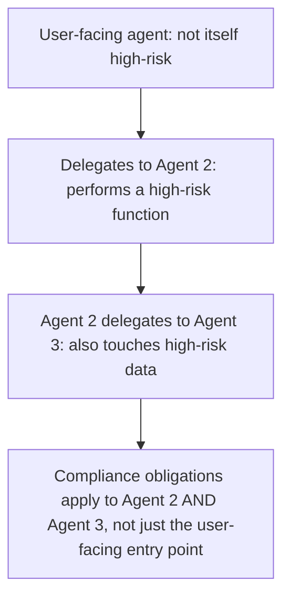
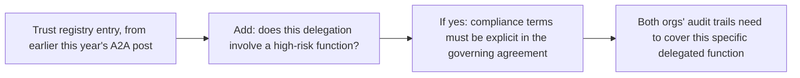

Current legal analysis of the EU AI Act's application to multi-agent systems establishes a specific, consequential interpretation: in a chain of AI agents, the compliance boundary extends to every agent that performs a high-risk function, not just the agent a user directly interacts with. This has direct, concrete implications for the A2A cross-organization delegation architecture this blog covered earlier this year — implications worth working through explicitly rather than leaving as an abstract legal point.

## What "the Boundary Extends to Every Agent" Actually Means



A user-facing orchestration agent that itself does nothing more than route requests — not high-risk in isolation — doesn't insulate the high-risk agents further down the delegation chain from their own compliance obligations. This directly contradicts an intuitive but incorrect assumption some teams have made: that compliance attaches only to the system a user or the regulator would naturally think of as "the AI system," rather than to every component actually performing a high-risk function regardless of how deep in a delegation chain it sits.

## Direct Implications for Cross-Organization A2A Delegation

```python
def compliance_implications_for_a2a_delegation(delegation_chain: list[dict]) -> dict:
    high_risk_agents_in_chain = [
        agent for agent in delegation_chain if agent["performs_high_risk_function"]
    ]
    return {
        "compliance_obligated_agents": high_risk_agents_in_chain,
        "cross_org_complication": any(
            agent["owning_org"] != delegation_chain[0]["owning_org"]
            for agent in high_risk_agents_in_chain
        ),
    }
```

This connects directly to the trust and identity posts from earlier this year on cross-organization A2A delegation — when a high-risk function is delegated to an agent owned by a *different organization*, both organizations now carry compliance exposure for that specific function, which needs to be an explicit part of the trust agreement covered in that earlier post (the pre-established, business/legal agreement backing any cross-org delegation), not an afterthought discovered during an audit.

## What This Means for the Trust Registry Design



The trust registry design from earlier this year already tracked authorization scope and data sensitivity per partner organization — extending it to explicitly flag whether a given delegation involves a high-risk function, and ensuring the governing agreement addresses compliance responsibility for that specific function, is a direct, concrete update this finding calls for, not a fundamentally new system.

## Technical Documentation Needs to Trace the Full Chain

```python
def document_delegation_chain_for_compliance(user_request_id: str) -> dict:
    full_chain = trace_full_delegation_chain(user_request_id)  # every agent touched, not just the entry point
    return {
        "chain": full_chain,
        "high_risk_functions_in_chain": [a for a in full_chain if a["high_risk"]],
        "compliance_documentation_per_agent": {
            a["agent_id"]: get_behavior_documentation(a) for a in full_chain if a["high_risk"]
        },
    }
```

This is a direct extension of the request-level tracing discipline covered throughout this blog's agent infrastructure series — tracing wasn't originally motivated by compliance, but the same trace data that answers "what happened during this request" for debugging purposes is exactly what's needed to demonstrate, per-agent, which components of a delegation chain carried high-risk compliance obligations and whether each one met them.

## Key Takeaways

1. **Compliance boundaries extend to every agent performing a high-risk function in a delegation chain**, not just the user-facing entry point — a specific, current legal interpretation
2. **Cross-organization A2A delegation of a high-risk function creates compliance exposure for both organizations**, and this needs to be explicit in the governing trust agreement, not discovered later
3. **Extend the trust registry design to flag high-risk delegations explicitly**, with compliance terms addressed in the agreement backing them
4. **Full delegation-chain tracing, already valuable for debugging, is exactly the data needed to demonstrate compliance per-agent across a chain** — the same infrastructure serves both purposes

---

*Part of the [Agentic Trust series](/tags/agentic-trust-series/) — evaluation, security, and governance for agentic AI at real-world scale.*
