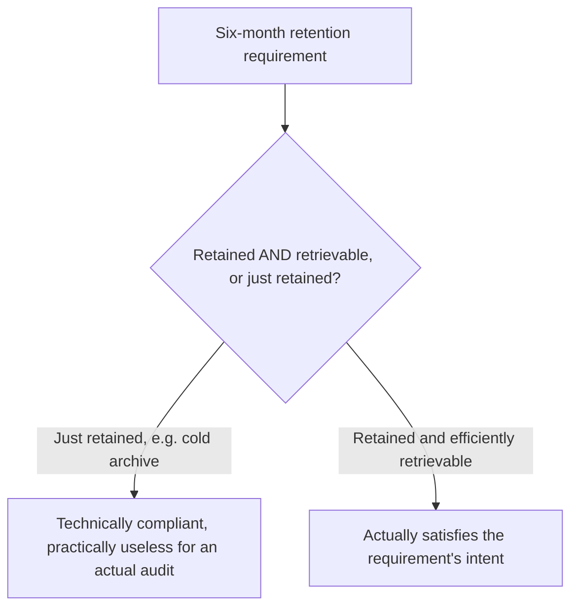
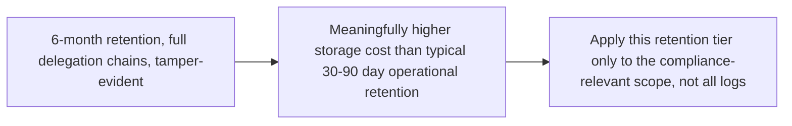

Six-month log retention, as one of the EU AI Act's high-risk domain requirements, sounds at first like a storage-policy configuration change — extend the retention window, done. Working through what actually needs to be true for that retention to satisfy the requirement's intent (not just its literal letter) surfaces real architectural implications this post works through concretely.

## Retained and Retrievable Are Different Requirements



A literal reading of "retained for six months" could technically be satisfied by dumping logs into cold storage with no practical way to query or retrieve a specific record within a reasonable timeframe — and this would almost certainly fail a real audit's actual expectation, which is that an investigator can retrieve the specific records relevant to a specific incident or decision within a reasonable timeframe, not that the bytes technically still exist somewhere.

## What This Means for the Logging Architecture Covered Earlier This Year

```python
def compliance_grade_log_retention_requirements() -> dict:
    return {
        "retention_window": "6 months minimum, for high-risk domain logs specifically",
        "retrievability": "Indexed and queryable by request_id, timestamp range, and agent/user identity — "
                           "not just stored as an undifferentiated blob",
        "integrity": "Tamper-evident — an auditor needs confidence the retrieved log wasn't modified after the fact",
        "scope": "Covers the full delegation chain per the previous post, not just the entry-point agent's own logs",
    }
```

The request-level logging covered earlier this year for operational debugging purposes (retrieved context, tool calls, not just the final answer) already satisfies most of the *content* requirement — what it likely doesn't satisfy without deliberate design is the **integrity** requirement, since operational logging is rarely built with tamper-evidence as an explicit goal, and the **scope** requirement, since operational logging often covers one agent's own trace rather than a full cross-agent delegation chain.

## Tamper-Evidence as the Genuinely New Requirement

```python
def append_only_audit_log_entry(entry: dict, previous_hash: str) -> dict:
    entry_content = json.dumps(entry, sort_keys=True)
    entry_hash = hashlib.sha256((previous_hash + entry_content).encode()).hexdigest()
    return {**entry, "entry_hash": entry_hash, "previous_hash": previous_hash}
    # A hash chain: any modification to a past entry breaks every
    # subsequent hash, making tampering detectable
```

A hash-chained, append-only log structure is a standard pattern for tamper-evident logging, and it's the piece most operational logging systems (built for debugging convenience, where an engineer might reasonably need to redact or correct an entry) don't have by default — retrofitting this specifically for the compliance-scoped subset of logs (high-risk domain interactions) rather than the entire operational log volume is usually the practical compromise, since applying tamper-evidence universally adds real overhead that isn't necessary outside the compliance-relevant scope.

## Cost and Storage Implications, Concretely



This connects directly to the cost-attribution discipline from earlier this year — compliance-grade log retention is a real, attributable cost, and scoping it precisely to what's actually high-risk-domain-relevant (rather than applying six-month tamper-evident retention to every operational log across the entire system) is what keeps this requirement's cost proportionate rather than an unbounded, undifferentiated expansion of storage spend.

## Key Takeaways

1. **"Retained" and "retrievable within a reasonable timeframe" are different bars** — cold storage that's technically retained but impractical to query likely fails a real audit's actual expectation
2. **Existing operational request-level logging covers most of the content requirement**, but usually not the tamper-evidence or full-delegation-chain-scope requirements
3. **Hash-chained, append-only logging is the standard tamper-evidence pattern**, applied to the compliance-relevant scope specifically rather than universally
4. **Scope compliance-grade retention precisely to high-risk-domain-relevant logs**, not the entire operational log volume, to keep the real storage-cost increase proportionate

---

*Part of the [Agentic Trust series](/tags/agentic-trust-series/) — evaluation, security, and governance for agentic AI at real-world scale.*
