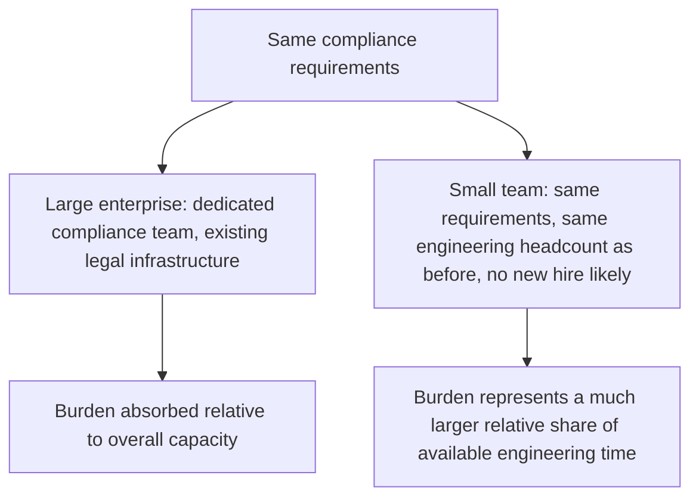
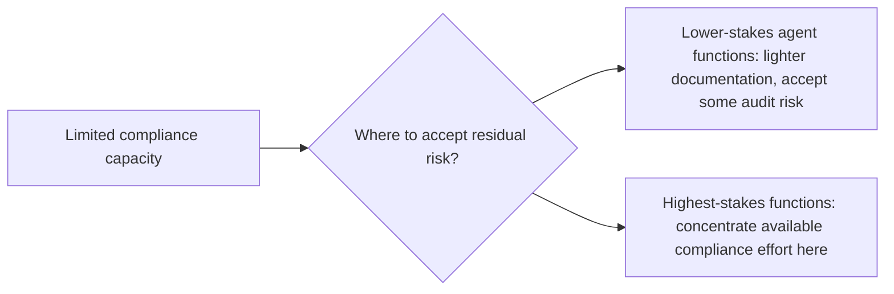

The EU AI Act's lack of a small-and-medium-enterprise exemption, flagged in this week's opening post, disproportionately affects smaller teams — a well-resourced enterprise can absorb conformity assessment and compliance infrastructure costs that represent a genuinely different burden relative to a small team's total engineering capacity. Three months into enforcement, worth surveying what smaller teams are actually doing to comply without the resourcing larger organizations bring to this problem.

## The Disproportionate Burden, Concretely



This isn't a claim that small teams face different requirements — the Act is explicit that they don't — it's that the *same* requirements consume a much larger proportion of a small team's total capacity, which changes the practical strategy from "build comprehensive compliance infrastructure" to "prioritize ruthlessly within a much tighter budget."

## What Smaller Teams Are Actually Prioritizing

```python
def small_team_compliance_prioritization(available_capacity: str) -> list[str]:
    # Given limited capacity, prioritize by cost-to-implement vs.
    # compliance-value, not by comprehensive coverage
    return [
        "Request-level logging (extends existing operational logging, low marginal cost)",
        "Policy-based escalation for genuinely high-stakes actions only (not blanket human review)",
        "Behavior documentation for the SPECIFIC claims an auditor would ask about, not exhaustive documentation",
        "Third-party conformity assessment support, if budget allows — often the highest-leverage external spend",
    ]
```

The pattern across teams successfully navigating this with limited resources: leaning heavily on infrastructure that already exists for operational reasons (the same connection between good practice and compliance evidence from earlier this week), and being deliberately narrow about documentation scope — covering the specific claims most likely to be audited rather than attempting comprehensive documentation of every system behavior, which a larger compliance team might have the capacity to produce but a small team genuinely doesn't.

## Where Smaller Teams Are Choosing to Accept More Risk



This is a direct application of the risk-tiering principle from earlier this year's governance council post — not every function needs the same depth of compliance rigor, and a small team's realistic strategy is concentrating limited compliance capacity on the functions that are both genuinely high-risk *and* most likely to actually be scrutinized, accepting a higher residual risk on lower-stakes functions rather than spreading thin, ineffective coverage evenly across everything.

## Community and Shared-Infrastructure Responses

A pattern specific to smaller teams that doesn't show up as much at enterprise scale: open-source and shared compliance-tooling projects emerging specifically to lower the cost of the auditable-logging and behavior-documentation infrastructure this series has covered, reducing the marginal engineering cost for any individual small team building compliant agentic systems, similar in spirit to how open-source guardrail libraries lowered the barrier to the security practices covered earlier this year.

## The Honest Assessment Three Months In

Smaller teams report this is a genuine, ongoing strain on capacity, not a solved problem — the practical compromises above reduce but don't eliminate the disproportionate burden, and several teams report deprioritizing feature work specifically to meet compliance deadlines, a real tradeoff cost worth naming plainly rather than understating.

## Key Takeaways

1. **The lack of an SME exemption means identical requirements consume a much larger share of a small team's total capacity** — not different requirements, a different relative burden
2. **Smaller teams are prioritizing infrastructure that already serves operational purposes**, and narrowing documentation scope to the specific claims most likely to be audited
3. **Risk-tiering — concentrating compliance effort on genuinely high-stakes, likely-to-be-scrutinized functions — is the realistic strategy under limited capacity**
4. **This remains a genuine, ongoing strain three months in**, with real tradeoffs against feature work — not a problem smaller teams have fully solved, just one they're managing

---

*Part of the [Agentic Trust series](/tags/agentic-trust-series/) — evaluation, security, and governance for agentic AI at real-world scale.*
