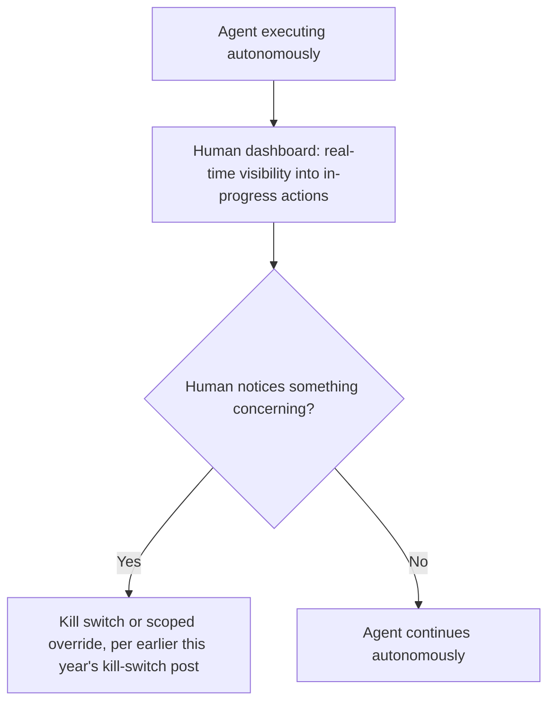
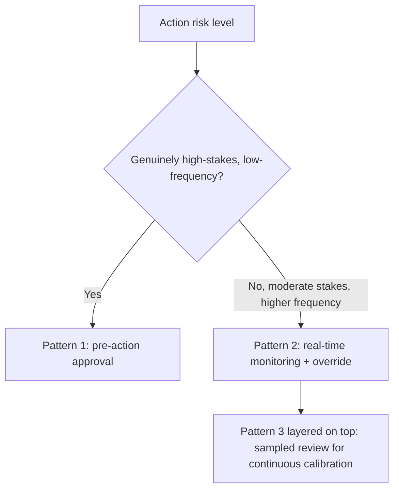

Article 14 requires that high-risk AI systems be designed for effective oversight by natural persons — a requirement stated at a level of abstraction that leaves genuine room for interpretation about what "effective" actually means for a multi-step agentic system, following directly from the compliance-complication post earlier this week. This works through three concrete implementation patterns, each mapping to infrastructure already covered on this blog, and which of them actually satisfies the requirement's evident intent versus merely its letter.

## Pattern 1: Pre-Action Approval Gate

```python
def pre_action_oversight(proposed_action: dict) -> dict:
    if requires_high_risk_review(proposed_action):
        return await_human_approval(proposed_action)  # blocks until reviewed
    return proceed_automatically(proposed_action)
```

This is the policy-based escalation pattern from earlier this year, applied directly — a human reviews and approves before a high-risk action takes effect. It most literally satisfies "effective oversight" for the specific actions it gates, and it's also the pattern least compatible with genuine multi-step agentic autonomy at scale, since gating every high-risk step defeats much of the efficiency case for deploying an agent in the first place.

## Pattern 2: Real-Time Monitoring With Override Capability



This reuses the kill switch infrastructure from earlier this year, framed as continuous oversight capability rather than only an emergency measure — a human can intervene at any point, without every action requiring pre-approval. This satisfies more of the efficiency case while still providing genuine oversight, and its adequacy depends heavily on whether the monitoring dashboard actually surfaces concerning activity in time for intervention to matter, which is a real design question, not a given.

## Pattern 3: Post-Hoc Sampled Review With Escalation Learning

```python
def post_hoc_oversight(action_log: list[dict], sample_rate: float = 0.1) -> dict:
    sampled = weighted_sample(action_log, sample_rate, weight_by="risk_and_novelty")
    review_results = [human_review(a) for a in sampled]
    # Findings feed back into policy — this is the sampled human-in-the-loop
    # eval pattern from earlier this year, applied to compliance oversight
    return {"reviewed": review_results, "policy_updates": derive_policy_updates(review_results)}
```

This is the weakest of the three for satisfying Article 14's evident intent on its own — a human reviewing a sample of actions *after* they've already taken effect isn't oversight in the sense of preventing or correcting a specific action in real time. It's a legitimate and valuable *complement* to the other two patterns (catching drift and informing policy updates), not a substitute for genuine pre-action or real-time oversight on the actions that are actually high-risk.

## Which Pattern to Use When



The realistic implementation for a mature agentic system combines all three, tiered by actual stakes — this mirrors the risk-tiering discipline from earlier this week's SME compliance post, and it's the pattern most likely to satisfy an auditor's actual scrutiny, since it demonstrates a deliberate, risk-proportionate oversight design rather than either blanket pre-approval (impractical at scale) or pure post-hoc sampling alone (too weak for genuinely high-stakes actions).

## Key Takeaways

1. **Article 14's "effective oversight" is abstract enough to admit multiple valid implementation patterns** — the choice matters for both compliance and practical usability
2. **Pre-action approval gates most literally satisfy the requirement and are least compatible with efficient autonomous operation at scale**
3. **Real-time monitoring with override capability, reusing this year's kill-switch infrastructure, balances oversight and efficiency** — its adequacy depends on whether the dashboard actually surfaces concerning activity in time
4. **Post-hoc sampled review is a valuable complement, not a substitute** — it doesn't prevent or correct specific high-risk actions in real time, only informs policy going forward

---

*Part of the [Agentic Trust series](/tags/agentic-trust-series/) — evaluation, security, and governance for agentic AI at real-world scale.*
