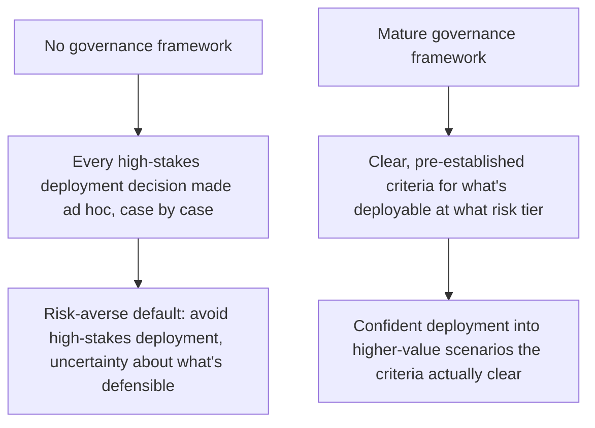
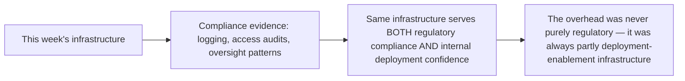

Industry research this year documents a real shift in how governance gets perceived: from compliance overhead to be minimized, toward a recognized enabler of deployment, because mature governance frameworks increase organizational confidence to deploy agents in higher-value, higher-stakes scenarios that a less-governed organization wouldn't risk. This connects directly to the governance council post from earlier this year, and it's worth working through mechanically why this shift is real rather than just favorable reframing of the same underlying cost.

## The Mechanism, Made Concrete



Without a governance framework, every genuinely high-stakes deployment decision (should this agent be trusted with this specific consequential action) gets made ad hoc, under real uncertainty about whether the organization has actually done its diligence — which reasonably biases toward caution and avoiding the deployment rather than accepting undefined risk. A mature framework, with the review gates from earlier this year's governance council post, replaces that ad hoc uncertainty with a defined, defensible process — and a deployment that clears a defined bar is a fundamentally more confident decision than one made without one.

## This Isn't Just a Feeling — It's a Measurable Deployment Velocity Effect

```python
def governance_maturity_vs_deployment_velocity(org_data: dict) -> dict:
    return {
        "avg_time_to_high_stakes_deployment_decision": org_data["decision_latency"],
        "pct_high_stakes_proposals_ultimately_approved": org_data["approval_rate"],
        "pct_approved_deployments_later_requiring_rollback": org_data["rollback_rate"],
    }
```

The organizations reporting the biggest confidence gains aren't the ones with the least governance friction — they're the ones where a proposal that clears the defined review criteria moves through *faster* than an ungoverned ad hoc decision would have, because the criteria themselves remove the repeated, case-by-case litigation of "is this actually okay" that an absent framework forces every single time. Mature governance is faster at approving what should be approved, not just better at blocking what shouldn't be.

## Where This Connects to Everything Else Covered This Series



This is the same connection made earlier this week between operational infrastructure and compliance evidence, extended one step further: the infrastructure isn't just dual-purpose between operations and compliance, it's also directly enabling — the same evidence that satisfies an external auditor is what lets an internal stakeholder confidently approve a higher-stakes deployment they'd otherwise have hesitated on.

## The Honest Caveat

This shift is real and it's not automatic — a governance framework that's bureaucratic theater (the distinction from earlier this year's governance council post) produces friction without the confidence benefit, since a review process with no real teeth or concrete criteria doesn't actually reduce anyone's uncertainty about whether a deployment is defensible. The enabler effect specifically requires the substantive, criteria-based governance covered throughout this series, not governance in name only.

## Key Takeaways

1. **Mature governance replaces ad hoc, uncertain high-stakes deployment decisions with a defined, defensible process** — this measurably increases deployment confidence, not just compliance posture
2. **Organizations reporting the biggest gains see faster approval of what should be approved**, not just better blocking of what shouldn't — governance done well accelerates good decisions
3. **The same infrastructure (logging, access audits, oversight patterns) serves compliance, operations, and deployment confidence simultaneously** — it was never purely a regulatory cost
4. **This effect requires substantive, criteria-based governance** — theater governance produces friction without the confidence benefit, the same distinction covered in this year's governance council post

---

*Part of the [Agentic Trust series](/tags/agentic-trust-series/) — evaluation, security, and governance for agentic AI at real-world scale.*
