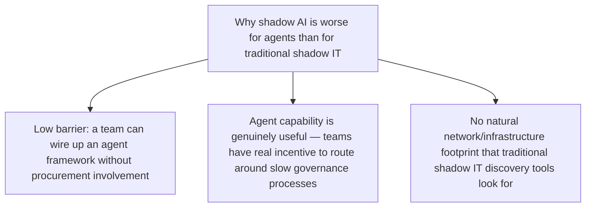
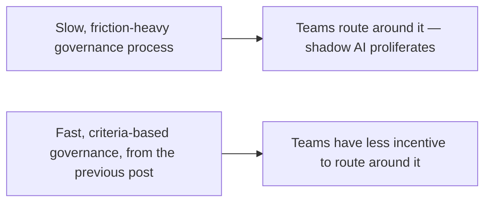

82% of enterprises, per current research, already have AI agents or workflows their security team wasn't aware of — a striking figure to close this week's governance stretch on, because every framework covered this week (compliance boundaries, oversight patterns, audit logging) is worthless for a system nobody knows exists. Closing this stretch with the practical discovery process this finding demands, before any of the governance covered earlier this week can actually apply.

## Why Shadow AI Proliferates Specifically With Agentic Tools



Traditional shadow IT discovery (network scanning, SaaS spend audits) doesn't reliably surface a team's internally-built agent wired up to call an LLM API directly with a personal or team credit card, using open-source frameworks with no procurement trail at all — which is exactly the profile of a meaningful fraction of the 82% figure, and exactly why standard shadow-IT discovery tooling misses it.

## A Discovery Process That Actually Works for This

```python
def shadow_ai_discovery_signals() -> list[dict]:
    return [
        {"signal": "LLM API traffic on the network", "method": "network egress monitoring for known LLM provider endpoints"},
        {"signal": "Unusual API spend on personal/team cards", "method": "expense report pattern matching against known LLM provider billing"},
        {"signal": "New MCP server registrations outside the official registry", "method": "DNS/service discovery scanning for MCP-protocol traffic"},
        {"signal": "Self-reported, amnesty-based survey", "method": "explicit, no-penalty disclosure process — often the highest-yield signal"},
    ]
```

The **amnesty-based survey** deserves emphasis — teams that built an unsanctioned agent to solve a real problem, under governance friction too slow for their actual need, are unlikely to voluntarily disclose it if disclosure carries punitive consequences. An explicit amnesty period (disclose now, no penalty, help us bring this under proper governance) consistently surfaces more shadow AI than technical discovery methods alone, because it removes the disincentive to admit what technical discovery would eventually find anyway.

## What Governance-as-Enabler, From the Previous Post, Actually Fixes This



This closes the loop on the previous post's argument directly — shadow AI isn't purely a discipline or awareness problem, it's frequently a rational response to governance friction that's slower than a team's actual need. The deployment-velocity argument from the previous post is also a direct shadow-AI mitigation: a governance process fast enough to clear legitimate requests promptly removes much of the incentive that drives teams to build around it in the first place.

## Bringing Discovered Shadow AI Into Governance, Not Just Shutting It Down

```python
def handle_discovered_shadow_agent(agent: dict) -> str:
    if agent["is_actively_valuable_to_the_business"]:
        return "bring_under_governance"  # register, review, retrofit compliance infrastructure per this week's posts
    return "sunset_with_transition_plan"  # phased deprecation, per the skill-deprecation lifecycle from earlier this year
```

A discovered shadow agent that's genuinely delivering value shouldn't be reflexively shut down — that punishes exactly the initiative that produced something useful, and it recreates the incentive to hide the next one better. Bringing it under governance (the retrofit process covered earlier this week for teams facing compressed compliance timelines) is usually the better outcome, reserving the sunset path for shadow agents that turn out not to be worth the governance investment once properly assessed.

## Key Takeaways

1. **82% of enterprises reportedly have undiscovered agentic AI — a figure that makes every other governance topic this week moot until discovery happens first**
2. **Standard shadow-IT discovery tooling misses much of this** — agentic tools have a fundamentally different footprint than traditional shadow IT
3. **Amnesty-based self-disclosure consistently outperforms purely technical discovery** — it removes the disincentive to admit what would eventually be found anyway
4. **Fast, criteria-based governance (from the previous post) directly reduces the incentive that drives shadow AI in the first place** — discovery and prevention are connected, not separate problems

---

*Part of the [Agentic Trust series](/tags/agentic-trust-series/) — evaluation, security, and governance for agentic AI at real-world scale.*
