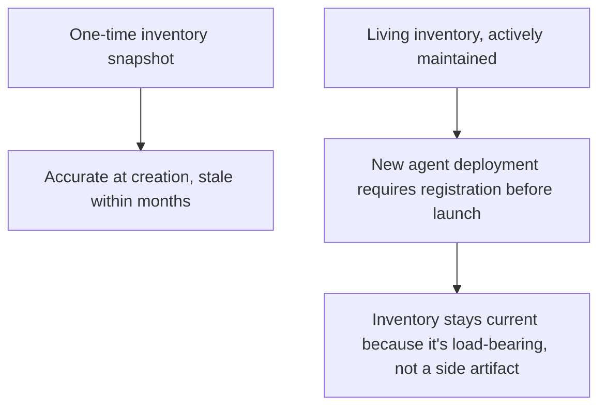

Last week closed with discovering shadow AI. Discovery alone doesn't govern anything — every discovered agent, alongside every already-sanctioned one, needs to land in a structured inventory before the compliance boundaries, oversight patterns, and audit requirements covered throughout this series can actually be applied and tracked systematically, rather than each governance conversation starting from "wait, what do we actually have."

## What the Inventory Actually Needs to Capture

```python
@dataclass
class AgentInventoryEntry:
    agent_id: str
    owning_team: str
    business_function: str
    performs_high_risk_function: bool  # per this week's compliance-boundary post
    delegation_chain_position: str  # entry point, intermediate, or terminal in an A2A chain
    data_access_scope: list[str]
    oversight_pattern: str  # which of the three Article 14 patterns from earlier this week
    last_access_audit: datetime
    compliance_documentation_status: str  # complete, partial, missing
    discovered_via: str  # "sanctioned_deployment" or "shadow_ai_discovery"
```

This is the MCP server registry pattern from earlier this year, generalized from tool servers specifically to every agent in the organization — the same rationale applies: past a certain scale, "what exists, who owns it, what can it do" is unanswerable without a structured, actively maintained inventory, and every governance activity covered this series depends on that question having a real answer.

## Why This Needs to Be a Living Inventory, Not a One-Time Audit



A one-time inventory exercise, however thorough, degrades the same way any unmaintained documentation does — new agents get built after the snapshot and never get added. Making inventory registration a genuine prerequisite for deployment (not a courtesy step teams can skip under deadline pressure) is what keeps it current, connecting directly to the governance-as-enabler argument from last week: a fast, lightweight registration step is a small cost relative to the deployment approval process it's part of.

## Using the Inventory to Drive Every Other Governance Activity

```python
def inventory_driven_governance_tasks(inventory: list[AgentInventoryEntry]) -> dict:
    return {
        "overdue_access_audits": [a for a in inventory if audit_overdue(a.last_access_audit)],
        "high_risk_agents_missing_documentation": [
            a for a in inventory if a.performs_high_risk_function and a.compliance_documentation_status != "complete"
        ],
        "shadow_discovered_not_yet_governed": [a for a in inventory if a.discovered_via == "shadow_ai_discovery"
                                                 and a.compliance_documentation_status == "missing"],
    }
```

This is what makes the inventory the actual operational hub for everything else covered this month, rather than a static reference document — every governance task (the recurring access audit from two weeks ago, the compliance documentation requirements covered later this week) becomes a queryable, trackable work item against the inventory, rather than a periodic manual sweep that has to rediscover the same information each time.

## Key Takeaways

1. **Discovery (last week's shadow AI post) and governance (this week) are connected by a structured inventory** — neither functions without it
2. **Generalize the MCP server registry pattern from earlier this year to every agent**, not just tool servers — the same "what exists, who owns it" problem applies at the same scale
3. **Make inventory registration a genuine deployment prerequisite**, not an optional courtesy step, to keep it current rather than stale within months
4. **Use the inventory as the operational hub driving every other governance task**, not a static reference — overdue audits, missing documentation, and ungoverned shadow discoveries should all be queryable against it directly

---

*Part of the [Agentic Trust series](/tags/agentic-trust-series/) — evaluation, security, and governance for agentic AI at real-world scale.*
