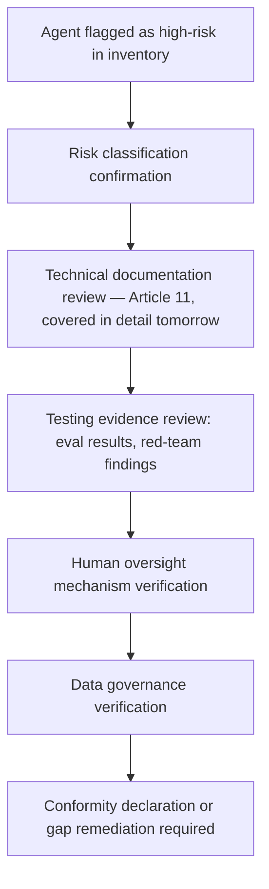
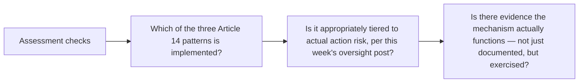

The EU AI Act's conformity assessment requirement for high-risk systems, referenced throughout this series without a concrete walkthrough, is the formal process demonstrating a system meets the Act's requirements before deployment. Using the agent inventory entry from the previous post as the concrete starting point, this walks through what the assessment actually involves for an agentic system specifically.

## The Assessment Stages



## Risk Classification Confirmation

Before anything else, the assessment confirms the inventory's `performs_high_risk_function` flag is actually correct — a genuine determination, not just accepting the initial classification, since misclassifying a high-risk function as lower-risk (whether through oversight or motivated reasoning to avoid the assessment burden) is itself a compliance failure the assessment process is meant to catch.

## Testing Evidence Review, Connected to This Series' Evaluation Coverage

```python
def conformity_testing_evidence(agent: AgentInventoryEntry) -> dict:
    return {
        "eval_results": get_golden_dataset_results(agent.agent_id),  # from earlier this year's eval posts
        "production_reliability_data": get_production_dashboard_data(agent.agent_id),  # from this month's week 1
        "red_team_findings": get_red_team_history(agent.agent_id),  # from earlier this year
        "regression_test_coverage": get_regression_test_summary(agent.agent_id),
    }
```

This is where every evaluation practice covered throughout this blog directly becomes assessment evidence — a system with a mature golden dataset, ongoing production reliability monitoring (this month's opening week), and a red-teaming track record walks into conformity assessment with concrete, already-existing evidence, rather than needing to construct testing evidence from scratch under assessment deadline pressure.

## Human Oversight Mechanism Verification



The last check — evidence the oversight mechanism has actually been exercised, not just theoretically exists — connects to the kill-switch testing discipline from earlier this year: a documented but never-tested emergency override is exactly the kind of gap a rigorous conformity assessment should catch, the same way that earlier post argued for periodic kill-switch drills specifically because untested emergency infrastructure is a real risk in its own right.

## What Happens When the Assessment Finds a Gap

```python
def handle_assessment_gap(gap: dict, agent: AgentInventoryEntry) -> str:
    if gap["severity"] == "blocking":
        return "deployment_blocked_until_remediated"
    if gap["severity"] == "moderate":
        return "conditional_approval_with_remediation_timeline"
    return "noted_for_next_review_cycle"
```

Not every gap found during assessment should block deployment outright — this connects to the risk-tiering discipline from earlier this week, distinguishing gaps serious enough to genuinely block from ones that warrant a documented remediation plan with a timeline, which is both more realistic for a team under real delivery pressure and, done properly with genuine follow-through, still a defensible position for an external auditor to review.

## Key Takeaways

1. **Conformity assessment starts with re-confirming risk classification**, not accepting the initial inventory flag uncritically
2. **Testing evidence review directly consumes eval, production monitoring, and red-team data this blog has covered as ongoing practice all year** — mature practice means assessment evidence already exists rather than needing to be constructed under deadline pressure
3. **Human oversight verification should confirm the mechanism has actually been exercised**, not just documented — an untested override mechanism is a real gap, the same lesson as the kill-switch testing post
4. **Not every finding should block deployment** — tiered remediation timelines are both realistic and defensible when genuinely followed through

---

*Part of the [Agentic Trust series](/tags/agentic-trust-series/) — evaluation, security, and governance for agentic AI at real-world scale.*
