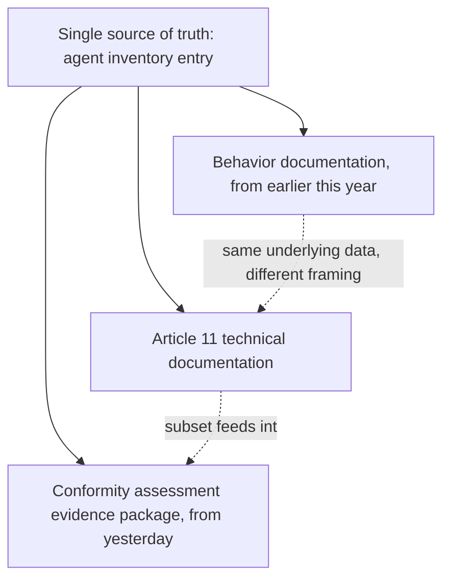

Article 11's technical documentation requirement — referenced but not detailed in yesterday's conformity assessment walkthrough — is the specific artifact an engineer actually has to produce, distinct from the testing evidence and oversight verification covered yesterday. This maps it directly to the behavior-documentation format this blog established earlier this year for compliance purposes generally, now made concrete against the Act's specific required content.

## What Article 11 Actually Requires, Mapped to Existing Format

```markdown
## Technical Documentation: [Agent Name] — Article 11 Mapping

### System Description (Article 11 requirement)
[General description of the system, intended purpose — this maps
directly to the role-definition format from last month's digital
workforce posts: scope, decision authority, reporting relationship]

### Design Specifications
[Architecture, including the delegation chain position from this
week's compliance-boundary post, and which oversight pattern from
Article 14 is implemented]

### Development Process
[This is new relative to the earlier behavior-documentation format —
requires describing HOW the system was built and validated, not just
what it currently does]

### Monitoring, Functioning, and Control
[This maps to the production reliability dashboard from this month's
opening week, and the ongoing access audit cadence from two weeks ago]

### Risk Management Measures
[Maps to the threat model from earlier this year, kept current per
the recurring red-team cadence]
```

## The Genuinely New Requirement: Development Process Documentation

```python
def development_process_documentation(agent: AgentInventoryEntry) -> dict:
    return {
        "training_or_configuration_history": get_prompt_and_model_version_history(agent.agent_id),  # from earlier this year's change-management post
        "validation_methodology": describe_eval_and_red_team_process(agent.agent_id),
        "known_limitations_discovered_during_development": get_documented_limitations(agent.agent_id),
    }
```

This is the one piece of Article 11 without a direct precedent in this blog's earlier behavior-documentation format, which focused on current-state claims (what the system does now) rather than developmental history — the prompt and model version history from earlier this year's change-management post is the closest existing infrastructure, and it needs explicit framing as development-process evidence, not just an operational changelog, to satisfy this specific requirement.

## Keeping This Current Without Duplicating Effort



The practical engineering lesson: don't maintain Article 11 documentation as a separate artifact duplicating the behavior documentation and inventory data already covered this series — generate it as a formatted view over the same underlying source of truth, the same way the conformity assessment evidence package from yesterday pulls from existing eval and monitoring data rather than requiring separately-authored assessment documentation.

## Why This Matters for Keeping Documentation Actually Current

```python
def documentation_staleness_risk(maintained_separately: bool) -> str:
    if maintained_separately:
        return "High risk — Article 11 docs drift from actual system behavior the same way any unmaintained doc does, per this blog's earlier drift-detection posts"
    return "Low risk — generated from live source data, inherits the currency of the underlying inventory and behavior documentation"
```

This is a direct application of the spec-drift and documentation-drift discussion from earlier this year — Article 11 documentation maintained as a separate, hand-written artifact will drift from actual system behavior the same way any disconnected documentation does, and generating it from the same live sources already covered this series is the concrete mitigation.

## Key Takeaways

1. **Article 11 requirements map substantially onto the behavior-documentation format and agent inventory already covered this series** — this isn't a wholly new documentation burden
2. **Development process documentation is the genuinely new piece**, requiring explicit framing of existing change-history data as developmental evidence, not just an operational changelog
3. **Generate Article 11 documentation as a formatted view over existing source-of-truth data**, not a separately-maintained artifact — this is what keeps it current
4. **Separately-maintained compliance documentation drifts from reality the same way any disconnected documentation does** — the fix is structural (single source of truth), not more diligent manual updating

---

*Part of the [Agentic Trust series](/tags/agentic-trust-series/) — evaluation, security, and governance for agentic AI at real-world scale.*
