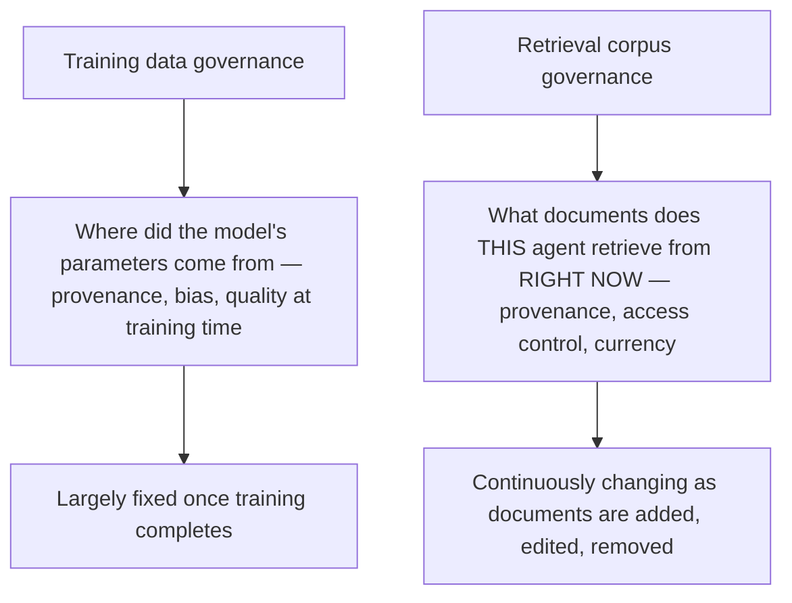

The Act's data governance requirements were largely conceived around training data — where a model's parameters actually come from. A RAG-backed agentic system, the architecture this blog has covered extensively all year, has a second, distinct data surface: the retrieval corpus, which shapes what the system actually says in a given interaction just as directly as training data shapes underlying model behavior, and needs its own explicit data governance treatment this series hasn't yet worked through directly.

## Why the Retrieval Corpus Needs Its Own Governance Treatment



Training data governance is a largely one-time (or infrequent, for fine-tuning) concern — evaluate provenance and quality at training time, done until the next training run. A retrieval corpus is continuously changing, per the [handling stale documents post](/posts/handling-stale-documents-live-knowledge-base/) from earlier this year, which means data governance for it can't be a one-time assessment — it needs the same ongoing discipline as the corpus itself.

## Applying This Series' Framework to the Retrieval Corpus Specifically

```python
def retrieval_corpus_data_governance(corpus: dict) -> dict:
    return {
        "provenance_tracked": check_source_attribution_exists(corpus),  # every document traceable to its source
        "access_control_current": verify_acl_sync_with_source_systems(corpus),  # from earlier this year's access-control post
        "pii_handling_current": verify_redaction_pipeline_active(corpus),  # from earlier this year's PII redaction post
        "staleness_within_policy": check_document_freshness_against_policy(corpus),  # from the staleness post
        "removed_documents_actually_removed": verify_deletion_propagation(corpus),  # not just marked inactive
    }
```

Every one of these checks maps to infrastructure this blog already covered for entirely operational reasons earlier this year — the genuine new requirement isn't new engineering, it's treating this existing infrastructure explicitly as data governance evidence for a high-risk agentic system, the same "operational practice doubles as compliance evidence" pattern established repeatedly across this series.

## The Compliance-Specific Addition: Corpus Change Audit Trail

```mermaid
flowchart LR
    A[Document added/modified/removed from corpus] --> B{Logged with who/when/why?}
    B -->|Yes| C[Satisfies data governance audit requirement]
    B -->|No, silent corpus changes| D[Gap — a regulator asking "why did the agent say X" can't trace it to a specific corpus state]
```

This is the one piece not fully covered by this blog's earlier RAG posts, which focused on staleness and quality rather than audit trail specifically — a corpus change log (what was added, when, by whom, and ideally why) is what lets an investigation trace a specific agent response back to the specific corpus state that produced it, the same request-level traceability principle from earlier this year applied to the corpus itself rather than just the request path.

```python
def log_corpus_change(document_id: str, change_type: str, actor: str, reason: str = ""):
    corpus_audit_log.append({
        "document_id": document_id, "change_type": change_type,  # added/modified/removed
        "actor": actor, "reason": reason, "timestamp": time.time(),
    })
```

## Why This Matters More for Agentic Systems Than for a Static Model

A RAG-backed agent's behavior can change meaningfully from one week to the next purely because the retrieval corpus changed, with no model or prompt update at all — which means data governance for the corpus is doing real, ongoing compliance work that training-data governance alone, evaluated once, structurally cannot cover for a system architected this way.

## Key Takeaways

1. **The Act's data governance obligations, largely conceived around training data, need explicit extension to a continuously-changing retrieval corpus for RAG-backed agents**
2. **This series' existing RAG infrastructure (provenance, access control, PII handling, staleness management) already covers most of the substantive requirement** — the work is recognizing it as governance evidence, not building new infrastructure
3. **A corpus change audit trail is the genuinely new piece** — without it, a specific agent response can't be traced back to the corpus state that produced it
4. **A RAG-backed agent's behavior can shift meaningfully from corpus changes alone**, with no model or prompt update — making ongoing corpus governance a real, continuous compliance requirement, not a one-time assessment

---

*Part of the [Agentic Trust series](/tags/agentic-trust-series/) — evaluation, security, and governance for agentic AI at real-world scale.*
