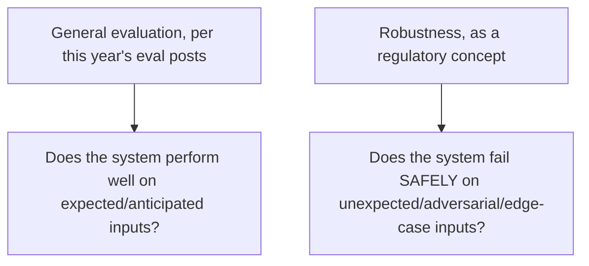

The Act names robustness explicitly among the high-risk obligations activated in August, alongside risk management and human oversight covered earlier this week. This is worth its own treatment because "robustness" as a regulatory term carries a somewhat different, more specific expectation than the general evaluation and red-teaming discipline this blog has covered all year — worth distinguishing precisely rather than assuming existing practice automatically satisfies it.

## Robustness vs. General Evaluation: The Distinction



This blog's evaluation posts throughout the year — golden datasets, production sampling, human-in-the-loop review — largely measure performance on the input distribution the system is expected to handle. Robustness, as the Act frames it, is specifically about behavior *outside* that expected distribution: does the system degrade gracefully, or does it fail in a way that produces harmful or unpredictable output when it encounters something genuinely unanticipated.

## What Regulatory-Grade Robustness Testing Actually Adds

```python
def robustness_test_suite(agent: AgentInventoryEntry) -> dict:
    return {
        "adversarial_input_handling": test_against_known_injection_patterns(agent),  # from earlier this year's jailbreak defense posts
        "graceful_degradation_under_load": test_behavior_at_capacity_limits(agent),  # from earlier this year's load-testing post
        "out_of_distribution_input_handling": test_against_genuinely_novel_inputs(agent),  # distinct from standard eval
        "failure_mode_containment": verify_sandboxing_and_kill_switch_function(agent),  # from earlier this year
    }
```

Three of these four map directly to infrastructure already covered this series — adversarial handling to jailbreak defense, load behavior to the load-testing post, failure containment to sandboxing and kill switches. The genuinely distinct piece is **out-of-distribution input handling**: deliberately testing with inputs constructed to be unlike anything in the golden dataset or production history, checking specifically for graceful degradation (a clear "I can't handle this confidently" response) rather than a confident, wrong response.

## Constructing Out-of-Distribution Test Cases Deliberately

```mermaid
flowchart LR
    A[Golden dataset: represents expected distribution] --> B[OOD test set: deliberately constructed to be UNLIKE the golden dataset]
    B --> C[Success criterion is different: not "correct answer" but "recognizes its own uncertainty"]
```

This requires a genuinely different construction process than the golden dataset covered earlier this year — rather than sampling from real production traffic (which by definition represents the expected distribution), OOD test cases need to be deliberately constructed to fall outside it: malformed structured input, requests combining unrelated domains in ways that wouldn't occur naturally, inputs in unexpected languages or formats. The evaluation criterion also differs: success isn't a correct answer, it's the system correctly recognizing it's outside its confident operating range and degrading safely rather than confabulating.

## Why This Connects to the Governance-as-Enabler Argument From Last Week

```python
def robustness_evidence_supports_deployment_confidence(test_results: dict) -> str:
    if test_results["graceful_degradation_rate"] > ROBUSTNESS_THRESHOLD:
        return "Strong evidence supporting deployment into higher-stakes scenarios with confidence"
    return "Gap identified — addressing this specifically unlocks broader deployment scope"
```

This is a direct, concrete instance of last week's governance-as-enabler argument — demonstrated robustness (the system fails safely, not just performs well on expected inputs) is exactly the kind of evidence that gives an organization genuine confidence to expand an agent's deployment scope into higher-stakes scenarios, distinct from and complementary to the general eval-score confidence this blog has argued for throughout the year.

## Key Takeaways

1. **Regulatory robustness is distinct from general evaluation performance** — it's specifically about safe failure on unexpected inputs, not performance on the expected distribution
2. **Three of the four robustness testing components map to infrastructure already covered this series** — adversarial handling, load behavior, and failure containment
3. **Out-of-distribution test construction is the genuinely new practice**, requiring deliberately atypical inputs and a different success criterion: safe degradation, not correctness
4. **Demonstrated robustness is direct evidence supporting confident deployment into higher-stakes scenarios**, connecting concretely to last week's governance-as-enabler argument

---

*Part of the [Agentic Trust series](/tags/agentic-trust-series/) — evaluation, security, and governance for agentic AI at real-world scale.*
