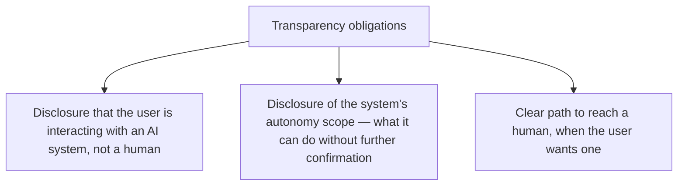
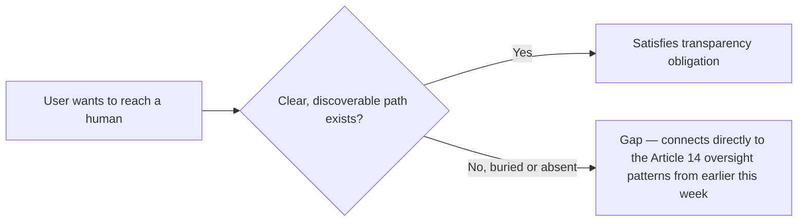

Last month's post on delegated shopping-agent autonomy argued that autonomy policy should be user-legible, framing it as good practice with an emerging regulatory dimension. This week's Article-by-article walkthrough reaches that regulatory dimension directly — transparency obligations under the Act specify concretely what a user is owed to know when interacting with an agentic system, converting what was framed as good practice into an explicit compliance requirement.

## What Transparency Actually Requires, Concretely



**Disclosure of interacting with AI** is the most familiar transparency requirement, already common practice across most 2026 deployments. **Disclosure of autonomy scope** is the requirement that connects directly to last month's shopping-agent post — a user delegating purchasing authority is specifically owed clarity about what that agent can do without asking again, not just that it's an AI system in the abstract.

## Implementing Autonomy Scope Disclosure Concretely

```python
def autonomy_disclosure_ui(agent_role: AgentRoleDefinition) -> dict:
    return {
        "disclosure_text": f"This assistant can {describe_autonomous_actions(agent_role)} "
                             f"without asking you first. It will always ask before "
                             f"{describe_escalated_actions(agent_role)}.",
        "policy_detail_link": get_full_policy_page(agent_role),  # the user-configurable policy from last month's post
    }
```

This directly operationalizes the "user should be able to see and adjust their own autonomy policy" argument from last month — what was framed there as good UX practice is, per this week's regulatory reading, closer to an actual obligation for any high-risk-adjacent agentic interaction, not an optional transparency nicety a team could reasonably deprioritize.

## The Human-Access-Path Requirement, Connected to Article 14



This connects the transparency requirement to the human oversight patterns covered earlier this week — Article 14's oversight mechanisms (pre-action approval, real-time monitoring, post-hoc review) are largely internal, system-side controls; the transparency obligation adds the user-facing complement, ensuring a human on the *user's* side of the interaction has a clear path to a human on the *system's* side, not just that internal oversight mechanisms exist somewhere in the architecture.

## Designing This Without Making Every Interaction Feel Like a Legal Disclaimer

```python
def progressive_transparency_disclosure(interaction_context: dict) -> str:
    if interaction_context["is_first_interaction"]:
        return "full_disclosure"  # complete autonomy scope explanation
    if interaction_context["involves_new_action_type"]:
        return "contextual_disclosure"  # just the relevant new capability
    return "minimal_persistent_indicator"  # ongoing subtle reminder, not repeated full disclosure
```

The practical UX challenge, given this obligation applies broadly: satisfying transparency requirements without degrading the interaction into a repeated wall of legal disclaimer text on every turn. Progressive disclosure — full detail on first interaction and when genuinely new capability is introduced, a minimal persistent indicator otherwise — satisfies the substantive obligation without the UX cost of full disclosure repeated on every single turn.

## Key Takeaways

1. **Transparency obligations convert last month's "good UX practice" argument for autonomy-scope disclosure into an explicit compliance requirement**
2. **Users are owed clarity on autonomy scope specifically — what the agent can do without asking again**, not just that they're talking to an AI in the abstract
3. **The human-access-path requirement is the user-facing complement to Article 14's system-side oversight mechanisms** — both need to exist, connected
4. **Progressive disclosure (full detail on first interaction and genuinely new capability, minimal indicator otherwise) satisfies the obligation without degrading every interaction into a wall of legal text**

---

*Part of the [Agentic Trust series](/tags/agentic-trust-series/) — evaluation, security, and governance for agentic AI at real-world scale.*
