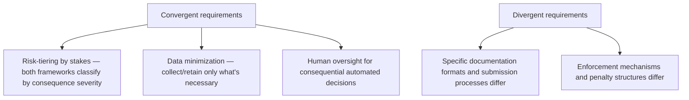
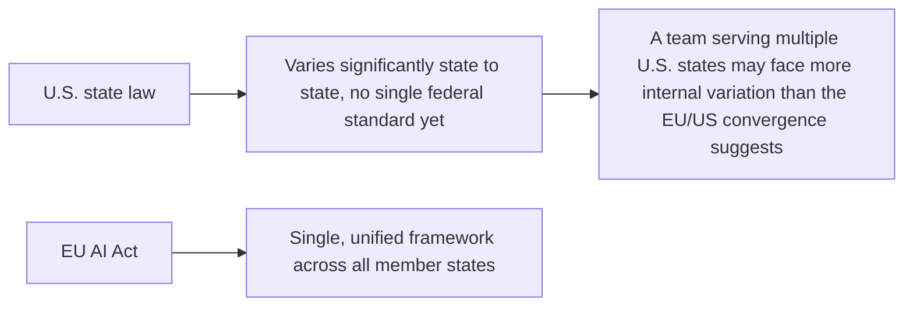

For a team building agentic systems that serve both EU and U.S. users, the instinct is to assume two largely separate compliance regimes requiring duplicated effort. Current legal analysis identifies real, specific convergence between the EU AI Act's risk tiers, GDPR-style data minimization principles, and emerging U.S. state-level AI legislation — worth understanding precisely, because it meaningfully reduces (without eliminating) the actual multi-jurisdiction engineering burden.

## Where the Convergence Is Real



The convergence is strongest at the architectural level — a system built around risk-tiered oversight (this week's Article 14 patterns), minimized data retention (the access-control and PII posts from earlier this year), and documented human escalation paths satisfies the *substance* of both frameworks' core principles, even though the specific documentation format, submission process, and enforcement mechanism differ meaningfully between jurisdictions.

## What This Means Practically for Architecture Decisions

```python
def multi_jurisdiction_architecture_strategy() -> dict:
    return {
        "build_once": [
            "risk-tiered escalation policy (Article 14 patterns + emerging US state requirements)",
            "data minimization and retention infrastructure (GDPR-aligned, transferable)",
            "audit logging and behavior documentation (format-adaptable to either jurisdiction)",
        ],
        "build_per_jurisdiction": [
            "specific documentation formatting and submission process",
            "jurisdiction-specific disclosure text and consent language",
        ],
    }
```

This is the practical payoff of the convergence finding: the substantive engineering work — the actual risk-tiering, data minimization, and oversight infrastructure covered throughout this series — is largely shared across jurisdictions, while the genuinely jurisdiction-specific work (documentation formatting, specific disclosure language) is a comparatively thin layer on top, not a full duplicate build.

## Where the Convergence Breaks Down and Real Divergence Remains



The convergence argument applies most cleanly to a comparison between the EU framework and any single U.S. state's emerging legislation — it applies less cleanly across the full patchwork of different U.S. state approaches, which don't converge as neatly with each other as leading state frameworks converge with the EU Act's principles. A team serving users across many U.S. states may face more real internal variation than the EU/U.S. comparison alone suggests.

## Designing for This Reality

```python
def jurisdiction_aware_compliance_config(agent: AgentInventoryEntry) -> dict:
    return {
        "shared_architecture": get_risk_tiered_oversight_config(agent),  # one implementation, serves all jurisdictions
        "jurisdiction_specific_overlays": {
            "EU": get_eu_specific_disclosure_and_documentation(agent),
            "US_CA": get_california_specific_requirements(agent),
            "US_CO": get_colorado_specific_requirements(agent),
            # additional states as their frameworks mature
        },
    }
```

The practical architecture pattern: one shared, substantive compliance infrastructure layer (the actual risk-tiering, oversight, and data governance covered throughout this series), with thin, jurisdiction-specific overlay configuration for the genuinely divergent pieces — documentation format, disclosure text, submission process — rather than maintaining fully separate compliance implementations per jurisdiction.

## Key Takeaways

1. **EU AI Act risk tiers, GDPR-style data minimization, and emerging U.S. state law converge substantially at the architectural level**, even though specific documentation and enforcement differ
2. **The substantive engineering work (risk-tiered oversight, data minimization, audit infrastructure) is largely shared across jurisdictions**, reducing real duplication
3. **The convergence is cleaner between the EU and any single U.S. state than across the full U.S. state patchwork**, which has more internal variation than the EU/U.S. comparison suggests
4. **Architect one shared compliance infrastructure layer with thin, jurisdiction-specific overlays**, rather than fully duplicating compliance implementations per jurisdiction

---

*Part of the [Agentic Trust series](/tags/agentic-trust-series/) — evaluation, security, and governance for agentic AI at real-world scale.*
