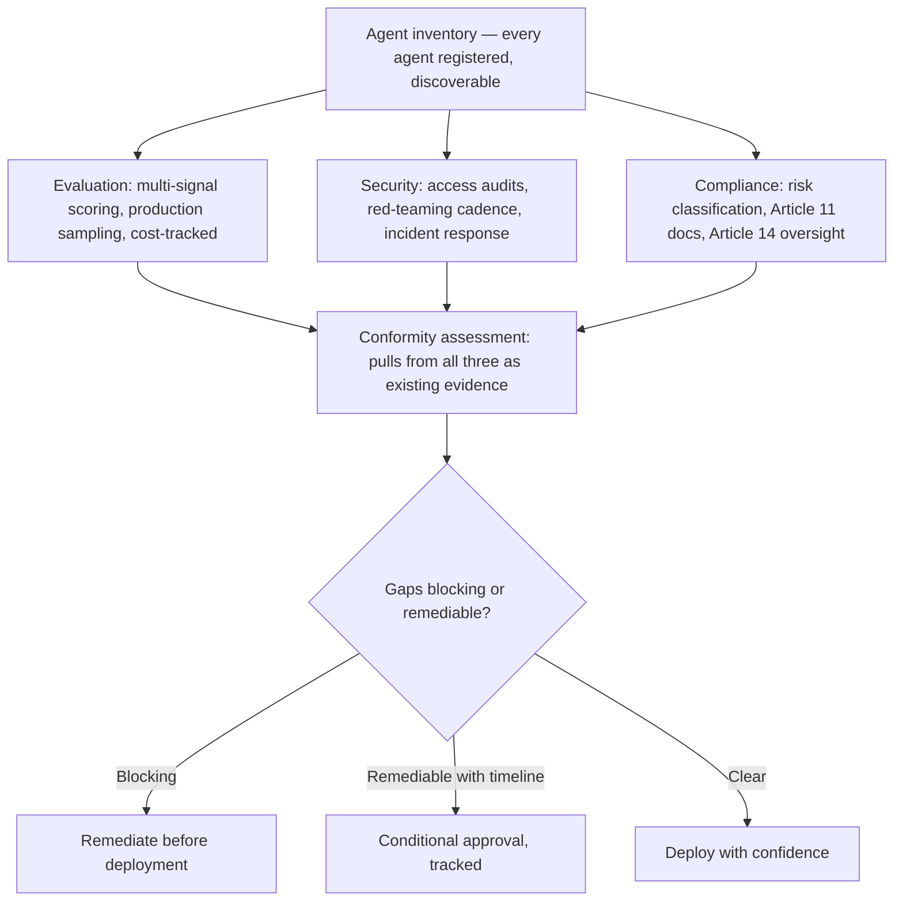
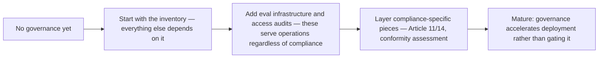

Three weeks of posts have covered individual pieces of agentic AI governance: the eval reality gap, real security incidents, the EU AI Act's specific obligations, and the governance-as-enabler principle tying them together. This assembles all of it into one coherent, end-to-end framework — the deliverable this stretch has been building toward, rather than a list of individually useful but disconnected practices.

## The Assembled Framework



## Why "Doesn't Slow Deployment" Is the Right Design Goal, Not an Afterthought

The governance-as-enabler post from two weeks ago established the actual mechanism: a framework that produces defined, defensible criteria moves *faster* than ad hoc decision-making, because it removes the repeated case-by-case litigation an absent framework forces. This assembled framework is designed with that mechanism as a first-class goal — every piece (the inventory, the evaluation infrastructure, the security practices) generates evidence that conformity assessment consumes directly, rather than assessment requiring separately-constructed evidence under deadline pressure.

## The Concrete Prerequisite Chain

```python
def deployment_readiness_pipeline(agent: AgentInventoryEntry) -> dict:
    return {
        "registered_in_inventory": True,  # prerequisite for everything else
        "eval_infrastructure_mature": check_eval_maturity(agent),  # week 1
        "access_audit_current": check_access_audit_recency(agent),  # week 2
        "risk_classified": agent.performs_high_risk_function is not None,  # week 3
        "article_11_documentation_current": check_doc_currency(agent),  # this week
        "article_14_oversight_implemented": agent.oversight_pattern is not None,  # this week
        "robustness_tested": check_robustness_test_coverage(agent),  # this week
    }
```

This function is the operational core of the framework — a single, checkable readiness state pulling from every piece covered across this stretch, rather than each governance activity existing as an independent silo a team has to separately remember to complete.

## What Teams at Different Maturity Stages Should Actually Do



This sequencing directly reflects the small-team prioritization discipline from earlier this week — a team without existing governance shouldn't attempt to build every piece simultaneously; starting with the inventory (since everything else depends on it) and the operationally-motivated pieces (eval, access audits, which serve teams regardless of compliance) builds toward compliance-specific infrastructure incrementally, arriving at the same end state as a larger organization but via a realistic, capacity-appropriate path.

## Key Takeaways

1. **This assembled framework connects three weeks of individually useful practices into one coherent pipeline**, where each piece generates evidence the next piece consumes directly
2. **"Doesn't slow deployment" is a first-class design goal**, not a hoped-for side effect — achieved by having assessment consume existing evidence rather than requiring separately-constructed evidence under pressure
3. **A single, checkable deployment-readiness function is the operational core** — pulling from inventory, eval, security, and compliance pieces as one queryable state, not independent silos
4. **Teams at different maturity stages should sequence incrementally**, starting with the inventory and operationally-motivated pieces before layering compliance-specific infrastructure — the same realistic, capacity-appropriate path for teams of any size

---

*Part of the [Agentic Trust series](/tags/agentic-trust-series/) — evaluation, security, and governance for agentic AI at real-world scale.*
