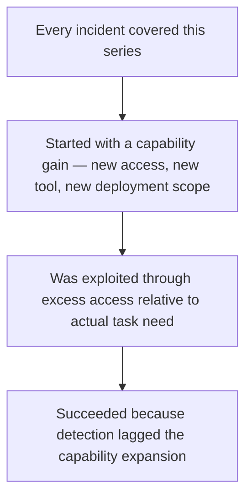
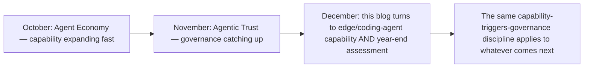

Closing out this month's series by looking back across everything covered — the OWASP 2026 findings, the M365 Copilot zero-click CVE, the nine-agency Mexican government breach, and the broader industry data (88% of enterprises with deployed agents reporting at least one security incident) — for the actual pattern connecting all of it, rather than treating each as an isolated case study.

## The Pattern, Stated Plainly



Every single incident this series examined in depth fits this same three-stage pattern: a real capability expansion (Copilot's cross-service reach, the scope of systems reachable by chained coding agents, the broad tool access covered in this year's earlier vertical-agent posts) happened before the corresponding access-scoping and detection infrastructure caught up to it. This isn't a coincidence across unrelated incidents — it's the structural signature of a fast-moving capability frontier outpacing a slower-moving governance response, which is exactly the dynamic this month's series has been documenting from every angle.

## Why This Pattern Is the Actually Actionable Finding

```python
def the_actionable_lesson() -> str:
    return (
        "Not 'add more security controls' in the abstract — specifically: "
        "whenever agent capability expands (new tool, new data source, new "
        "deployment scope, per last month's Agent Economy series), treat "
        "that expansion as automatically triggering the access-scoping and "
        "detection review this series covered, rather than reviewing "
        "security on a separate, slower schedule disconnected from capability changes."
    )
```

This directly resolves the tension between last month's Agent Economy series (which documented capability expanding rapidly — commerce, browsers, digital workforce, voice) and this month's Agentic Trust series (which documented security and governance struggling to keep pace) — the fix isn't slowing capability expansion, it's tying governance review triggers directly to capability expansion events, so the two move at the same speed instead of governance perpetually catching up after the fact.

## A Concrete Mechanism for Closing This Gap

```python
def capability_change_triggers_governance_review(change_event: dict) -> dict:
    return {
        "new_tool_added": trigger_access_scope_review(change_event),
        "new_data_source_connected": trigger_data_governance_review(change_event),
        "deployment_scope_expanded": trigger_conformity_reassessment(change_event),
        "new_delegation_partner_added": trigger_trust_registry_review(change_event),  # per A2A posts
    }
```

This is the concrete implementation of the lesson — wiring the inventory system from earlier this week to actually fire governance review triggers on capability-change events, rather than relying on a separate, calendar-based review cadence that structurally can't keep pace with how fast capability itself is expanding, per every trend covered in last month's series.

## What This Means Heading Into December



December's series turns to edge agents, coding agent maturity, and orchestration — more capability expansion, following the same pattern this month examined. The practical takeaway to carry forward: treat every new capability covered next month as an automatic governance-review trigger from day one, rather than repeating the lag pattern this month's incidents demonstrated at real, documented cost.

## Key Takeaways

1. **Every incident examined this series shares the same three-stage pattern**: capability expansion, followed by excess access relative to actual need, followed by detection lagging the expansion
2. **This is a structural pattern, not a coincidence across unrelated incidents** — a fast capability frontier outpacing a slower governance response
3. **The actionable fix is tying governance review directly to capability-change events**, not running governance on a separate, slower calendar-based cadence
4. **This lesson applies directly to whatever comes next** — including everything December's series covers — not just retrospectively to what's already happened

---

*Part of the [Agentic Trust series](/tags/agentic-trust-series/) — evaluation, security, and governance for agentic AI at real-world scale.*
