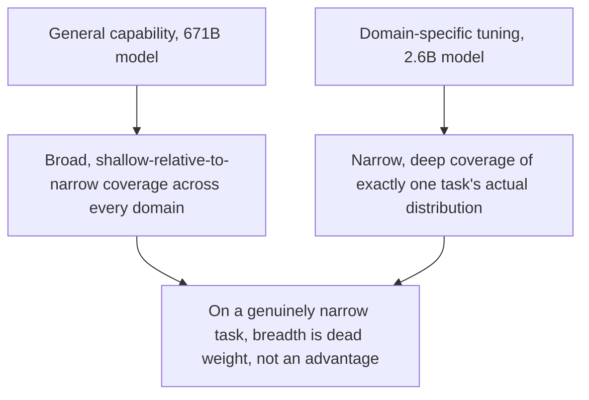
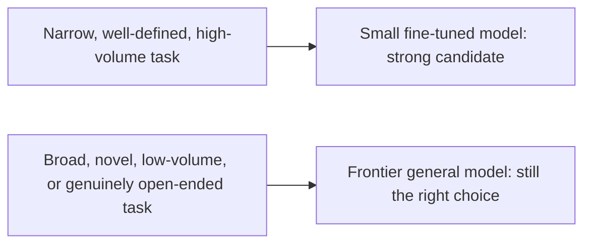

A documented 2026 result puts a 2.6B-parameter small language model ahead of a 671B-parameter model — over 250 times larger — on domain-specific tasks. This isn't a fluke or a cherry-picked benchmark; it's the concrete demonstration of something this blog's model-routing and capability-based-routing posts argued throughout the year: raw parameter count and task-specific performance are genuinely different axes, and for a narrow enough task, they can diverge dramatically.

## Why This Result Isn't Actually Surprising, Given Everything Else This Year



This is the vertical-agent thesis from October's series, restated at the model level instead of the system level — a general-purpose 671B model's vast capability is largely irrelevant weight for a narrow domain task, the same way a general-purpose agent's broad tool coverage is largely irrelevant weight for a narrow vertical use case. A 2.6B model fine-tuned specifically on the target domain's actual task distribution doesn't need to carry capability for the thousands of other domains it will never be asked about.

## The Mechanism: Fine-Tuning Concentrates Capacity Where It's Needed

```python
def why_small_fine_tuned_beats_large_general(task_type: str) -> dict:
    return {
        "large_general_model": {
            "capacity_allocated_to_this_task": "small fraction of total parameters, diluted across all domains",
            "in_context_learning_overhead": "must infer task-specific patterns fresh each time from prompt context",
        },
        "small_fine_tuned_model": {
            "capacity_allocated_to_this_task": "all parameters trained specifically toward this task distribution",
            "in_context_learning_overhead": "minimal — task patterns are baked into weights, not inferred per-call",
        },
    }
```

A frontier model handling a narrow task still has to do real work inferring the specific patterns of that task from in-context examples or instructions on every call — a small model fine-tuned specifically on that task's distribution has already encoded those patterns directly into its weights, at training time rather than inference time, which is both more reliable and dramatically cheaper per call.

## Where This Result Doesn't Generalize



This is the same caveat this blog's earlier distillation post made explicit — the result doesn't mean small models are broadly catching up to frontier capability across the board. It means that for the specific, narrow, well-defined tasks that make up a meaningful share of real production agentic workloads (per the vertical-agent evidence from October), the parameter-count intuition that "bigger is always better" was already wrong for this category of task, and this result makes that concrete with a striking, specific number.

## What This Sets Up for the Rest of This Week

The immediate practical question this raises — how small can a model go before this advantage disappears, and what determines the right size for a given task — is exactly where the rest of this week's posts go: sizing the sweet spot, hybrid local/cloud routing, and what's actually running on-device in production today.

## Key Takeaways

1. **A documented 2026 result shows a 2.6B model outperforming a 671B model on domain-specific tasks** — a concrete, striking demonstration, not a theoretical claim
2. **This is the vertical-agent thesis from October's series restated at the model level** — narrow, deep beats broad, shallow-relative-to-narrow for a sufficiently well-defined task
3. **Fine-tuning encodes task patterns into weights at training time**, avoiding the per-call in-context-learning overhead a general model pays on every request for the same narrow task
4. **This doesn't generalize to broad, novel, or genuinely open-ended tasks** — it's specifically true for the narrow, well-defined, high-volume task category this blog has argued dominates real production workloads

---

*Part of the [Road to 2027 series](/tags/road-to-2027-series/) — edge agents, coding agent maturity, orchestration, and where agentic AI stands as the year closes.*
