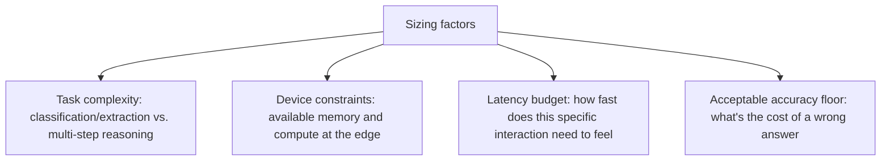
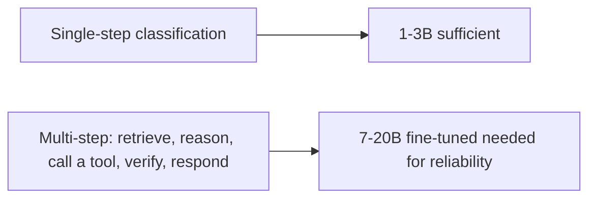

Industry consensus in 2026 puts the 1-3B parameter range as the practical sweet spot for edge deployment, with the 7-20B range — after fine-tuning — able to match GPT-4-class tool-use quality. Rather than treating this as a single number to target, this works through the actual factors that determine where a specific task falls within that range, extending yesterday's finding into a practical sizing framework.

## The Factors That Actually Determine Sizing



```python
def size_recommendation(task_complexity: str, device_memory_gb: float, latency_budget_ms: int) -> str:
    if task_complexity == "classification_or_extraction" and device_memory_gb >= 2:
        return "1-3B range — sufficient capacity, fits comfortably on-device"
    if task_complexity == "multi_step_tool_use" and device_memory_gb >= 8:
        return "7-20B range with fine-tuning — needed for reliable multi-step reasoning"
    if device_memory_gb < 2:
        return "Below 1-3B threshold — consider hybrid routing to cloud (tomorrow's post) rather than compromising the local model further"
    return "Task complexity exceeds what's reliably achievable at this device's memory budget — hybrid routing required"
```

## Classification and Extraction: Where 1-3B Genuinely Suffices

Tasks that map cleanly onto the earlier procurement and document-processing posts from October — structured extraction, classification, intent routing — are exactly where the 1-3B range holds up well, because these tasks don't require the deep multi-step reasoning that larger models' additional capacity primarily serves. This is the same "narrow, well-defined task" category from yesterday's post, now with a specific size range attached to it.

## Multi-Step Tool Use: Where 7-20B With Fine-Tuning Becomes Necessary



Multi-step agentic tasks — the ReAct-style reasoning loops covered in this blog's April cheatsheet post — genuinely benefit from more capacity, because each step in the loop compounds the risk of a reasoning error, and a model with less headroom is more likely to accumulate errors across steps. This is where the 7-20B range earns its larger footprint even at the edge, provided the device can actually support it.

## The Practical Sizing Process

```python
def practical_sizing_workflow(candidate_task: dict) -> dict:
    return {
        "step_1": "Classify task complexity honestly — resist the urge to default to a larger model 'just in case'",
        "step_2": "Identify actual device memory/compute constraints for the target deployment",
        "step_3": "Build a small eval set (per this blog's golden-dataset discipline) and test candidate sizes empirically",
        "step_4": "Choose the smallest size that clears your accuracy floor on that eval set — not the largest available",
    }
```

The last step matters as much as any technical factor — the instinct to default toward a larger model "to be safe" works against every cost and latency benefit edge deployment is meant to deliver, and it's worth resisting in favor of actually measuring whether the smaller size clears your specific accuracy bar, using the same eval discipline this blog has argued for all year rather than assuming size is a reliable proxy for adequacy.

## Key Takeaways

1. **1-3B suffices for classification and extraction tasks**; 7-20B with fine-tuning is needed for reliable multi-step tool-use reasoning
2. **Sizing should follow from task complexity and device constraints**, not a default assumption that bigger is always safer
3. **Multi-step reasoning loops compound error risk across steps**, which is specifically why they benefit from more model capacity even at the edge
4. **Measure empirically against your own eval set to find the smallest size that clears your accuracy floor** — the same discipline this blog has argued for all year, applied to model sizing specifically

---

*Part of the [Road to 2027 series](/tags/road-to-2027-series/) — edge agents, coding agent maturity, orchestration, and where agentic AI stands as the year closes.*
