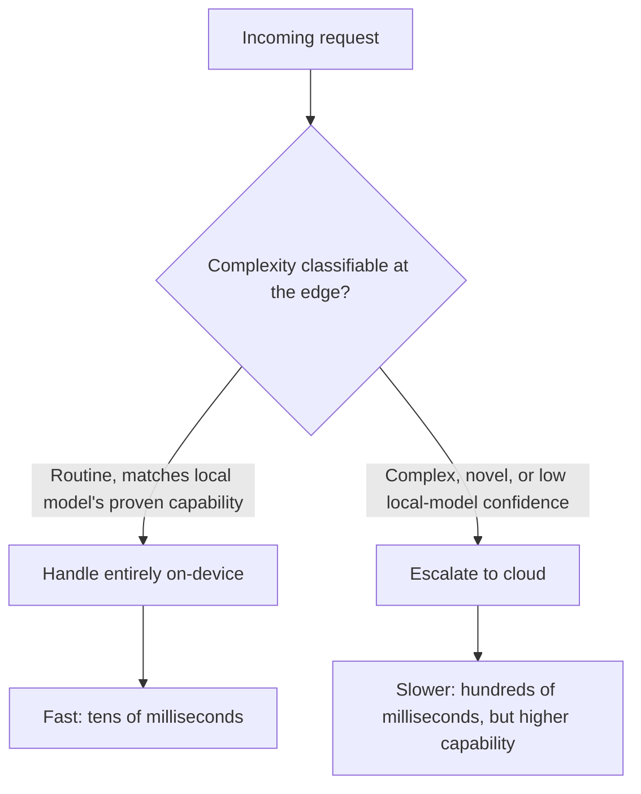
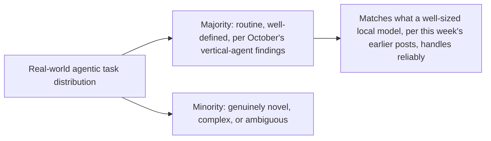

Multiple 2025-2026 practitioner reports converge on a similar figure: 80-90% of agentic tasks can be retained in an efficient local (on-device) lane under a well-designed hybrid architecture, with only the remaining 10-20% genuinely requiring cloud escalation. This extends the routing-policy and multi-vendor capability-routing posts from earlier this year to a new dimension of the same underlying decision: not just which model, but which *location* handles a given request.

## The Routing Decision, Extended



```python
def hybrid_route_decision(request: dict, local_model, confidence_threshold: float = 0.8) -> str:
    local_result = local_model.process(request, return_confidence=True)
    if local_result.confidence >= confidence_threshold:
        return "handled_locally"
    return "escalate_to_cloud"  # the cascade-routing pattern from earlier this year, applied to edge/cloud instead of cheap/expensive model
```

This is mechanically the same cascade-routing pattern from this blog's earlier model-routing posts — try the cheaper (here, local) option first, escalate on low confidence — applied to a new axis. The economics are similar too: most value comes from the majority case being handled at near-zero marginal cost (no network round trip, no per-token cloud API cost), with the cloud escalation reserved for the minority of requests that genuinely need it.

## Why 80-90% Is a Believable Figure, Not an Aspirational One



This figure is consistent with everything else covered this week and throughout this blog's Agent Economy series in October — if the majority of real production agentic tasks are narrow and well-defined (the vertical-agent thesis), and a properly-sized 1-3B or fine-tuned model handles narrow, well-defined tasks reliably (yesterday's sizing post), then a high local-handling rate is the expected outcome of good architecture, not an unusually optimistic industry claim.

## What Determines Whether You Actually Hit This Range

```python
def factors_determining_local_handling_rate() -> dict:
    return {
        "task_distribution_narrowness": "More narrow, well-defined tasks = higher local rate achievable",
        "local_model_sizing_quality": "Under-sized local model = artificially low confidence, more unnecessary escalation",
        "confidence_calibration": "Miscalibrated confidence scoring = either over-escalation (wasted cloud cost) or under-escalation (quality risk)",
    }
```

The confidence calibration point connects directly to the model-swap evaluation discipline from earlier this year — a local model whose confidence signal is poorly calibrated (systematically overconfident or underconfident) either escalates too often, losing the cost and latency benefit hybrid routing is meant to deliver, or too rarely, risking quality on cases that actually needed cloud-level capability. Calibrating this against your own eval set, not assuming the model's raw confidence output is trustworthy out of the box, is where most of the engineering effort in hitting this range actually goes.

## Key Takeaways

1. **Practitioner data puts 80-90% local-lane retention as achievable under well-designed hybrid architecture** — a believable figure given October's vertical-agent findings, not an aspirational one
2. **This is mechanically the same cascade-routing pattern from earlier this year's cost-optimization posts**, applied to edge/cloud location instead of cheap/expensive model tier
3. **The achievable local-handling rate depends on task distribution narrowness, local model sizing, and confidence calibration** — not a fixed property of the architecture alone
4. **Confidence calibration is where most of the real engineering effort goes** — a miscalibrated signal produces either wasted cloud cost or unacceptable quality risk

---

*Part of the [Road to 2027 series](/tags/road-to-2027-series/) — edge agents, coding agent maturity, orchestration, and where agentic AI stands as the year closes.*
