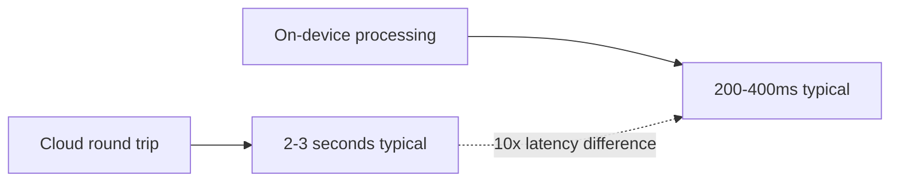
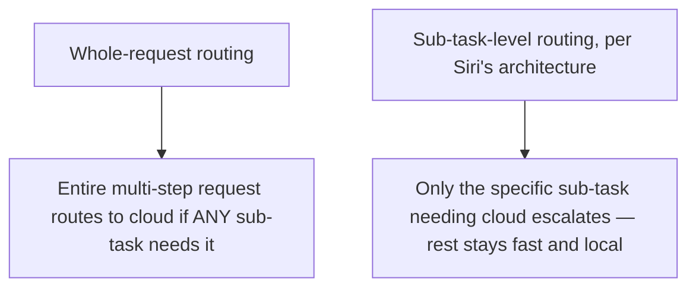

Apple's Siri, with the multi-step agentic capabilities introduced in iOS 26, is the most widely-deployed real-world instance of exactly the hybrid architecture this week's posts have covered in the abstract — running primarily on-device, with request decomposition, tool selection, and response generation happening locally, and only specific API calls requiring cloud connectivity. Worth examining as a concrete case study, since it's running at a scale (hundreds of millions of devices) that validates the architecture beyond any single enterprise deployment.

## The Latency Numbers That Make the Case



This roughly 10x latency reduction is the concrete, user-facing payoff of the hybrid architecture covered throughout this week — not an abstract engineering benefit, but the direct difference between an assistant that feels genuinely responsive and one with the perceptible lag that's defined voice assistant interactions for most of their history. This connects directly to the voice agent posts from October, where interruption handling and natural conversational timing depend on exactly this kind of latency reduction to feel right.

## What Specifically Runs Locally

```python
siri_local_pipeline = {
    "request_decomposition": "runs on-device — breaking a multi-step request into sub-tasks",
    "tool_selection": "runs on-device — deciding which capability handles which sub-task",
    "response_generation": "runs on-device — for the majority of interactions",
    "specific_api_calls": "cloud — only when a sub-task genuinely requires external data or cloud-scale capability",
}
```

This maps precisely onto the hybrid routing framework from earlier this week — the *reasoning about what to do* (decomposition, tool selection) stays local even when a specific sub-task's execution needs cloud access, which is a more granular application of the local-vs-cloud decision than routing an entire request wholesale. The orchestration happens locally; only the specific capability that genuinely needs cloud resources escalates.

## Why This Granularity Matters More Than Whole-Request Routing



A coarser, whole-request routing decision would send an entire multi-step task to the cloud if even one sub-step needed cloud capability, discarding the latency benefit for every other sub-step in that same request. Sub-task-level routing — decomposing first, locally, then routing each piece independently — preserves the local-lane speed benefit for the majority of sub-tasks even within a request that has one cloud-dependent component, which is a more sophisticated and more valuable implementation of this week's hybrid architecture than simple whole-request routing.

## What This Validates About the Rest of This Week's Posts

```python
def what_this_case_study_validates() -> list[str]:
    return [
        "The 1-3B-to-20B sizing framework from earlier this week is operating at real, massive consumer scale, not just enterprise pilots",
        "The 80-90% local-handling figure from yesterday's post is consistent with what a mainstream, widely-scrutinized consumer product achieves",
        "Sub-task-level routing granularity is worth the added engineering complexity over simpler whole-request routing",
    ]
```

## Key Takeaways

1. **Siri's iOS 26 architecture is a massive-scale, real-world validation of this week's hybrid edge/cloud routing framework**, not just an enterprise pattern
2. **The roughly 10x latency reduction (200-400ms vs 2-3 seconds) is the concrete, user-facing payoff** — directly relevant to the voice-agent interruption-handling work from October's series
3. **Reasoning and orchestration stay local even when a specific sub-task needs cloud resources** — a more granular, sub-task-level routing decision than routing an entire request wholesale
4. **This granularity is worth its added complexity** — it preserves the local-lane latency benefit for most of a multi-step request even when one component needs cloud escalation

---

*Part of the [Road to 2027 series](/tags/road-to-2027-series/) — edge agents, coding agent maturity, orchestration, and where agentic AI stands as the year closes.*
