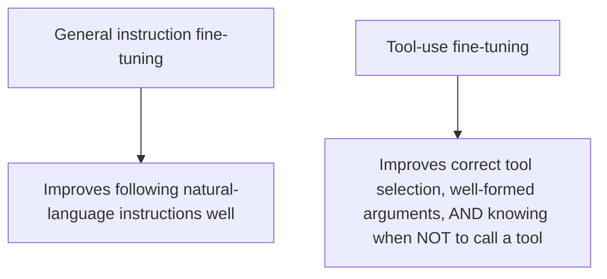
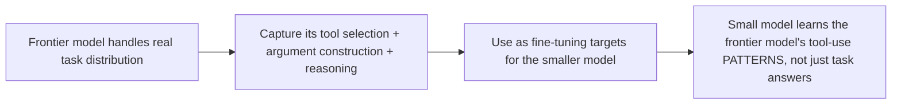

Earlier this week's sizing post named 7-20B models, after fine-tuning, as capable of matching GPT-4-class tool-use quality — a claim worth unpacking concretely, since "fine-tuning" covers a range of approaches and tool-use specifically has its own particular training considerations distinct from general instruction-following fine-tuning.

## Why Tool-Use Fine-Tuning Is a Distinct Problem From General Fine-Tuning



Tool-use quality has three distinct failure modes that general instruction fine-tuning doesn't specifically target: choosing the wrong tool for a task, malforming the arguments to an otherwise-correct tool choice (connecting to this blog's earlier function-calling error-recovery post), and — often underweighted in training data — failing to recognize when no tool call is needed at all, over-invoking a tool reflexively. Fine-tuning specifically for tool use needs training examples covering all three, not just examples of correct tool calls in isolation.

## Building the Fine-Tuning Dataset

```python
def tool_use_finetuning_dataset(base_task_distribution: list[dict]) -> list[dict]:
    dataset = []
    for example in base_task_distribution:
        dataset.append({
            "input": example["user_request"],
            "correct_tool_call": example["expected_tool_and_args"],
            "reasoning": example["why_this_tool_and_these_args"],  # chain-of-thought supervision improves generalization
        })
    # Explicitly include negative examples — requests that should NOT trigger any tool call
    dataset.extend(build_negative_examples(base_task_distribution))
    return dataset
```

This directly extends the distillation dataset construction from this blog's earlier small-model-distillation post — the same golden-dataset curation discipline applies, with the tool-use-specific addition of deliberately including negative examples (cases where the correct behavior is *not* calling a tool), since a fine-tuning set consisting only of positive tool-call examples will bias the resulting model toward over-invocation, the same over-invocation failure mode covered in this blog's earlier skill-testing posts.

## Distilling From a Frontier Model's Tool-Use Behavior Specifically



The distillation approach from September's post applies directly here — rather than only training toward correct final answers, capturing the frontier model's actual tool-selection reasoning as supervision teaches the smaller model the *pattern* of good tool-use decision-making, not just memorized correct answers for the specific training examples, which is what actually determines whether the fine-tuned model generalizes to tool-use scenarios outside its exact training distribution.

## Evaluating the Fine-Tuned Model's Tool-Use Quality Specifically

```python
def evaluate_tool_use_quality(model, eval_set: list[dict]) -> dict:
    return {
        "correct_tool_selection_rate": measure_tool_choice_accuracy(model, eval_set),
        "well_formed_argument_rate": measure_argument_validity(model, eval_set),
        "appropriate_non_invocation_rate": measure_correct_no_tool_cases(model, eval_set),  # the over-invocation check
        "compared_to_frontier_baseline": run_eval(model, eval_set)["avg"] - run_eval(frontier_model, eval_set)["avg"],
    }
```

This is the same skill invocation-testing discipline from this blog's earlier agent-skills posts, applied specifically to validate that fine-tuning actually closed the gap to frontier tool-use quality — not just producing a model that handles the happy path well, but one that correctly declines to invoke tools on the negative examples too.

## Key Takeaways

1. **Tool-use fine-tuning is a distinct problem from general instruction fine-tuning**, with three specific failure modes: wrong tool choice, malformed arguments, and over-invocation
2. **Include deliberate negative examples in the fine-tuning dataset** — training only on positive tool-call examples biases the model toward over-invocation
3. **Distill the frontier model's tool-selection reasoning, not just final answers**, to teach the pattern of good decision-making rather than memorized responses to specific training examples
4. **Evaluate specifically for appropriate non-invocation, not just correct-tool-call accuracy** — this is the check most likely to be skipped and most likely to reveal a real gap

---

*Part of the [Road to 2027 series](/tags/road-to-2027-series/) — edge agents, coding agent maturity, orchestration, and where agentic AI stands as the year closes.*
