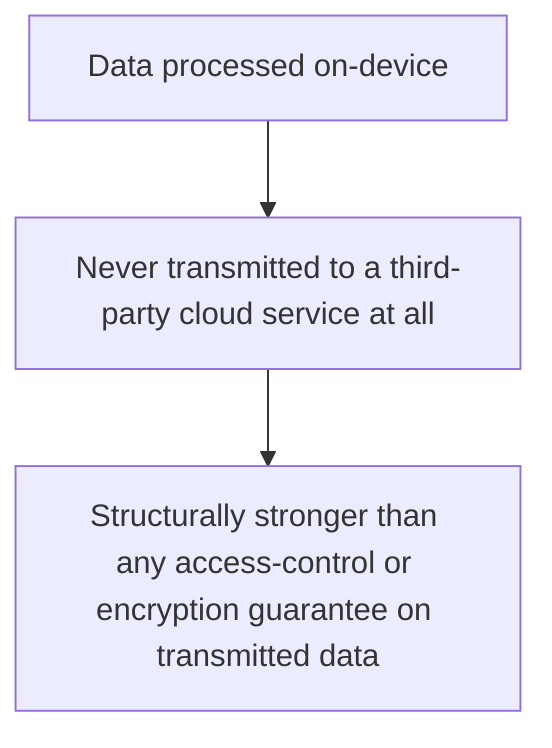
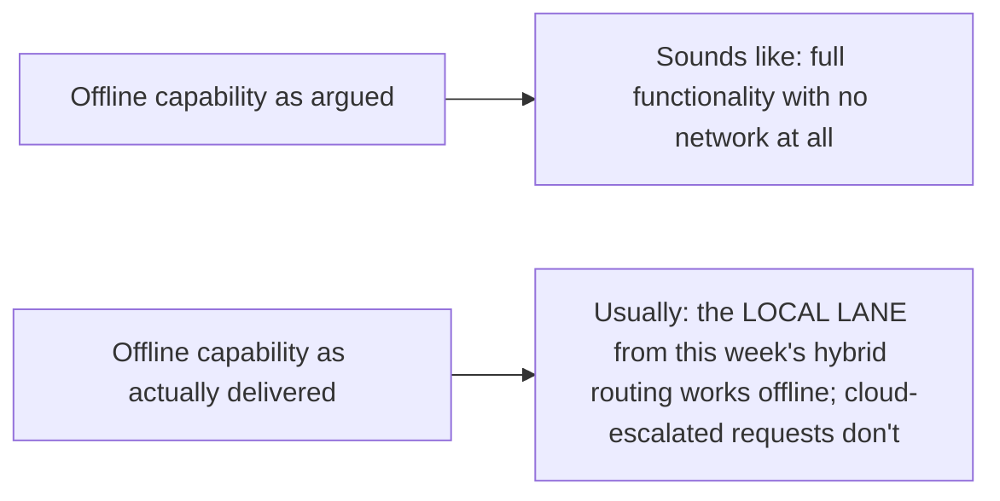
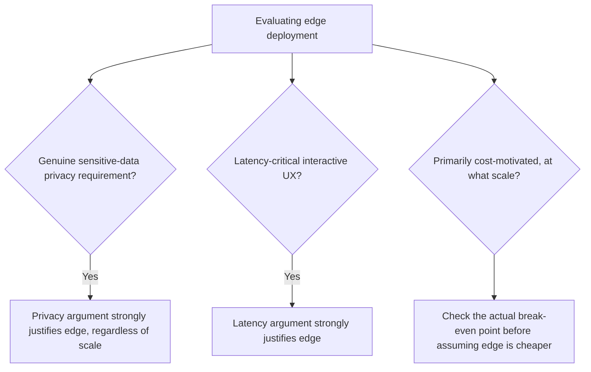

Edge agent deployment gets justified with a cluster of arguments — privacy, latency, cost savings, offline capability — presented together as if uniformly strong. Working through them individually, two hold up robustly under scrutiny, and the others are real but more conditional than they're often presented as, worth being precise about before treating "edge is better" as a blanket conclusion.

## Privacy: The Argument That Holds Up Most Robustly



This connects directly to the earlier PII-redaction and access-control posts from this blog's RAG series — the strongest privacy guarantee isn't a well-implemented redaction pipeline or access control on data in transit and at rest in the cloud, it's data that's never transmitted at all. For healthcare, financial, and other genuinely sensitive on-device processing (voice agent healthcare intake, covered in October's series, is a direct example), this argument holds up because it's a structural guarantee, not a policy or implementation-quality guarantee.

## Latency: The Argument With the Clearest, Measured Evidence

Tuesday's Siri case study provided the concrete number — roughly 10x latency reduction, 200-400ms versus 2-3 seconds. This is the argument with the least room for dispute, because it's directly measurable and consistently replicated across deployments, unlike some of the other arguments in this cluster that are more context-dependent.

## Cost: A Real Argument, More Conditional Than It's Often Presented

```python
def cost_argument_conditionality(deployment_scale: dict) -> str:
    if deployment_scale["device_count"] > BREAK_EVEN_THRESHOLD:
        return "Cost argument holds — one-time hardware cost amortized across many devices beats per-token cloud API cost at scale"
    return "Cost argument weaker at small scale — cloud API cost may be lower than the fixed engineering investment in edge deployment infrastructure"
```

The "API tokens for millions of devices are prohibitively expensive compared to a one-time hardware investment" argument is genuinely true at the scale it's usually cited for (millions of devices) and considerably weaker for a smaller deployment, where the fixed engineering cost of building and maintaining edge deployment infrastructure (covered throughout this week) can exceed what cloud API costs would have been at that smaller scale. This is a real argument with a real break-even point, not an unconditional cost advantage.

## Offline Capability: Real, and Narrower Than It Sounds



Given this week's hybrid routing architecture, "works offline" typically means the 80-90% of requests handled in the local lane continue working, while the remaining requests that genuinely need cloud escalation don't — which is a real and valuable partial capability, and meaningfully narrower than "full offline functionality" as it's sometimes presented in marketing material, worth being precise about when setting expectations for a deployment.

## Applying This Precision to a Real Deployment Decision



## Key Takeaways

1. **Privacy is the most structurally robust argument** — data never transmitted is a stronger guarantee than any policy on transmitted data
2. **Latency has the clearest, most consistently measured evidence**, per this week's Siri case study specifically
3. **The cost argument is real and has an actual break-even point** — it's weaker than often presented at smaller deployment scales
4. **"Offline capability" is usually the local-lane-only capability from this week's hybrid architecture**, not full offline functionality — be precise about this when setting deployment expectations

---

*Part of the [Road to 2027 series](/tags/road-to-2027-series/) — edge agents, coding agent maturity, orchestration, and where agentic AI stands as the year closes.*
