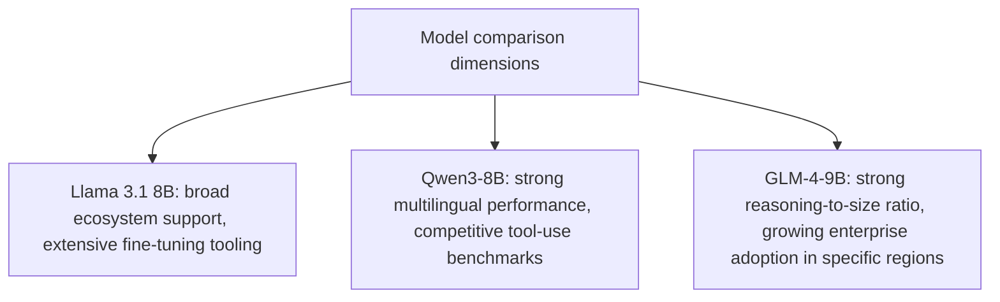
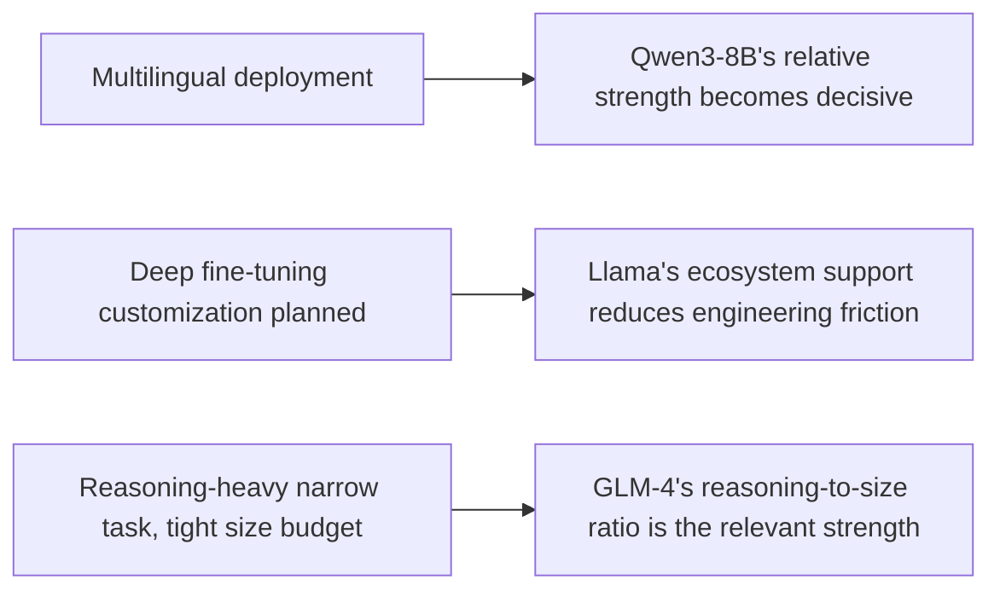

Industry recommendations name Meta's Llama 3.1 8B Instruct, Qwen3-8B, and GLM-4-9B-0414 as top candidates for 2026 edge deployment. Closing this week's stretch with a practical comparison — and, consistent with everything this blog has argued about benchmark trust all through November's series, a reminder that this list is a starting shortlist, not a substitute for evaluating against your own task on your own eval set.

## What Distinguishes the Three at a High Level



None of these is a strictly dominant choice across every dimension — each has genuine relative strengths, and the right choice depends on which dimensions actually matter for your specific edge deployment, following the capability-based routing logic from October's series applied here to model selection rather than runtime routing.

## Applying This Blog's Own Benchmark-Skepticism to This Comparison

```python
def evaluate_edge_model_candidates(candidates: list[str], your_golden_dataset: list[dict]) -> dict:
    # Per November's benchmark-gaming and lab-to-production-gap posts:
    # published rankings are a shortlist filter, not a selection decision
    return {
        candidate: run_eval(candidate, your_golden_dataset)
        for candidate in candidates
    }
```

This is a direct, deliberate application of the skepticism this blog argued for throughout November's series — a published top-three list is useful for narrowing from the full space of available models to a manageable shortlist, and the actual selection decision should run each shortlisted candidate against your own task-specific eval set, the same discipline argued for model-swap decisions generally earlier this year.

## Dimension-Specific Selection Guidance



The practical decision process: identify which specific dimension matters most for your deployment (following this week's sizing framework — task complexity, latency budget, device constraints) before comparing candidates, rather than trying to rank all three on a single undifferentiated "which is best" axis that doesn't reflect how differently they actually perform across different dimensions.

## Fine-Tuning Tooling Maturity Is an Underweighted Selection Factor

```python
def tooling_maturity_matters_for_total_cost() -> str:
    return (
        "A model with a stronger raw benchmark score and immature fine-tuning "
        "tooling can have a higher total engineering cost than a slightly "
        "weaker model with mature, well-documented fine-tuning support — "
        "especially given Tuesday's post established that tool-use "
        "fine-tuning is real, non-trivial engineering work, not a one-line "
        "config change."
    )
```

Given this week's fine-tuning post established real engineering effort behind adapting any of these models for tool-use quality, the maturity of each model's fine-tuning ecosystem — documentation, community tooling, known failure modes — is a legitimate selection factor alongside raw benchmark performance, and one that's easy to underweight if comparison stops at published accuracy numbers.

## Closing This Week: The Throughline

This week moved from a striking single result (2.6B beating 671B) through sizing, hybrid routing, a massive-scale case study, fine-tuning mechanics, and honest argument-by-argument scrutiny of the edge case, to this practical selection framework — the throughline is that edge deployment succeeds through the same evaluation and engineering discipline this blog has argued for all year, applied to a newer deployment context, not through a fundamentally different set of principles.

## Key Takeaways

1. **Llama 3.1 8B, Qwen3-8B, and GLM-4-9B each have genuine relative strengths** — none is strictly dominant across every dimension
2. **Apply this blog's benchmark-skepticism from November directly**: use published rankings as a shortlist filter, then evaluate against your own task-specific golden dataset
3. **Identify which specific dimension matters most for your deployment before comparing** — multilingual need, fine-tuning customization plans, or reasoning-to-size ratio point toward different candidates
4. **Fine-tuning tooling maturity is a real, underweighted cost factor** — given tool-use fine-tuning is genuine engineering work, not a config toggle, per this week's earlier post

---

*Part of the [Road to 2027 series](/tags/road-to-2027-series/) — edge agents, coding agent maturity, orchestration, and where agentic AI stands as the year closes.*
