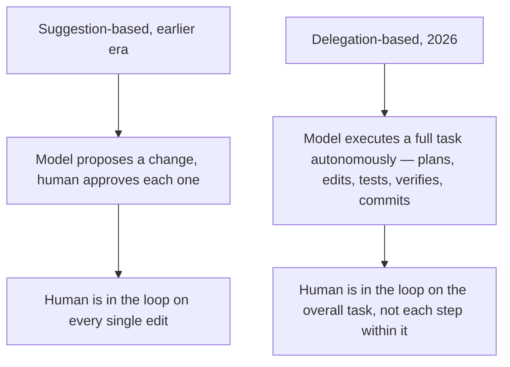
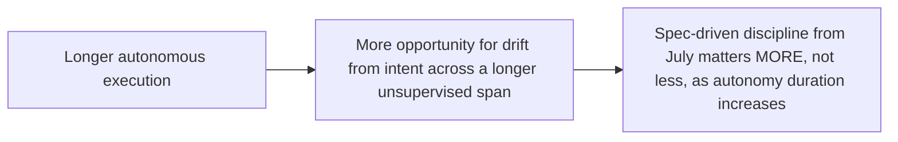

This blog's July series covered spec-driven development as the process discipline that makes agentic coding trustworthy at scale. Running alongside that, and worth its own examination, is a shift in the tools themselves this year: coding agents moved from suggestion-based IDE assistance (autocomplete, inline suggestions requiring approval on every change) to genuine delegation — CLI agents running autonomously for hours, coordinating changes across dozens of files, executing shell commands to verify their own work, and committing with descriptive messages, without requiring human approval at every step.

## The Shift, Concretely



This is exactly the pre-action-approval-versus-real-time-monitoring distinction from November's Article 14 oversight patterns post, now showing up in a completely different domain — coding agents. Suggestion-based tools implement something close to Pattern 1 (pre-action approval on every step); delegation-based tools implement something closer to Pattern 2 (autonomous execution with monitoring and override capability), the same tradeoff between thoroughness and throughput that governed the compliance discussion, now shaping how software actually gets written.

## Why This Shift Required More Than Just a Better Model

```python
def what_enabled_the_shift() -> list[str]:
    return [
        "Reliable tool-call execution (shell commands, file edits) — the idempotency and error-recovery "
        "discipline from earlier this year's agent infrastructure series",
        "Self-verification loops — the agent running its own tests and interpreting results, not just "
        "generating code and stopping",
        "Sandboxed execution — running shell commands autonomously requires the sandboxing discipline "
        "from earlier this year's guardrails series, not just a capable model",
    ]
```

A more capable underlying model alone doesn't explain this shift — every piece of infrastructure this blog covered across its agent infrastructure and guardrails series earlier this year (reliable tool execution, sandboxed command execution, structured error recovery) had to mature in parallel for autonomous multi-hour execution to become something teams would actually trust, independent of how good the model's raw code generation became.

## What This Means for the Spec-Driven Discipline From July



This directly reinforces, rather than replaces, July's spec-driven development series — a longer autonomous execution window without a well-specified target gives more opportunity for drift before a human ever checks in, which makes the constitution, spec review, and acceptance-criteria discipline from July more load-bearing as delegation duration increases, not less relevant now that agents can execute longer without supervision.

## Setting Up the Rest of This Week

This shift raises immediate practical questions this week's remaining posts work through: what does the agent actually do during a multi-hour unsupervised session, how much of real-world "agentic coding" usage actually reaches this level of autonomy versus staying workflow-based, and what changes for a team's engineering process once agents are routinely opening their own pull requests.

## Key Takeaways

1. **Coding agents shifted from suggestion (approval per edit) to delegation (autonomous multi-hour execution) this year** — a genuine capability shift, not just marketing repositioning
2. **This maps directly onto the Article 14 oversight-pattern spectrum from November's series** — pre-action approval versus autonomous execution with monitoring, now visible in a coding context
3. **The shift required infrastructure maturity beyond the underlying model** — reliable tool execution, self-verification, and sandboxing, all covered earlier this year for entirely different reasons
4. **Longer autonomous execution makes July's spec-driven discipline more important, not less** — more unsupervised time means more opportunity for drift without a well-specified target

---

*Part of the [Road to 2027 series](/tags/road-to-2027-series/) — edge agents, coding agent maturity, orchestration, and where agentic AI stands as the year closes.*
