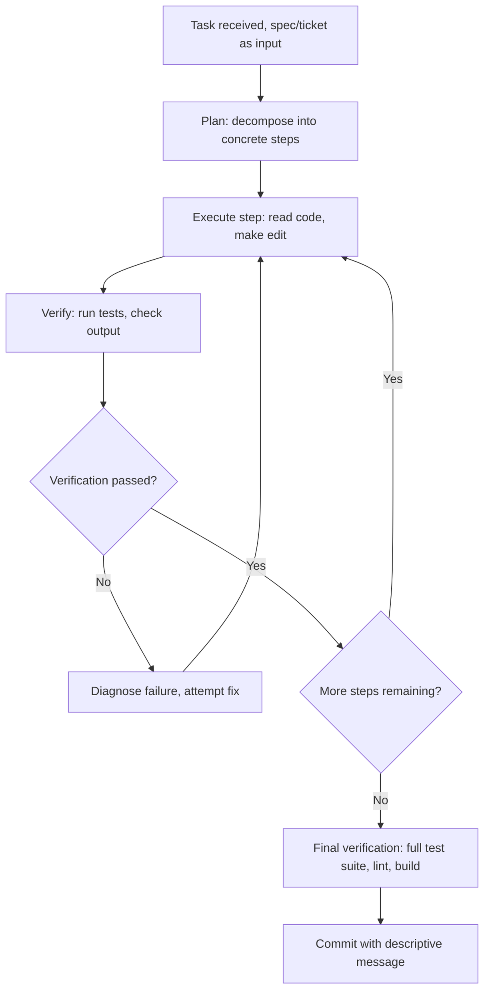

Yesterday's post named the shift to multi-hour autonomous delegation without detailing what actually happens during that time. This walks through the execution loop concretely — what a coding agent does across a multi-hour unsupervised session, and where deliberate checkpoints still matter even in a genuinely delegated task.

## The Execution Loop



This is the same perceive-plan-act-observe loop from October's browser-agent tutorial, applied to a coding context — the structural pattern (act, verify the result, adapt based on what actually happened) recurs across genuinely different agentic domains, which is worth noting as a general principle rather than treating each domain's agent architecture as unrelated.

## Where Self-Verification Actually Happens

```python
def self_verification_step(change: dict, test_suite: list) -> dict:
    result = run_tests(change, test_suite)
    if not result["passed"]:
        failure_analysis = diagnose_test_failure(result)
        # This is the retry-with-error-feedback pattern from earlier this
        # year's function-calling error recovery post, applied to test failures
        return {"needs_fix": True, "diagnosis": failure_analysis}
    return {"needs_fix": False}
```

This directly reuses the function-calling error-recovery discipline from earlier this year — a failing test isn't a dead end, it's structured feedback the agent uses to diagnose and retry, the same pattern as recovering from a malformed tool call, applied to test failures specifically. This self-correction loop, running many times across a multi-hour session without human involvement, is what makes multi-hour autonomy actually productive rather than just longer unsupervised time.

## Where Human Checkpoints Still Matter, Even Within Full Delegation

```mermaid
flowchart LR
    A[Fully autonomous execution] --> B{Encounters a genuinely ambiguous decision the spec didn't resolve?}
    B -->|Yes| C[This is exactly the "genuine ambiguity" case from July's SDD series]
    C --> D[Should escalate rather than guess — same principle, coding-specific instance]
```

This connects directly to the handling-genuine-ambiguity post from July's spec-driven development series — even in a fully delegated multi-hour session, the agent will sometimes hit a genuinely ambiguous decision the spec didn't anticipate, and July's guidance (specify a decision procedure for the irreducibly ambiguous case, escalate rather than guess) applies exactly as written, now operating within an autonomous execution loop rather than a single-turn interaction.

## What the Commit History From an Autonomous Session Actually Shows

```python
def review_autonomous_session_commit_history(session_id: str) -> list[dict]:
    commits = get_commits_for_session(session_id)
    return [
        {"commit": c, "was_a_self_correction": c["message"].startswith("Fix:"), "test_status_at_commit": c["test_results"]}
        for c in commits
    ]
```

A genuinely useful practice for reviewing an autonomous session's work: reading the full commit history, not just the final diff, since the self-correction commits reveal the actual reasoning trajectory — how many times the agent hit a failure and fixed it, and what those failures were, which is diagnostic information a squashed final diff discards entirely.

## Key Takeaways

1. **The execution loop (plan, act, verify, adapt) is the same structural pattern as October's browser-agent architecture**, applied to a coding-specific context — not an unrelated design
2. **Self-verification against test failures reuses the function-calling error-recovery pattern from earlier this year**, treating a failing test as structured feedback rather than a dead end
3. **Genuinely ambiguous decisions within an autonomous session should escalate, per July's spec-driven-development guidance**, applied here to a multi-hour execution context rather than a single-turn interaction
4. **Review the full commit history of an autonomous session, not just the final diff** — self-correction commits reveal the actual reasoning trajectory a squashed diff discards

---

*Part of the [Road to 2027 series](/tags/road-to-2027-series/) — edge agents, coding agent maturity, orchestration, and where agentic AI stands as the year closes.*
