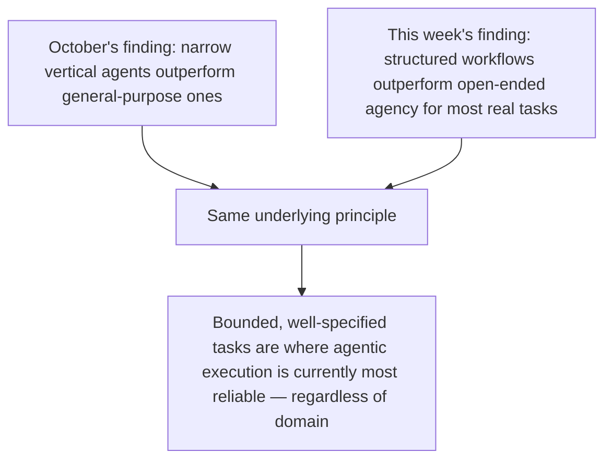

The developer community's own honest 2026 self-assessment, after moving past the "agents will change everything" phase, settles on a roughly 90/10 split: about 90% of real production coding-agent usage is structured workflows (a defined pipeline the agent executes reliably), with only about 10% genuinely open-ended autonomous agency (an agent given a broad goal and left to figure out its own approach). Worth examining why this split represents mature, realistic adoption rather than a disappointing shortfall from the "fully autonomous" vision.

## Why This Mirrors October's Vertical-Agent Finding Exactly



This is the vertical-agent thesis from October's Agent Economy series, restated in a coding-specific context: a well-defined workflow (implement this ticket following this spec, run these checks, open a PR) is bounded and measurable the same way a narrow vertical agent's task is bounded and measurable, while fully open-ended agency (solve this broad problem however you see fit) carries the same reliability risk as a general-purpose assistant attempting a broad range of tasks without narrow scoping.

## What "Workflow" Actually Means in This Context

```python
WORKFLOW_EXAMPLE = {
    "trigger": "New ticket assigned with a well-specified acceptance criteria (per July's SDD series)",
    "steps": [
        "read_ticket_and_related_spec",
        "implement_change",
        "run_test_suite",
        "self_correct_on_failure",  # from yesterday's post
        "open_pull_request_with_summary",
    ],
    "human_checkpoint": "code_review_before_merge",  # not before every internal step
}
```

A "workflow" in this sense isn't a return to suggestion-based, approval-per-edit tooling from earlier this year's post — it's autonomous execution (yesterday's multi-hour session pattern) within a well-defined structure, distinct from genuinely open-ended agency where the agent has to determine its own approach to an under-specified problem from scratch.

## Where the 10% Open-Ended Agency Actually Earns Its Place

```mermaid
flowchart LR
    A[Well-specified ticket, clear acceptance criteria] --> B[Workflow — 90% of usage]
    C[Genuinely exploratory: "investigate why this system is slow"] --> D[Open-ended agency — the 10%]
```

The 10% open-ended category tends to be genuinely exploratory tasks without a pre-specifiable target — root-cause investigation, architectural exploration — where the whole point is that a human couldn't write a precise spec upfront because the answer isn't known yet. This connects to the earlier ambiguity post from July's SDD series: genuinely irreducible ambiguity (not knowable in advance, not just under-specified) is exactly where open-ended agency is worth its higher variance and lower predictability, and exactly where a structured workflow wouldn't apply even if you tried to force one.

## Why This Split Should Inform How Teams Adopt Coding Agents

```python
def adoption_strategy_by_task_type(task: dict) -> str:
    if task["acceptance_criteria_specifiable_upfront"]:
        return "Structure as a workflow — this is where reliability is highest, per the 90% finding"
    return "Reserve for open-ended agency — accept higher variance, use for genuinely exploratory work only"
```

The practical lesson for a team adopting coding agents in 2027: default to structuring tasks as workflows wherever a spec can be written upfront (the large majority, per this data), and reserve open-ended agency deliberately for the minority of genuinely exploratory tasks where a workflow wouldn't fit in the first place — not because open-ended agency is a lesser capability, but because it's suited to a genuinely different, smaller category of task.

## Key Takeaways

1. **A roughly 90/10 workflow-to-open-ended-agency split describes real 2026 coding agent usage**, per the developer community's own honest assessment
2. **This mirrors October's vertical-agent finding exactly** — bounded, well-specified tasks are where agentic execution is currently most reliable, regardless of domain
3. **"Workflow" here means structured, autonomous execution (yesterday's pattern) within a well-defined scope**, not a regression to suggestion-based tooling
4. **The 10% open-ended category is suited to genuinely exploratory tasks without a pre-specifiable target** — not a lesser capability, a different category of task entirely

---

*Part of the [Road to 2027 series](/tags/road-to-2027-series/) — edge agents, coding agent maturity, orchestration, and where agentic AI stands as the year closes.*
