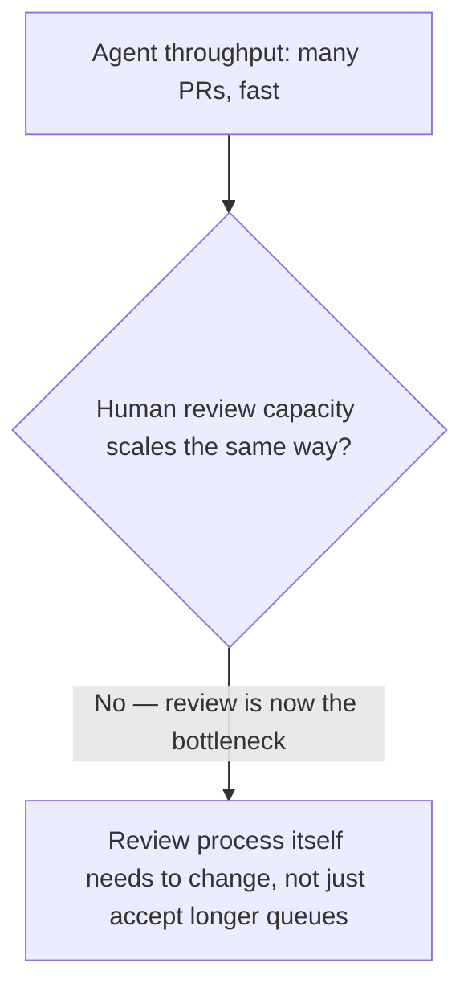
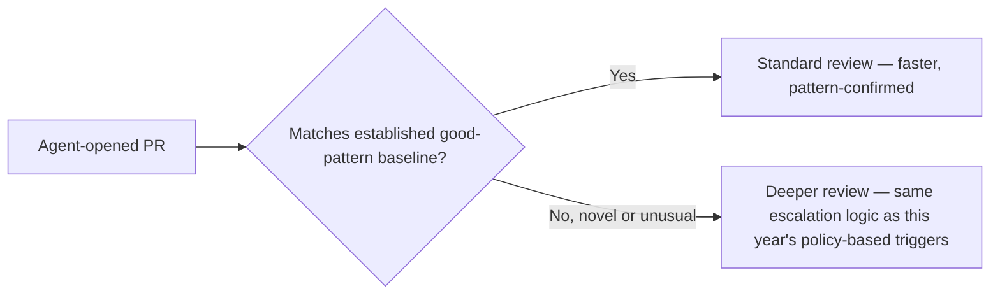

Companies this year report coding agents that pick up a ticket, read the codebase, write and test the code, fix their own failures, and open a pull request — the full autonomous loop from earlier this week, operating end to end. This works through what has to change in an engineering team's process for this to actually work well, not just technically function, extending last month's hybrid-teams post from October to a coding-specific context.

## Review Volume Changes the Review Process Itself



This is directly the ticket-triage-throughput problem from October's IT-ops post, now applied to code review specifically — an agent that opens PRs at a much higher rate than a human team previously merged them shifts the bottleneck entirely to review capacity, and simply asking human reviewers to review faster isn't a sustainable fix, the same lesson from that earlier post about redesigning the workflow rather than inserting higher throughput into an unchanged process.

## Applying the Code-Review-for-Spec-Driven-Changes Framework at Higher Volume

```python
def review_focus_at_agent_scale(pr: dict, spec: dict) -> dict:
    return {
        # From July's SDD series: spec fidelity check, not re-litigating requirements
        "spec_fidelity": check_implementation_matches_spec(pr, spec),
        # From July's SDD series: scope creep detection
        "unreviewed_scope_creep": check_for_undocumented_additions(pr, spec),
        # NEW at this volume: pattern detection across many agent PRs
        "matches_known_good_pattern": compare_against_agent_pr_baseline(pr),
    }
```

July's code-review-for-spec-driven-changes post already established the right focus — spec fidelity and scope creep, not re-litigating requirements already settled at spec-review time. At the volume autonomous agents produce, a third check becomes practical and valuable: comparing a new PR against the pattern of previously-reviewed, approved agent PRs, since deviations from an established good pattern are a fast, scalable signal for where a human reviewer's limited attention should concentrate.

## Escalation for PRs That Don't Fit the Pattern



This is the policy-based escalation principle from earlier this year, applied to code review specifically — routine PRs that match an established pattern get standard (fast) review; PRs that deviate from the pattern get the deeper scrutiny a human reviewer's limited time should be concentrated on, rather than spreading uniform review depth across every PR regardless of how routine or unusual it is.

## What Changes About the Team's Own Skill Requirements

```python
def team_skill_shift() -> dict:
    return {
        "less_emphasized": "Writing routine, well-specified code by hand",
        "more_emphasized": [
            "Writing precise specs the agent can execute against reliably (July's SDD discipline)",
            "Reviewing PRs efficiently at higher volume, focused on the right signals",
            "Recognizing when a task belongs in the 10% open-ended category from yesterday's post, not the workflow category",
        ],
    }
```

This connects to the skills-gap post from October's digital workforce week — the actual skill shift isn't "engineers become obsolete," it's a shift in where engineering time concentrates: toward spec-writing precision and efficient, focused review, and away from routine hand-implementation of well-specified tasks, the same organizational skill-gap dynamic covered generally in October now shown concretely in a coding-specific context.

## Key Takeaways

1. **Agent PR throughput shifts the bottleneck to human review capacity** — this needs a redesigned review process, not just faster individual reviewers, the same lesson as October's workflow-redesign post
2. **July's spec-fidelity and scope-creep review focus still applies directly** — plus a new, volume-enabled check: comparing against an established good-pattern baseline
3. **Escalate review depth based on deviation from the established pattern**, applying this year's policy-based escalation logic to code review specifically
4. **The team skill shift concentrates toward spec-writing precision and efficient review**, not toward obsolescence — directly extending October's skills-gap findings to a coding-specific context

---

*Part of the [Road to 2027 series](/tags/road-to-2027-series/) — edge agents, coding agent maturity, orchestration, and where agentic AI stands as the year closes.*
