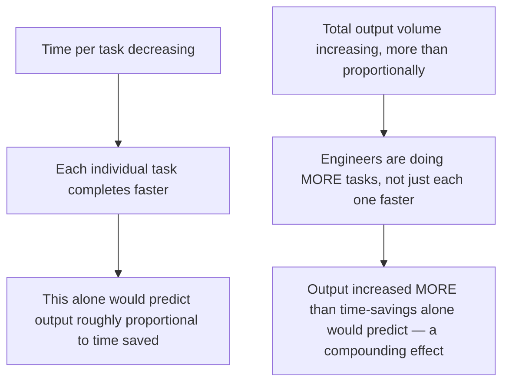
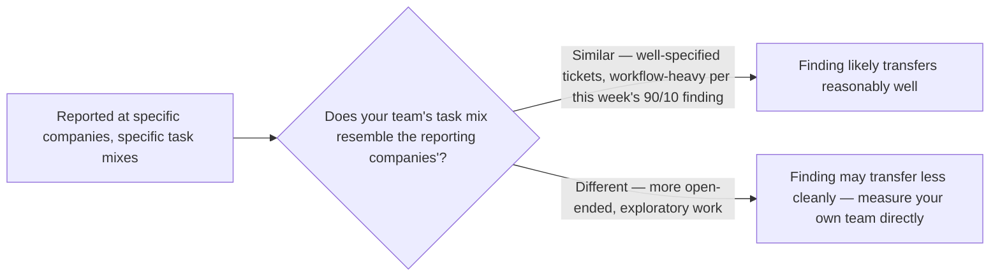

A 2026 industry report on agentic coding tool usage found a specific, notable combination: engineers report a net *decrease* in time spent per task, alongside a much larger net *increase* in total output volume. These aren't the same finding stated twice — they're two distinct effects worth separating carefully, applying the execution-outcome measurement discipline from October's series rather than accepting a headline productivity claim at face value.

## Why These Are Two Distinct Effects



If time-per-task simply decreased and engineers did the same number of tasks in less time, output volume would increase proportionally to time saved. The report's finding that volume increased by *more* than that proportional relationship suggests a compounding effect — not just doing the same work faster, but taking on additional work that wouldn't have been attempted at all under the previous time cost, connecting to the earlier vertical-agent economics from October where lower marginal cost per task changes what's worth doing, not just how fast existing work completes.

## The Metric This Report Gets Right That a Simpler One Would Miss

```python
def why_this_two_part_metric_matters() -> str:
    return (
        "A single 'productivity increased X%' number, per October's execution-"
        "outcome-measurement principle, risks conflating faster completion of "
        "the SAME work with genuinely more work getting done. Separating time-"
        "per-task from total-output-volume is exactly the disaggregation this "
        "blog has argued for throughout the year — a single aggregate metric "
        "hides more than it reveals."
    )
```

This is a direct instance of the disaggregation principle argued throughout November's evaluation series — the 56.6% aggregate reliability figure needed segmentation to be meaningful, and a single productivity percentage needs the same treatment: separating "faster at the same work" from "doing more work" is what makes this report's finding actually informative rather than a headline number that could mean either thing.

## What This Means for Measuring Your Own Team's Adoption

```python
def measure_coding_agent_adoption_properly(team_data: dict) -> dict:
    return {
        "time_per_completed_task_trend": trend_over_time(team_data, "time_per_task"),
        "total_tasks_completed_trend": trend_over_time(team_data, "tasks_completed"),
        "task_complexity_distribution_shift": check_for_new_task_categories(team_data),
        # Per this month's execution-outcome discipline: quality, not just volume
        "defect_rate_trend": trend_over_time(team_data, "post_merge_defect_rate"),
    }
```

The defect-rate check is the addition this blog's own evaluation skepticism argues for beyond what the industry report covers — a volume increase that comes with a rising defect rate is a very different finding than one that holds quality steady, and given November's entire series on why aggregate performance claims deserve scrutiny, any team measuring its own coding-agent adoption should track quality alongside the two volume-related metrics, not assume quality held constant just because the report didn't flag it as a concern.

## The Honest Caveat on Generalizing This Finding



Consistent with this month's edge-model-selection post's argument against trusting published numbers without your own verification: this report's specific magnitude was measured on specific companies with specific task distributions, and a team whose work skews more toward the 10% open-ended category from earlier this week should expect this exact combination to transfer less cleanly than a team whose work is mostly the 90% workflow category the report's participating companies likely represent.

## Key Takeaways

1. **Time-per-task decreasing and total output volume increasing are two distinct effects**, and the report's finding that volume increased more than time-savings alone predicts suggests a compounding effect: more work attempted, not just faster completion of the same work
2. **This finding exemplifies the disaggregation principle from November's evaluation series** — a single productivity percentage would hide the more informative two-part story
3. **Track defect rate alongside volume when measuring your own adoption** — a volume increase with rising defects is a different, more concerning finding than one with quality held steady
4. **This specific magnitude was measured on specific companies' task distributions** — verify against your own team's actual task mix rather than assuming direct transfer

---

*Part of the [Road to 2027 series](/tags/road-to-2027-series/) — edge agents, coding agent maturity, orchestration, and where agentic AI stands as the year closes.*
