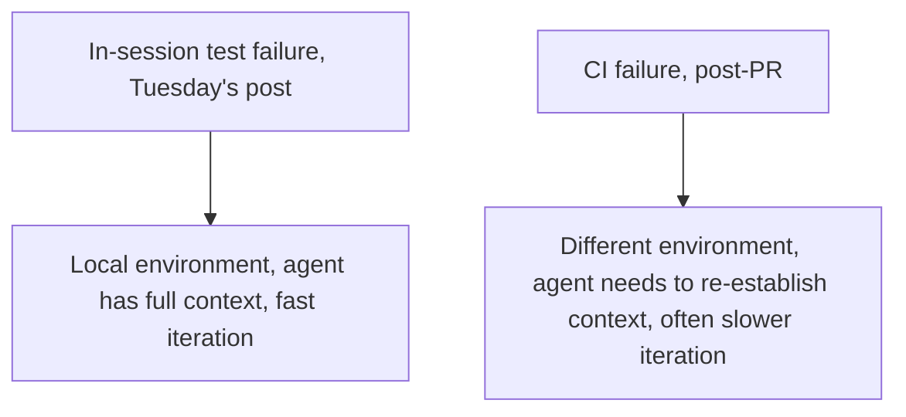
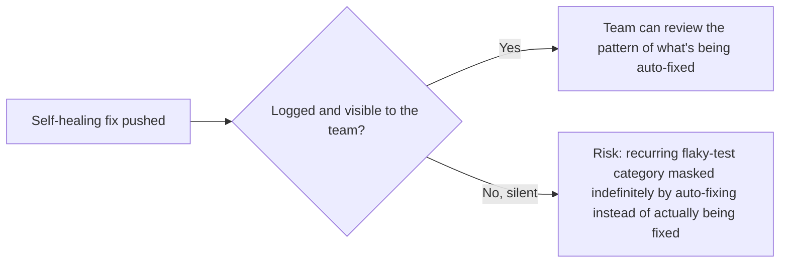

Tuesday's post covered self-correction *within* an autonomous coding session — the agent runs its own tests before committing. Self-healing CI extends this one step further: an agent watching the CI pipeline itself, after a PR has already been opened, diagnosing a failure that only surfaces in the full CI environment, and pushing a fix before a human ever sees the red build. This requires real additions beyond Tuesday's in-session verification loop.

## Why CI Failures Are a Different Category Than In-Session Test Failures



A CI failure that didn't reproduce locally often indicates an environment-specific issue (a dependency version mismatch, a flaky test exposed by CI's parallelization, a timing issue that doesn't manifest on a developer's faster local machine) — genuinely harder to diagnose than an in-session failure, because the agent has to reconstruct why the CI environment specifically triggered something local execution didn't.

## The Self-Healing CI Loop

```python
def self_healing_ci_response(ci_failure: dict, pr: dict) -> dict:
    diagnosis = diagnose_ci_specific_failure(ci_failure)  # environment diff, not just error message
    if diagnosis["confidence"] < FIX_CONFIDENCE_THRESHOLD:
        return {"action": "flag_for_human", "reason": "Low confidence in automated diagnosis"}

    fix = generate_fix(diagnosis)
    push_fix_commit(pr, fix, message=f"Fix: {diagnosis['summary']}")
    return {"action": "auto_fixed", "diagnosis": diagnosis, "fix_commit": fix["commit_sha"]}
```

The **confidence threshold before attempting an automated fix** is the critical addition this pattern needs beyond Tuesday's in-session loop — an agent confidently pushing a wrong fix to a CI failure it doesn't actually understand is worse than leaving the failure visible for a human, connecting directly to this year's escalation-design principle: policy-based escalation should govern whether the agent proceeds autonomously or flags for human help, based on diagnosis confidence, not just whether *a* fix was generated.

## Observability Specifically for Self-Healing Activity



This connects to the earlier warning from this blog's guardrails series about silently-corrected failures masking an underlying problem — a self-healing loop that quietly fixes the same category of CI flakiness repeatedly, without surfacing that pattern to the team, prevents anyone from noticing and addressing the actual root cause of the recurring flakiness. Self-healing activity needs its own visible log, the same transparency principle from November's series applied to an internal engineering-process context rather than an end-user-facing one.

## Where This Fits Relative to the 90/10 Split From Earlier This Week

```python
def self_healing_ci_classification() -> str:
    return (
        "This is squarely a WORKFLOW pattern, not open-ended agency — "
        "diagnosing and fixing a CI failure within a well-defined PR context "
        "is bounded and specifiable, fitting the 90% category from Monday's "
        "post rather than the 10% open-ended exploratory category."
    )
```

## Key Takeaways

1. **CI failures are a genuinely different, often harder diagnostic category than in-session test failures** — environment-specific issues that don't reproduce locally
2. **Require a confidence threshold before attempting an automated fix**, applying this year's policy-based escalation principle — a confidently wrong auto-fix is worse than a visible failure
3. **Log self-healing activity visibly to the team**, not silently — otherwise a recurring flakiness pattern gets repeatedly patched instead of actually diagnosed and fixed at its root cause
4. **This is a workflow pattern, not open-ended agency**, fitting cleanly into the 90% category from earlier this week — bounded, well-specified, and reliably automatable

---

*Part of the [Road to 2027 series](/tags/road-to-2027-series/) — edge agents, coding agent maturity, orchestration, and where agentic AI stands as the year closes.*
