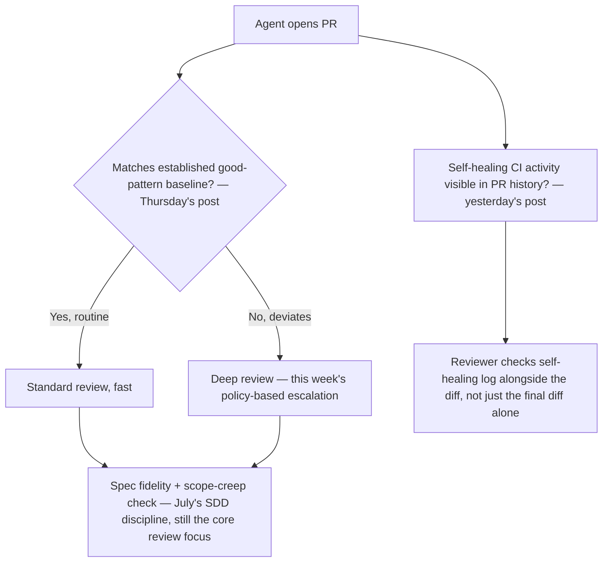
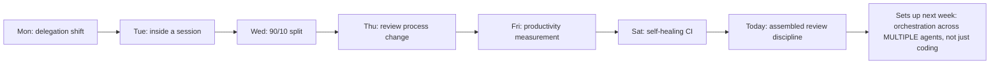

This week covered the shift to delegation, what happens inside an autonomous session, the 90/10 workflow-vs-agency split, review-process changes, productivity measurement, and self-healing CI. Closing the week by synthesizing these into one coherent review discipline — what a team's actual code review process should look like once agent-opened PRs, including self-healed ones, are routine rather than novel.

## The Assembled Review Pipeline



## Why This Needs to Be an Explicit, Designed Pipeline, Not an Emergent Habit

```python
def why_explicit_design_matters_at_this_volume() -> str:
    return (
        "At low agent-PR volume, ad hoc review (each reviewer applying their "
        "own judgment per PR) works fine. At the volume this week's posts "
        "describe — companies reporting agents picking up tickets and opening "
        "PRs routinely — inconsistent, un-designed review practice across "
        "reviewers becomes the actual bottleneck, the same lesson as October's "
        "workflow-redesign post: inserting higher throughput into an "
        "unredesigned process just moves the bottleneck, it doesn't remove it."
    )
```

## The Metrics That Tell You Whether the Pipeline Is Actually Working

```python
def review_pipeline_health_metrics(pr_history: list[dict]) -> dict:
    return {
        "pct_routed_to_fast_review": pct(pr["review_path"] == "standard" for pr in pr_history),
        "defect_rate_by_review_path": groupby_measure(pr_history, "review_path", "post_merge_defect"),
        "review_time_trend": trend_over_time(pr_history, "time_to_merge"),
        # Connects to Friday's productivity measurement: volume AND quality together
        "self_healing_pattern_recurrence": check_recurring_self_heal_categories(pr_history),
    }
```

The `defect_rate_by_review_path` metric is the one that actually validates whether the fast/deep review split (Thursday's pattern-matching approach) is calibrated correctly — if PRs routed to fast review show a meaningfully higher defect rate than deep-reviewed ones, the pattern-matching threshold needs recalibration, the same eval-calibration discipline this blog has argued for throughout the year, applied to a review-routing decision rather than a model-output decision.

## What This Week Adds Up To, Heading Toward the Year's Close



This week examined agentic coding specifically, as one deep instance of the general agentic maturity theme running through this entire month. Next week's series zooms out from coding specifically to multi-agent orchestration generally — the same underlying principles (bounded workflows over open-ended agency, escalation calibrated to actual risk, visible self-correction rather than silent masking) apply there too, now across a fleet of heterogeneous agents rather than one coding agent's own session.

## Key Takeaways

1. **A coherent review pipeline needs explicit design at agent-PR volume**, not ad hoc per-reviewer judgment that worked fine at lower volume
2. **The pipeline combines pattern-matching routing, spec-fidelity focus, and visibility into self-healing activity** — synthesizing every piece covered this week into one system
3. **Track defect rate by review path specifically** — this is what validates whether the fast/deep review split is actually calibrated correctly, not just assumed to be working
4. **This week's coding-specific findings are one instance of principles that generalize** — bounded workflows, calibrated escalation, and visible self-correction apply across agentic domains, not just coding, setting up next week's orchestration series

---

*Part of the [Road to 2027 series](/tags/road-to-2027-series/) — edge agents, coding agent maturity, orchestration, and where agentic AI stands as the year closes.*
