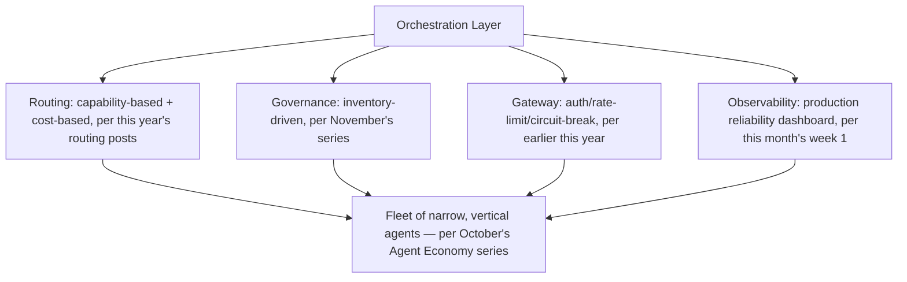
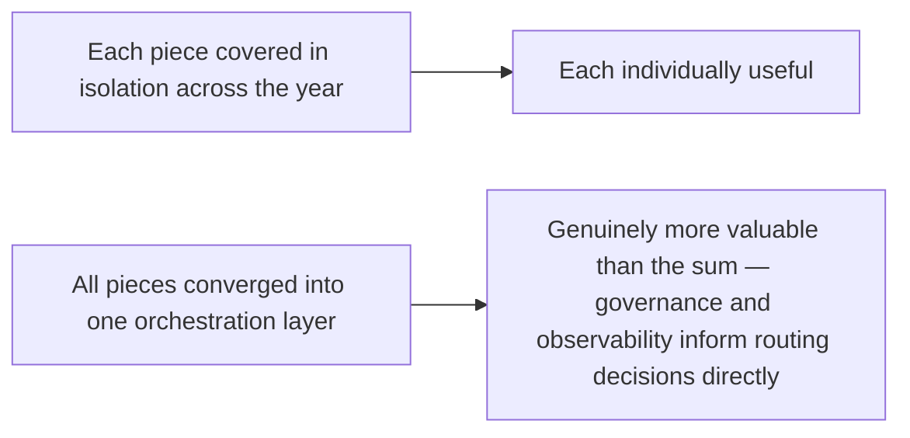

October's orchestration-layer post introduced the core concept — routing, shared context, multi-vendor model selection, consistent policy enforcement — early in this blog's coverage. Returning to it now, closing the year, with what a genuinely mature deployment actually looks like once every piece covered across the intervening months (guardrails, evaluation, compliance, coding-agent maturity) is assembled into one operating system, not just the orchestration concept in isolation.

## The Mature Orchestration Stack, Assembled



This is the year's coverage converging into a single picture — what looked like separate topics across separate months (routing in October, governance in November, edge/coding in December) are all facets of the same orchestration layer in a genuinely mature deployment, not independent systems that happen to coexist.

## The Difference Between "Has an Orchestration Layer" and "Mature Orchestration"

```python
def orchestration_maturity_assessment(deployment: dict) -> dict:
    return {
        "routing_sophistication": deployment.get("uses_capability_and_cost_routing", False),  # not just round-robin
        "governance_integrated": deployment.get("orchestration_enforces_inventory_and_compliance", False),  # not bolted on separately
        "observability_covers_composite_risk": deployment.get("tracks_cross_agent_exposure", False),  # per November's fleet-review post
        "handles_both_workflow_and_open_ended": deployment.get("routes_by_task_type_per_dec_10_split", False),
    }
```

A deployment technically "has orchestration" the moment it routes requests to more than one agent. Maturity, per this year's full coverage, means the orchestration layer actively enforces governance (not a separate audit process bolted on afterward), tracks composite cross-agent risk (not just individual agent health), and correctly distinguishes workflow-appropriate tasks from genuinely open-ended ones per this week's coding-agent findings — a much higher bar than the basic routing concept introduced in October.

## Why This Convergence Matters More Than Any Single Piece



The value of a mature orchestration layer isn't that it has more features than an immature one — it's that the pieces inform each other. A routing decision that accounts for a specific agent's current compliance documentation status (should this request even route to an agent whose Article 11 documentation is stale, per November's series) is a genuinely different, more capable system than one where routing and compliance are separate concerns that happen to both exist.

## Setting Up the Rest of This Week

This convergence raises immediate practical questions the rest of this week works through: how this looks when the fleet spans multiple agent frameworks rather than one consistent stack, how policy actually gets centralized across heterogeneous agents, and where this maturity itself introduces new risk — specifically, orchestration becoming the very bottleneck it was built to prevent.

## Key Takeaways

1. **Mature orchestration is the convergence of a full year's coverage** — routing, governance, gateway infrastructure, and observability as one integrated system, not separate topics that happen to coexist
2. **"Has orchestration" and "mature orchestration" are different bars** — maturity means governance and observability actively inform routing decisions, not exist as parallel, disconnected processes
3. **The value of convergence is that pieces inform each other** — a routing decision aware of an agent's compliance status is a genuinely more capable system than routing and compliance existing as separate concerns
4. **This maturity introduces its own new risks**, which the rest of this week examines directly — including orchestration becoming a bottleneck itself

---

*Part of the [Road to 2027 series](/tags/road-to-2027-series/) — edge agents, coding agent maturity, orchestration, and where agentic AI stands as the year closes.*
