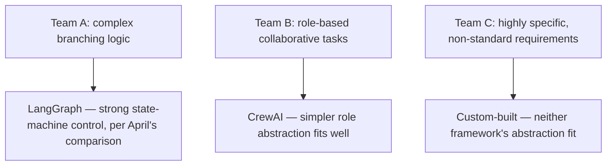
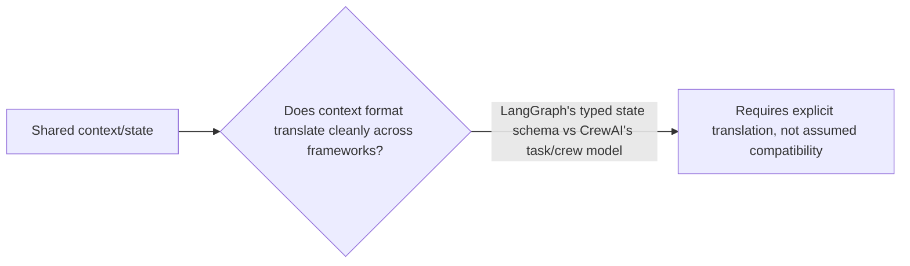

April's comparison posts — LangGraph vs CrewAI, then AutoGen added to the comparison — framed these as alternatives a team chooses between for a given system. In practice, a mature 2026 fleet often runs several simultaneously: one team's agent built on LangGraph for its strong state-machine control, another's on CrewAI for its role-based simplicity, and custom-built agents for cases neither framework fit well. This works through what actually coordinating across genuinely different frameworks requires at the orchestration layer.

## Why Multi-Framework Fleets Happen, Reasonably



April's comparison already established that these frameworks have genuinely different strengths for different problem shapes — the natural consequence, once an organization has enough independent teams each making that choice well for their own problem, is a fleet spanning multiple frameworks, not a single framework chosen once organization-wide. This is a reasonable outcome of good per-team decisions, not a failure of standardization to enforce.

## The Coordination Problem This Creates

```python
class CrossFrameworkOrchestrator:
    def route_to_agent(self, task: dict, agent_registry: dict) -> dict:
        target_agent = self.select_agent(task, agent_registry)
        # Each framework has a different invocation interface —
        # normalize at the orchestration boundary, not throughout the codebase
        adapter = self.get_framework_adapter(target_agent["framework"])
        return adapter.invoke(target_agent, task)

    def get_framework_adapter(self, framework: str):
        return {
            "langgraph": LangGraphAdapter(),
            "crewai": CrewAIAdapter(),
            "custom": CustomAgentAdapter(),
        }[framework]
```

This is the same abstraction-layer discipline from earlier this year's vendor lock-in posts — a thin adapter per framework, normalizing invocation at the orchestration boundary, keeps the rest of the orchestration logic (routing, governance enforcement, observability) framework-agnostic, rather than needing framework-specific logic scattered throughout the orchestration codebase.

## Where Cross-Framework Coordination Gets Genuinely Hard



Passing shared context between a LangGraph-based agent and a CrewAI-based agent within the same orchestrated workflow requires explicit translation between each framework's own state representation — LangGraph's structured, namespaced state schema (from earlier this year's state-design post) doesn't map automatically onto CrewAI's task/crew abstraction. This translation layer is real, non-trivial engineering work, not a solved problem the orchestration layer gets for free just by wrapping each framework's API.

## Governance and Observability Still Need to Be Framework-Agnostic

```python
def enforce_governance_across_frameworks(agent: dict, action: dict) -> bool:
    # Per November's inventory-driven governance: this check doesn't care
    # which framework the agent is built on, only its inventory entry
    return check_policy_compliance(get_inventory_entry(agent["agent_id"]), action)
```

This is the direct payoff of November's inventory-centric governance design — because governance checks operate against the inventory entry (agent ID, risk classification, permissions) rather than against framework-specific internals, the same governance and observability infrastructure covers a LangGraph agent, a CrewAI agent, and a custom agent uniformly, without needing separate governance logic per framework.

## Key Takeaways

1. **A multi-framework fleet is a reasonable outcome of good per-team framework choices**, per April's comparison posts, not a standardization failure
2. **Normalize invocation at a thin adapter layer per framework**, keeping routing, governance, and observability logic framework-agnostic — the same abstraction discipline as earlier vendor lock-in posts
3. **Cross-framework shared context requires explicit translation between each framework's own state model** — this is real engineering work, not solved automatically by API wrapping
4. **Governance and observability built against the agent inventory, not framework internals, cover a multi-framework fleet uniformly** — a direct payoff of November's inventory-centric governance design

---

*Part of the [Road to 2027 series](/tags/road-to-2027-series/) — edge agents, coding agent maturity, orchestration, and where agentic AI stands as the year closes.*
