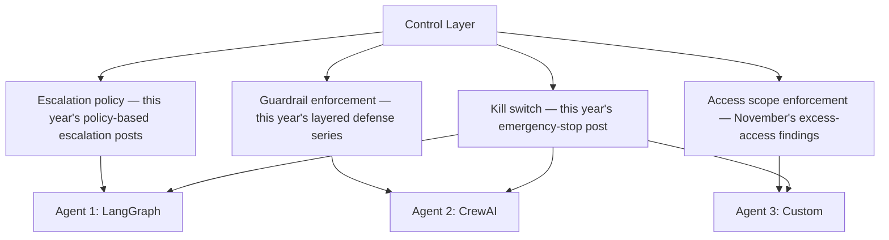
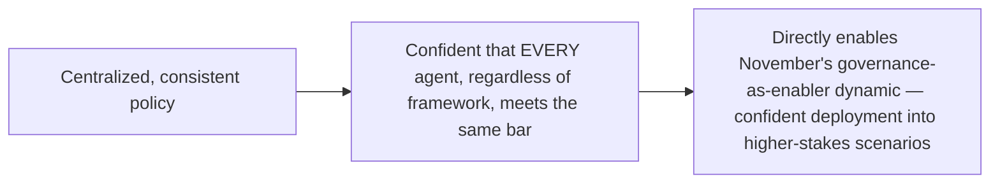

Yesterday's post established that governance checks operating against the agent inventory, not framework internals, cover a heterogeneous fleet uniformly. This extends that into a full control layer design — the single place policy decisions (escalation thresholds, guardrail enforcement, access scope) get made and enforced consistently, gathering a year's worth of individually-covered policy mechanisms into one coherent architectural layer.

## What the Control Layer Actually Centralizes



Every one of these was covered earlier this year as an individual mechanism, largely in the context of a single agent or a single framework. The control layer is the architectural decision to implement each of them *once*, at a layer every agent passes through regardless of its underlying framework, rather than reimplementing escalation logic, guardrails, and access checks separately inside each framework-specific agent.

## Why Centralization Here Specifically Matters More Than for Other Concerns

```python
def why_policy_centralization_is_higher_stakes() -> str:
    return (
        "The agent gateway post from earlier this year argued for "
        "centralizing auth/rate-limiting/circuit-breaking for maintenance-"
        "cost reasons. Policy (escalation, guardrails, access) has a "
        "SECURITY reason too: policy enforced inconsistently across "
        "framework-specific implementations is exactly the kind of gap "
        "November's excess-access root-cause finding identified — a "
        "policy correctly enforced in the LangGraph adapter and imperfectly "
        "ported to the CrewAI adapter is a real, exploitable inconsistency."
    )
```

This connects the maintenance-cost argument from the gateway post with the security argument from November's incident-analysis posts — inconsistent policy enforcement across framework-specific reimplementations isn't just wasteful engineering duplication, it's a genuine security gap of exactly the kind that produced real 2026 incidents covered in November's series.

## Implementation: Policy as Data, Not Code Scattered Per Agent

```python
POLICY_REGISTRY = {
    "escalation": {
        "high_value_action_threshold": 5000,
        "irreversible_action": "always_escalate",
    },
    "access": {
        "max_scope_per_agent_role": get_role_based_access_limits(),
    },
    "guardrails": {
        "required_layers": ["input_classification", "output_validation", "action_consistency"],
    },
}

def enforce_policy(agent_action: dict, agent_inventory_entry: dict) -> dict:
    # Every framework's adapter calls through THIS single function
    return check_against_policy_registry(agent_action, agent_inventory_entry, POLICY_REGISTRY)
```

Policy expressed as centrally-maintained data, checked through one shared enforcement function every framework adapter calls into, is what actually delivers the consistency yesterday's post argued for — a policy change (a new escalation threshold, a new required guardrail layer) updates once, in the registry, and takes effect across every agent in the fleet immediately, regardless of framework.

## The Control Layer as the Actual Governance-as-Enabler Mechanism



This is the concrete architectural mechanism behind November's governance-as-enabler argument — an organization can only be genuinely confident deploying agents into higher-stakes scenarios if it trusts that policy is actually enforced consistently across its entire heterogeneous fleet, which a centralized control layer delivers and a per-framework, per-agent reimplementation approach structurally cannot guarantee.

## Key Takeaways

1. **The control layer centralizes escalation, guardrails, access, and kill-switch policy — mechanisms covered individually throughout the year — into one enforcement point every agent passes through**
2. **This is both a maintenance-cost and a security argument** — inconsistent per-framework policy reimplementation is exactly the kind of gap that produced real incidents covered in November's series
3. **Implement policy as centrally-maintained data, checked through one shared function**, not scattered logic reimplemented per framework adapter
4. **A centralized control layer is the concrete mechanism behind governance-as-enabler** — confident higher-stakes deployment requires trusting consistent enforcement across the whole fleet, which only centralization can actually guarantee

---

*Part of the [Road to 2027 series](/tags/road-to-2027-series/) — edge agents, coding agent maturity, orchestration, and where agentic AI stands as the year closes.*
