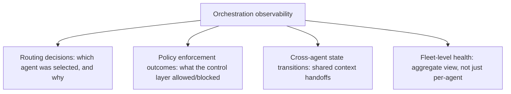
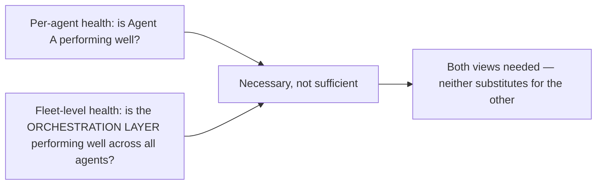

Every observability post this blog has published this year — MCP call tracing, the production reliability dashboard, request-level RAG logging — focused on a single agent or a single request's journey through one agent. The orchestration layer introduced this week is itself a system with its own behavior worth observing directly: routing decisions, cross-agent state management, and the control layer's policy enforcement from yesterday all need their own observability surface, distinct from (though connected to) individual agent observability.

## What Orchestration-Specific Observability Actually Covers



**Routing decision observability** is the piece with no direct single-agent analog — when a request routes to Agent A instead of Agent B, that decision itself (which capability-based or cost-based routing logic from earlier this year actually fired, and why) is worth logging, because a routing misconfiguration is a distinct failure category from any individual agent's own quality regression, and debugging "why did this request get handled poorly" needs to distinguish between "the wrong agent was selected" and "the right agent was selected but performed poorly."

## A Concrete Orchestration Trace

```python
def log_orchestration_decision(request_id: str, routing_decision: dict, policy_checks: dict):
    orchestration_log.append({
        "request_id": request_id,
        "candidate_agents_considered": routing_decision["candidates"],
        "selected_agent": routing_decision["selected"],
        "routing_rationale": routing_decision["reason"],  # capability match, cost tier, etc.
        "policy_checks_applied": policy_checks,  # from yesterday's control layer
        "policy_checks_passed": all(c["passed"] for c in policy_checks.values()),
    })
```

This is distinct from, and complementary to, the individual-agent request tracing covered earlier this year — a full debugging picture for a problematic request now requires both the orchestration-level trace (was this routed correctly, did policy checks pass) and the individual-agent trace (did the selected agent execute correctly), the same two-layer diagnostic structure as debugging a network issue by checking both routing infrastructure and the destination server.

## Fleet-Level Health as Its Own Distinct View



```python
def fleet_level_health_dashboard(orchestration_logs: list[dict]) -> dict:
    return {
        "routing_accuracy": measure_correct_agent_selection_rate(orchestration_logs),
        "policy_block_rate_by_reason": groupby_measure(orchestration_logs, "policy_block_reason"),
        "cross_agent_handoff_failure_rate": measure_context_handoff_failures(orchestration_logs),
        "load_distribution_across_fleet": measure_request_distribution(orchestration_logs),
    }
```

`load_distribution_across_fleet` is worth calling out specifically — an orchestration layer that's technically routing correctly but consistently overloading one specific agent while others sit idle is a capacity-planning problem invisible from any individual agent's own health metrics, since that agent's own dashboard would just show it's busy, not that the orchestration layer's distribution logic is the actual root cause.

## Connecting This to November's Compliance Documentation

The orchestration-level trace from earlier in this post directly satisfies the full-delegation-chain documentation requirement from November's compliance-boundary post — a regulator or auditor asking "trace this specific decision through the full agent chain" needs exactly this orchestration-level record connecting to each individual agent's own trace, not just individual agent logs in isolation with no record of how they were selected or coordinated.

## Key Takeaways

1. **The orchestration layer needs its own observability surface**, distinct from individual agent observability — routing decisions and policy enforcement outcomes have no single-agent analog
2. **A full debugging picture requires both orchestration-level and individual-agent-level traces together**, the same two-layer diagnostic structure as network routing plus destination server debugging
3. **Fleet-level health metrics (load distribution, cross-agent handoff failures) surface problems invisible from any individual agent's own dashboard**
4. **Orchestration-level tracing directly satisfies the full-delegation-chain compliance documentation requirement from November's series** — it's the missing piece individual agent logs alone can't provide

---

*Part of the [Road to 2027 series](/tags/road-to-2027-series/) — edge agents, coding agent maturity, orchestration, and where agentic AI stands as the year closes.*
