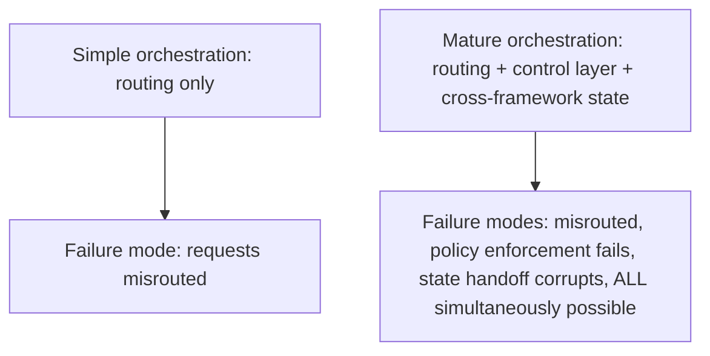
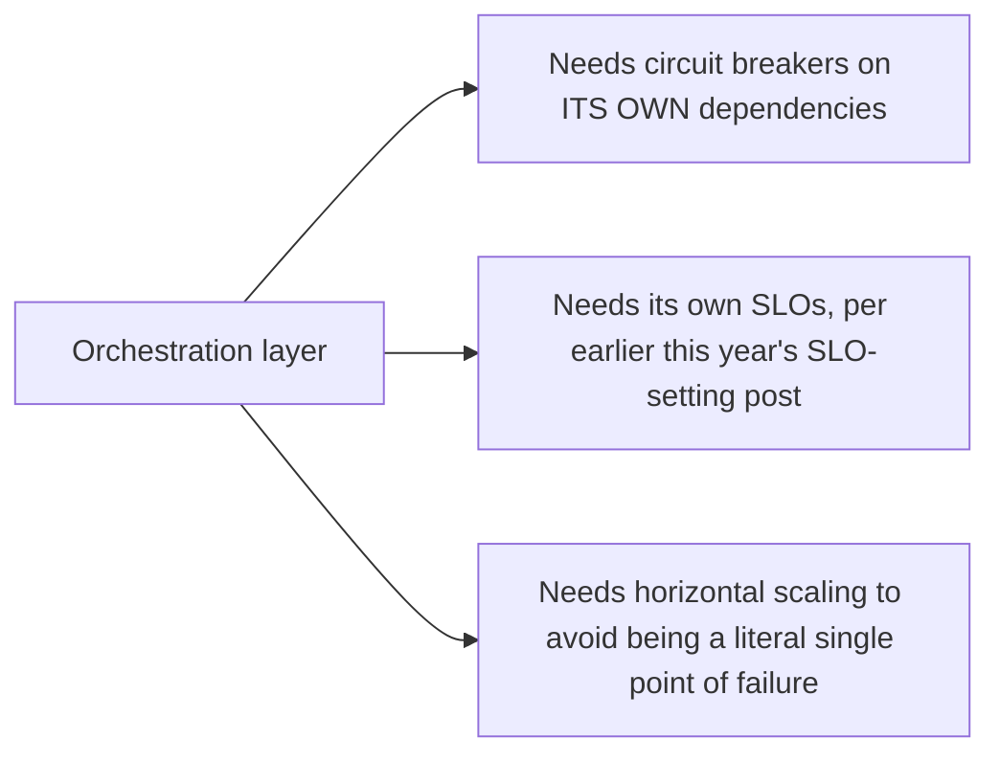

October's orchestration-layer post flagged, briefly, that centralizing routing, context, and policy concentrates real operational risk in one place. Five days into this week's deep dive — cross-framework coordination, the control layer, orchestration-specific observability — that risk deserves a full, concrete treatment, because the mature version assembled this week concentrates meaningfully more failure modes than the simple routing layer October originally described.

## Why Maturity Increases This Risk, Not Just Capability



Every capability added across this week — the control layer centralizing policy, cross-framework state translation, fleet-level observability — is also a new way the orchestration layer itself can fail, and because they're centralized (the entire point of this week's design), a failure in any one of them potentially affects every agent in the fleet simultaneously, not just the specific agent or request involved.

## The Specific Failure Modes Worth Planning For

```python
def orchestration_failure_modes() -> dict:
    return {
        "control_layer_unavailable": "Every agent's escalation/guardrail checks fail — fail open or closed? "
                                       "Per this year's gateway post: security-critical checks fail closed, "
                                       "availability checks may reasonably fail open",
        "routing_logic_degrades": "Requests still route, but capability-matching quality drops — "
                                    "harder to detect than a hard failure",
        "cross_framework_state_translation_breaks": "One framework's agents lose access to shared context "
                                                       "from another framework's agents specifically",
    }
```

The **routing logic degrades** case deserves particular attention — unlike a hard failure (loud, immediately detectable), degraded routing quality can persist for a while before anyone notices, since requests are still being handled, just less well-matched to the agents actually best suited for them. This connects to the anomaly-detection discipline from earlier this year: monitoring routing accuracy trend (from yesterday's fleet-health dashboard), not just orchestration uptime, is what catches this specific degraded-not-down failure mode.

## Applying This Year's Reliability Infrastructure to the Orchestration Layer Itself



This is the direct, natural extension of infrastructure this blog has covered all year, now pointed at the orchestration layer itself rather than at the agents it coordinates — the same circuit-breaker discipline that protects agents from unreliable downstream tools should protect the orchestration layer from its own dependencies (the policy registry, the agent inventory), and the same SLO-setting discipline from earlier this year should apply to the orchestration layer's own availability and latency, measured and tracked as its own service.

## Designing the Fallback When Orchestration Itself Degrades

```python
def orchestration_degraded_fallback(request: dict) -> dict:
    if orchestration_layer_health_check_failing():
        # Fall back to direct routing to a known-safe default agent,
        # bypassing sophisticated capability-based routing but preserving
        # basic function — the same fail-safe-degradation principle as
        # this year's guardrail robustness posts
        return route_to_default_safe_agent(request)
    return normal_orchestrated_routing(request)
```

A well-designed degraded mode — falling back to simpler, more conservative routing rather than failing the entire fleet when the sophisticated orchestration layer itself has an issue — is what prevents the concentration risk from becoming a full outage. This directly reuses the robustness-testing principle from November's series: graceful degradation under adverse conditions, applied to the orchestration layer's own failure modes rather than to input-handling robustness.

## Key Takeaways

1. **Every capability this week's mature orchestration design adds is also a new way it can fail** — maturity increases concentrated risk, not just capability
2. **Degraded (not down) routing quality is the hardest failure mode to detect** — monitor routing accuracy trend specifically, not just orchestration uptime
3. **Apply this year's full reliability toolkit — circuit breakers, SLOs — to the orchestration layer itself**, not just to the agents it coordinates
4. **Design an explicit degraded-mode fallback** (simpler, more conservative routing) rather than letting an orchestration-layer issue become a full fleet outage — the same graceful-degradation principle from November's robustness-testing post

---

*Part of the [Road to 2027 series](/tags/road-to-2027-series/) — edge agents, coding agent maturity, orchestration, and where agentic AI stands as the year closes.*
