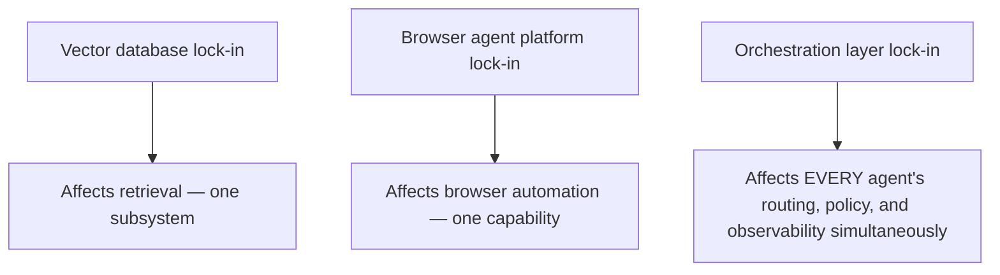
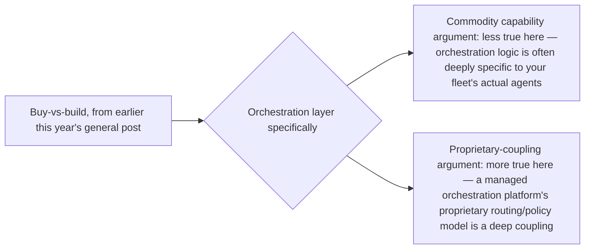

This blog covered vendor lock-in risk for vector databases, browser-agent platforms, and payment protocols at various points this year, each time applying the same core principle: a thin abstraction layer bounds coupling to any single vendor's specific implementation. The orchestration layer this week has been building up — now the central coordination point for every agent in a heterogeneous fleet — is the highest-stakes instance of this exact pattern, since lock-in here doesn't affect one integration, it affects the entire fleet's operating substrate.

## Why Orchestration Lock-In Is Different in Degree, Not Kind



If a managed, vendor-provided orchestration platform is adopted rather than the self-built control layer covered earlier this week, migrating away from it later means re-architecting how every single agent in the fleet gets routed to, governed, and observed simultaneously — a categorically larger migration than swapping a vector database or a browser automation provider, because the orchestration layer sits above and coordinates everything else this year's coverage has built.

## Applying This Year's Abstraction Discipline, at Higher Stakes

```python
class OrchestrationInterface(ABC):
    """The application-facing interface — kept vendor-neutral"""
    @abstractmethod
    def route_request(self, request: dict) -> dict: ...
    @abstractmethod
    def enforce_policy(self, action: dict) -> bool: ...
    @abstractmethod
    def get_fleet_health(self) -> dict: ...

class SelfBuiltOrchestration(OrchestrationInterface):
    """This week's control-layer design"""
    ...

class ManagedVendorOrchestration(OrchestrationInterface):
    """Wraps a vendor-provided orchestration platform behind the same interface"""
    ...
```

The same discipline from earlier vendor lock-in posts — reach past the abstraction only for deliberately-chosen, genuinely differentiated vendor features, documented as an explicit coupling decision — applies here with amplified stakes, since an undocumented, incidental dependency on a specific orchestration vendor's proprietary feature now couples the entire fleet's operating model to that vendor, not just one subsystem.

## The Buy-vs-Build Decision, Revisited for This Specific Layer



Earlier this year's general buy-vs-build framework leaned toward buying commodity capabilities and building proprietary-system-coupled ones. Applied specifically to orchestration: the routing and policy logic is often deeply specific to an organization's actual fleet of agents (built up incrementally, as this week's posts have shown, from the specific mix of frameworks and agent types in use) — which pushes the calculus further toward building the core control layer in-house, even while using managed infrastructure (compute, observability tooling) underneath it.

## What "Documented Coupling" Looks Like at This Scale

```python
def document_orchestration_vendor_coupling(feature_used: str, vendor: str) -> dict:
    return {
        "feature": feature_used,
        "vendor": vendor,
        "generic_equivalent_exists": check_if_avoidable(feature_used),
        "migration_cost_if_avoided": "N/A — using generic path",
        "migration_cost_if_kept": estimate_full_fleet_migration_cost(feature_used),  # the amplified stakes
        "decision_owner": "platform_team_lead",  # explicit accountability, given the stakes
    }
```

Given the amplified migration cost at this layer specifically, the decision to accept a vendor-specific orchestration coupling deserves a higher bar of explicit sign-off than the same decision at a lower-stakes layer (like the vector database examples from earlier this year) — this is where "documented, deliberate coupling" from the general vendor lock-in principle should actually require a named decision-owner and an explicit cost estimate, not just a code comment.

## Key Takeaways

1. **Orchestration layer lock-in affects the entire fleet's operating substrate simultaneously**, a categorically larger migration risk than lock-in at any single subsystem covered earlier this year
2. **Apply the same abstraction-interface discipline from earlier vendor lock-in posts**, with amplified stakes given what depends on this specific layer
3. **The buy-vs-build calculus leans further toward building the core control layer in-house**, since orchestration logic tends to be deeply specific to an organization's actual fleet composition
4. **Vendor-coupling decisions at this layer deserve a higher bar of explicit sign-off** — a named decision-owner and real migration-cost estimate, not just a documented code comment

---

*Part of the [Road to 2027 series](/tags/road-to-2027-series/) — edge agents, coding agent maturity, orchestration, and where agentic AI stands as the year closes.*
