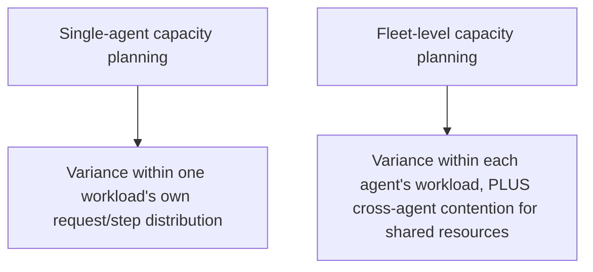
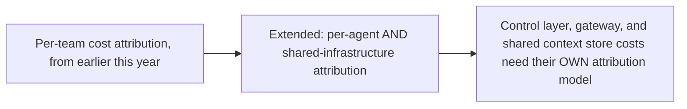

Earlier this year's capacity-planning post addressed the core problem for a single agentic workload — request volume and per-request step count both vary, making traditional request-count-based planning insufficient. A true multi-agent fleet, the subject of this entire week, compounds that same unpredictability across every agent simultaneously, plus adds cross-agent contention this earlier post didn't need to address. Closing this week's orchestration stretch with what actually changes at fleet scale.

## Why Fleet-Level Capacity Planning Is a Different Problem, Not Just a Bigger One



This week's control layer, shared context store, and gateway infrastructure are exactly the shared resources that introduce the fleet-specific contention problem — a spike in one agent's complexity mix (per the earlier compute-unit weighting approach) can consume shared control-layer or gateway capacity that other, unrelated agents in the fleet also depend on, a failure mode with no analog in single-agent capacity planning.

## Extending the Compute-Unit Model to Fleet Scale

```python
def fleet_capacity_estimate(agent_workloads: list[dict]) -> dict:
    per_agent_compute_units = {
        agent["agent_id"]: estimate_capacity_need(agent["historical_requests"])  # from earlier this year's method
        for agent in agent_workloads
    }
    return {
        "per_agent": per_agent_compute_units,
        "fleet_total_p50": sum(a["compute_units_per_request_p50"] for a in per_agent_compute_units.values()),
        # Fleet-level tail risk is NOT simply the sum of individual p99s —
        # correlated spikes across agents matter more
        "fleet_correlated_spike_risk": estimate_correlated_spike_scenario(agent_workloads),
    }
```

The **correlated spike risk** is the genuinely new consideration at fleet scale — individual agents' p99 compute-unit consumption, summed naively, understates real fleet-level tail risk if multiple agents' complexity spikes correlate (a shared upstream data source having a bad day, a shared control-layer dependency slowing down, a business event like the holiday-season stress test from October affecting every commerce-related agent simultaneously) rather than being independent.

## Cost Attribution at Fleet Scale, Extending Earlier This Year's Discipline



```python
def fleet_cost_attribution(agent_costs: dict, shared_infra_costs: dict, allocation_method: str = "proportional_usage") -> dict:
    if allocation_method == "proportional_usage":
        total_agent_cost = sum(agent_costs.values())
        return {
            agent_id: cost + (shared_infra_costs["total"] * (cost / total_agent_cost))
            for agent_id, cost in agent_costs.items()
        }
```

Shared orchestration infrastructure (the control layer, the gateway, fleet-wide observability) has real cost that doesn't belong to any single agent — extending the per-team attribution discipline from earlier this year requires an explicit allocation method for this shared cost, so a team reviewing their agent's total cost sees an honest, complete picture rather than an artificially low number that excludes the shared infrastructure their agent actually depends on.

## Closing This Week: The Full Orchestration Picture


This week closes with orchestration as a fully specified, honestly-assessed system — capable, and carrying real concentrated risk, cost, and lock-in considerations at every layer this week examined. Next week closes the year itself: a holiday commerce check-in, a year of voice agents in production, reader questions, failure stories, and the retrospective this entire year has been building toward.

## Key Takeaways

1. **Fleet-level capacity planning adds cross-agent contention for shared orchestration resources**, a failure mode with no single-agent analog
2. **Correlated spike risk across agents matters more than the sum of individual p99s** — shared dependencies and common business events can synchronize multiple agents' complexity spikes simultaneously
3. **Shared orchestration infrastructure needs its own explicit cost attribution method**, or per-agent cost figures give teams an artificially incomplete picture
4. **This week assembled a fully specified, honestly-assessed orchestration system** — capability alongside real concentrated risk, cost, and lock-in considerations, not orchestration presented as an unqualified win

---

*Part of the [Road to 2027 series](/tags/road-to-2027-series/) — edge agents, coding agent maturity, orchestration, and where agentic AI stands as the year closes.*
