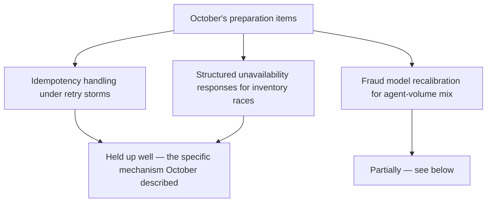
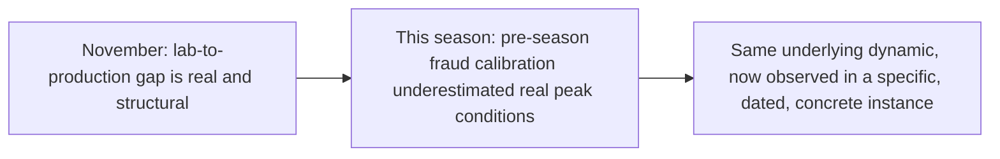

October's holiday-stress-test post worked through the capacity, fraud-model, and inventory-race-condition risks in advance of the season projected industry-wide to see millions of consumers letting shopping agents handle purchases end to end for the first time at real scale. With the season now behind us, checking that projection and preparation against what actually happened — the honest follow-through this blog has tried to maintain throughout the year rather than making a prediction and never revisiting it.

## What Held Up From October's Preparation



The idempotency and structured-unavailability preparations from October's post map onto genuine engineering mechanisms this blog has covered all year (idempotency keys, structured tool responses), and merchants that had implemented them going into the season report exactly the outcome October predicted — retry storms during peak load didn't produce the duplicate-charge incidents that a checkout flow without solid idempotency handling would have risked.

## Where Reality Diverged From the October Projection

```python
def divergence_from_projection() -> dict:
    return {
        "fraud_false_positive_rate": "Higher than October's preparation anticipated — the agent-volume "
                                       "mix at actual peak scale exceeded what pre-season calibration "
                                       "testing covered",
        "authorization_dispute_volume": "The 'genuinely new dispute category' from October's fraud post "
                                          "materialized at meaningfully higher volume than most merchants' "
                                          "initial planning assumed",
    }
```

This is worth stating plainly rather than glossing over — the fraud false-positive rate at actual peak volume exceeded pre-season calibration, consistent with this blog's own November-series lesson that lab/pre-season testing systematically underestimates real production conditions, the same 37% gap dynamic from November's opening post, now observed directly in this specific, concrete commerce context rather than as an abstract industry statistic.

## What This Confirms About November's Broader Argument



This is genuinely useful as a confirming data point rather than just a repeated abstract claim — November argued the lab-to-production gap is structural and should be expected, not treated as a one-off surprise when it happens. The holiday season's fraud-calibration gap is exactly that dynamic showing up in a predictable, specific place, which is itself evidence the framework from November's series is describing something real and recurring, not a one-time anomaly from the specific studies it cited.

## What Merchants Are Adjusting Heading Into Next Year

```python
def post_season_adjustments() -> list[str]:
    return [
        "Fraud model recalibration now includes a dedicated peak-volume agent-traffic simulation, "
        "not just steady-state agent volume testing",
        "Authorization dispute handling process, treated as genuinely new in October, is being "
        "formalized rather than handled ad hoc as disputes arrived",
    ]
```

## Key Takeaways

1. **Idempotency and structured-unavailability preparations from October held up well** — the specific engineering mechanisms performed as expected under real peak load
2. **Fraud false-positive rates and authorization dispute volume exceeded pre-season projections** — a concrete instance of November's lab-to-production gap, not a one-off surprise
3. **This is exactly the confirming pattern November's series predicted**, making it evidence the broader framework describes something structurally real, not an isolated finding from the specific studies cited
4. **Merchants are now building dedicated peak-volume agent-traffic simulation into fraud calibration**, closing the specific gap this season exposed — the honest, iterative process this blog has tried to model all year

---

*Part of the [Road to 2027 series](/tags/road-to-2027-series/) — edge agents, coding agent maturity, orchestration, and where agentic AI stands as the year closes.*
