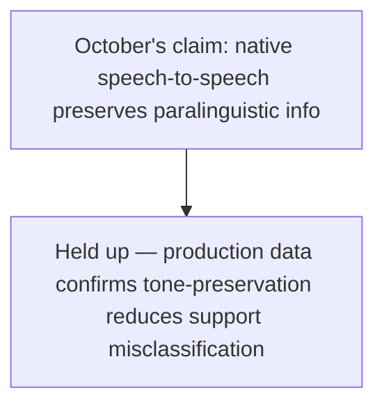
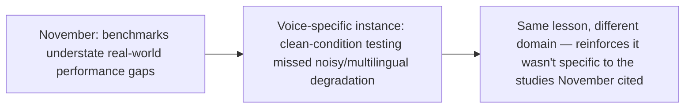

October's three-post voice agent stretch covered native speech-to-speech architecture, interruption handling design, and regulated-industry compliance requirements — all in the abstract, ahead of a full production year. Looking back with real deployment experience behind those posts, what actually held up and what broke in practice.

## What Held Up: The Architecture Argument



The core architectural argument from October's first voice post — that native speech-to-speech models preserve tone information a cascaded STT-LLM-TTS pipeline structurally loses — held up in production specifically where it mattered most: support contexts, where correctly detecting frustration versus neutral statement affects escalation decisions. Teams that deployed native speech-to-speech for support specifically report fewer tone-related misclassification incidents than cascaded-pipeline baselines from earlier deployments.

## What Broke: Interruption Handling at the Edges

```python
def interruption_handling_production_gaps() -> dict:
    return {
        "backchannel_vs_interruption_distinction": "Held up well for clear cases, degraded specifically "
                                                       "in noisy environments (phone calls with background "
                                                       "noise) — October's post didn't anticipate this "
                                                       "specific degradation condition",
        "multilingual_interruption_patterns": "Backchannel acknowledgment patterns vary by language and "
                                                 "culture in ways the underlying turn-detection models "
                                                 "weren't uniformly trained for — a genuine gap October's "
                                                 "single-language-implicit framing missed",
    }
```

This is worth naming honestly — October's interruption-handling post described the backchannel-versus-interruption distinction as "genuinely hard" but didn't anticipate these two specific degradation conditions, both of which turned out to matter in real deployments spanning noisy real-world audio conditions and multiple languages, neither of which a single clean-audio, single-language demo environment would surface.

## What This Confirms About This Blog's Own Evaluation Arguments



This is the second confirming instance this week (after yesterday's holiday commerce post) of November's core argument showing up in a concrete, previously-uncovered domain — voice agent testing conducted under clean, single-language conditions understated real-world performance the same structural way lab benchmarks understated production agent reliability generally. The lesson generalizes beyond the specific studies November cited; it's a property of how testing conditions systematically differ from production conditions, regardless of domain.

## What Teams Are Doing Differently Now

```python
def production_learnings_applied() -> list[str]:
    return [
        "Interruption-handling eval sets now explicitly include noisy-background and multilingual "
        "test cases, not just clean single-language audio",
        "Regulated-industry deployments (October's healthcare intake post) report the mandatory-"
        "escalation-category design held up without significant gaps — the more conservative, "
        "explicitly-scoped design from that post proved appropriately cautious",
    ]
```

The regulated-industry finding is a genuine positive to close on — October's healthcare intake post's conservative design (explicit mandatory escalation categories, never left to agent judgment) is exactly the kind of design that degrades safely even when other, less conservative aspects of voice agent design (interruption handling) revealed gaps — a real vindication of the policy-based-escalation-over-model-judgment principle this blog argued for throughout the year.

## Key Takeaways

1. **The core native-speech-to-speech architecture argument held up in production**, with measurable tone-preservation benefits in support contexts specifically
2. **Interruption handling broke specifically in noisy and multilingual conditions** that October's single-clean-language framing didn't anticipate — a genuine, honestly-named gap
3. **This is a second confirming instance of November's lab-to-production gap argument**, now shown to generalize across domains rather than being specific to the studies originally cited
4. **The conservative, policy-based mandatory-escalation design for regulated voice contexts proved appropriately cautious** — it degraded safely even where other design choices revealed real gaps

---

*Part of the [Road to 2027 series](/tags/road-to-2027-series/) — edge agents, coding agent maturity, orchestration, and where agentic AI stands as the year closes.*
