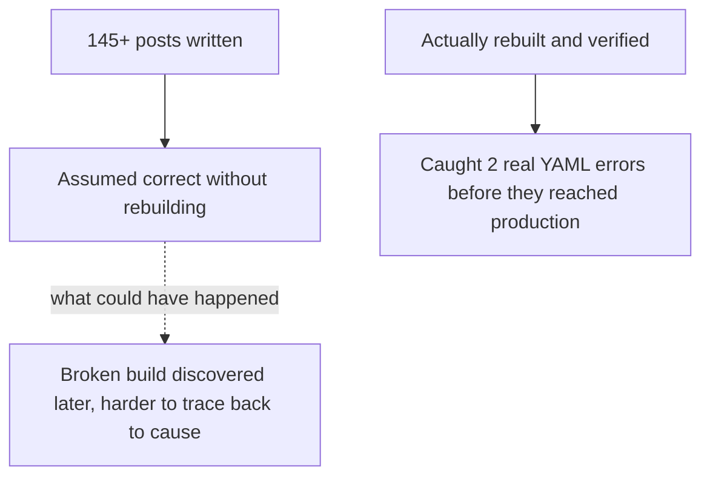

A lighter holiday post: a roundup of this year's most instructive agent failures covered on this blog, ranked not by drama but by how much each one actually taught — the criterion this blog has tried to apply all year to which incidents were worth a deep dive versus a passing mention.

## Most Instructive: The Microsoft 365 Copilot Zero-Click CVE

Covered in depth in November. What makes it the year's most instructive failure isn't its scale — it's that the vulnerability required no user action at all, which is the cleanest possible demonstration that user-education-based defenses are structurally insufficient against indirect injection. Every other lesson from this year's security posts (structural content separation, action-consistency checking) traces back to defending against exactly this failure shape.

## Most Consequential: The Nine-Agency Government Breach

Covered in November. Not the most technically novel incident of the year, but the one that most concretely demonstrated agent-amplified individual attacker capability — a single operator, two coding agents, nine agencies, roughly two months. The lesson that outlasts the specific incident: defender capability now needs to scale to match attacker capability that agents amplify, not just attacker sophistication.

## Most Avoidable, in Retrospect: The Silent Human-Completion Pattern

From October's execution-outcome measurement post — not a single incident, but a pervasive pattern this blog named early in the Agent Economy series: agents marked as having "resolved" a task that a human then quietly finished off the books, inflating apparent success rates. Avoidable because the fix (checking for reopened tickets, tracking `reopened_rate`) is comparatively simple once the pattern is named — the hard part was recognizing it was happening at all.

## Most Instructive About This Blog's Own Practice: The Two Front-Matter YAML Bugs

A smaller-scale, self-referential entry — the two YAML parsing errors caught during this blog's own massive September expansion, where unquoted descriptions containing colons broke the build. Instructive specifically because it demonstrated the value of the "always rebuild and verify, don't just trust the writing process" discipline this blog argued for throughout the year, applied to itself rather than to a third-party system.



## The Pattern Across All Four

```python
def common_thread_across_years_failures() -> str:
    return (
        "Every one of these was a gap between what was ASSUMED to be true "
        "(a user must act for injection to succeed, defender sophistication "
        "matches attacker sophistication, 'resolved' means resolved, code "
        "written correctly doesn't need verification) and what was ACTUALLY "
        "true. The fix in every case was building a verification step that "
        "didn't previously exist, not a smarter model or more sophisticated technique."
    )
```

This is worth stating as the year's unifying lesson on failure specifically: none of this year's most instructive failures were solved by waiting for better underlying AI capability — every one was closed by adding a verification or detection step that made an implicit assumption explicit and checkable, the same throughline as the "visibility as prerequisite" finding from November's retrospective.

## Key Takeaways

1. **The M365 Copilot CVE is this year's most instructive failure** — it cleanly demonstrates why user-education defenses are structurally insufficient against indirect injection
2. **The nine-agency breach is the most consequential** — concrete evidence of agent-amplified attacker capability at real scale
3. **Silent human task completion is the most pervasively avoidable pattern**, once named — simple to detect, easy to miss without deliberately looking
4. **Every instructive failure this year was closed by adding explicit verification for an implicit assumption**, not by waiting for better underlying model capability — the practical lesson to carry into next year

---

*Part of the [Road to 2027 series](/tags/road-to-2027-series/) — edge agents, coding agent maturity, orchestration, and where agentic AI stands as the year closes.*
