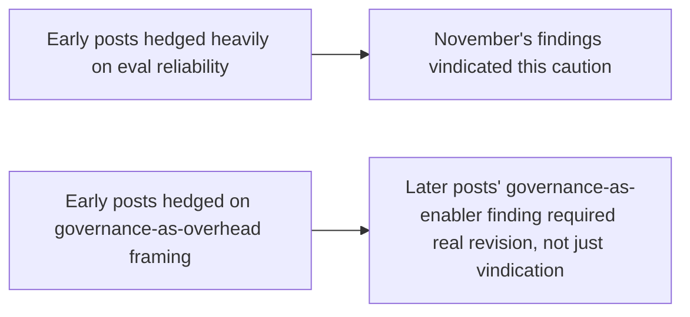

Closing this week's holiday check-in stretch with the hardest kind of post to write honestly — not what held up (covered across this week's other posts), but what this blog actually got wrong or oversold across a year of daily writing. Naming this plainly, rather than only ever pointing backward to validate earlier posts, is the standard this blog has tried to hold other claims to all year, and it should apply to its own claims too.

## Where Early Posts Were Too Confident

```mermaid
flowchart TD
    A[April's agent-pattern posts] --> A1[Presented ReAct/Plan-and-Execute/Reflexion as clean, separable choices]
    B[Reality, per later posts' own findings] --> B1[Production systems blend these constantly, and the "choice" framing oversimplified this]
```

The April cheatsheet post presenting ReAct, Plan-and-Execute, and Reflexion as three choices to pick between (even while noting they compose) leaned more toward "pick one" than production reality, per this year's later coding-agent posts, actually supported — real systems blend these fluidly and continuously, and framing it as a decision between named categories, even with a composition caveat, oversold how discrete the choice actually is in practice.

## Where a Prediction Aged Poorly

```python
def prediction_accuracy_check() -> dict:
    return {
        "claim": "Early-year framing implicitly assumed frontier models would remain the default choice "
                  "for most agentic tasks, with small models as a narrow edge-case optimization",
        "reality_by_december": "December's series showed small/fine-tuned models are a mainstream, "
                                 "central strategy for a large share of real production tasks, not a "
                                 "narrow edge-case — this blog underweighted this trend for most of the year",
    }
```

This is worth naming specifically — this blog's model-selection framing through most of the year implicitly centered frontier models as the default, with cost-optimization routing framed as an efficiency layer on top of that default. December's edge/SLM week suggests the more accurate framing, in hindsight, treats task-appropriate sizing as the actual default decision, with frontier-model use as the exception for genuinely broad or novel tasks — a real shift in framing this blog didn't fully anticipate until the evidence accumulated late in the year.

## Where This Blog Was Right to Be Cautious, in Retrospect



Not every early-year caution turned out to be correctly calibrated — the eval-skepticism running through early posts (always verify on your own data, don't trust a single benchmark number) was, per November's series, exactly right and arguably still understated relative to the 37% and 56.6% figures that later confirmed it. The governance framing, by contrast, genuinely needed revision — early posts leaned toward governance as necessary overhead, and November's governance-as-enabler finding was a real correction, not just additional supporting evidence for an already-correct position.

## Why This Post Matters More Than a Simple Correction

```python
def why_honest_error_accounting_matters() -> str:
    return (
        "Per this blog's own argument throughout November's evaluation series: "
        "a system (or a year of writing) that only ever reports its successes "
        "produces exactly the kind of false confidence this blog spent a month "
        "warning against in agent evaluation specifically. Holding this blog's "
        "own claims to the same scrutiny standard argued for elsewhere is the "
        "only way that standard means anything."
    )
```

## Key Takeaways

1. **April's agent-pattern framing oversold how discrete the ReAct/Plan-and-Execute/Reflexion choice actually is in production practice**
2. **This blog underweighted small/fine-tuned models as a mainstream strategy for most of the year**, only fully correcting the framing in December once the evidence accumulated
3. **Early eval-skepticism was correctly calibrated and vindicated by November's findings** — not every early caution needed correction, some needed only confirmation
4. **The governance-as-overhead framing genuinely needed revision**, not just additional support — November's governance-as-enabler finding was a real correction to an earlier position, not a foregone conclusion restated

---

*Part of the [Road to 2027 series](/tags/road-to-2027-series/) — edge agents, coding agent maturity, orchestration, and where agentic AI stands as the year closes.*
