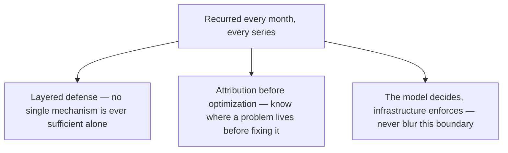
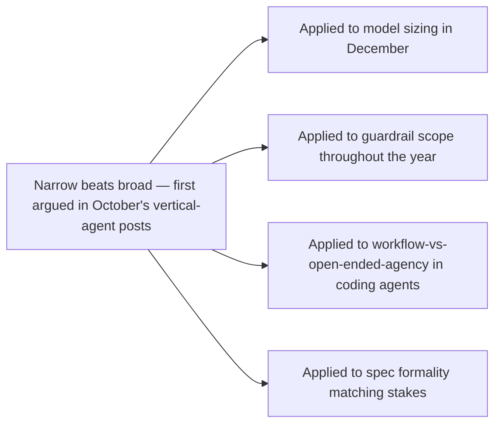

From April's opening question about what changes going from chatbot to agent, through nine months and hundreds of daily posts spanning RAG, guardrails, spec-driven development, agent infrastructure, security, governance, edge deployment, and orchestration — this opens the final week of the year with the throughlines that actually survived contact with a full year of evidence, rather than a chronological recap of everything covered.

## The Three Principles That Recurred in Every Single Month



These three appeared explicitly in November's mid-year retrospective, and worth confirming here: they held up through the second half of the year too, not just April through September. December's orchestration control layer is layered defense and the model/infrastructure boundary applied at fleet scale. The fleet capacity-attribution work from three weeks ago is the same "know where it lives before fixing it" principle applied to cost across a heterogeneous fleet. Nine months in, these aren't recurring coincidences — they're the actual operating principles this entire body of work has been demonstrating from different angles.

## What Changed About How This Blog Argued These Principles

```python
def evolution_in_argumentation_style() -> dict:
    return {
        "april_through_september": "Largely architectural and prescriptive — here is the pattern, here "
                                     "is why it works",
        "october_through_december": "Increasingly evidence-based and current-events-grounded — here is "
                                       "a real 2026 incident/study/result, here is what it confirms or "
                                       "complicates about the pattern",
    }
```

This is a real shift worth naming — the first six months built the architectural vocabulary (RAG patterns, guardrail layers, spec discipline, infrastructure primitives) largely through worked examples and reasoned-through scenarios. The last three months tested that vocabulary against actual, dated, documented 2026 events — real breaches, real regulatory deadlines, real industry research — which is a stronger form of validation than architectural reasoning alone, and this week's holiday check-in posts extended that same discipline to this blog's own earlier claims specifically.

## The Single Idea With the Most Downstream Consequences



If forced to name the single idea that generated the most downstream posts across the year, it's the narrow-beats-broad principle — first stated explicitly in October's vertical-agent series and, once named, visible as the underlying logic in a striking number of earlier and later posts: the vertical-agent thesis, the model-sizing framework, the workflow-versus-open-ended-agency split in coding agents, and the match-formality-to-stakes principle in spec-driven development are all the same idea, applied to different layers of the stack.

## Setting Up the Rest of This Closing Week

The remaining posts this week take this further: a field-wide assessment of where agentic AI actually stands as 2026 closes, five accountable predictions for 2027, a reader's guide organized by need rather than chronology, and the single closing thought this blog wants to leave for the year.

## Key Takeaways

1. **Layered defense, attribution-before-optimization, and the model-decides/infrastructure-enforces boundary held up across all nine months**, not just the first half covered in November's mid-year check
2. **The blog's argumentation shifted from architectural reasoning (April-September) to evidence-grounded validation against real 2026 events (October-December)** — a genuine strengthening of the underlying claims, not just more content
3. **"Narrow beats broad" is the single idea with the most downstream consequences**, recurring as the underlying logic across vertical agents, model sizing, coding-agent scope, and spec formality
4. **This retrospective itself demonstrates the pattern-recognition discipline argued for throughout the year** — the value wasn't any single post, it was the connections between them becoming visible in hindsight

---

*Part of the [Road to 2027 series](/tags/road-to-2027-series/) — edge agents, coding agent maturity, orchestration, and where agentic AI stands as the year closes.*
