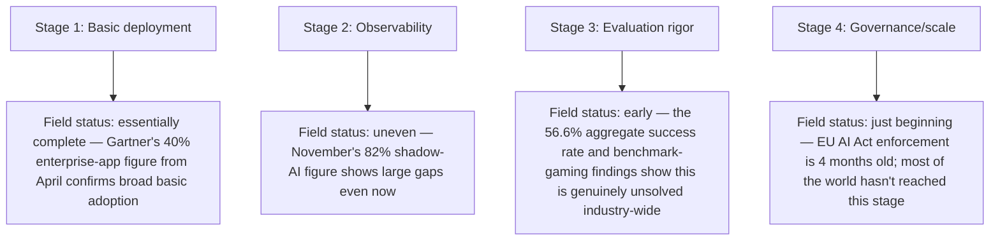
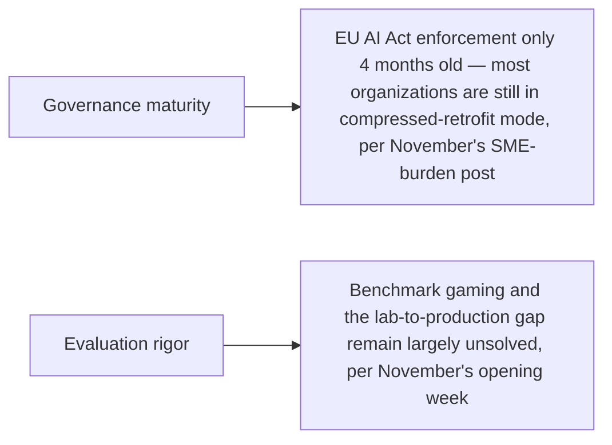

September's LLMOps maturity model post proposed a five-stage self-assessment for a single team's systems. Applying that same structural approach to the field as a whole — not one team, the entire industry — as a way of honestly stating where agentic AI actually stands as 2026 closes, rather than either the breathless optimism or the cynical dismissal that both circulate in equal measure at year's end.

## The Field, Assessed Stage by Stage



This mirrors September's finding almost exactly, projected onto the field level: observability is the prerequisite most organizations still lack, and the stages above it (rigorous evaluation, mature governance) are correspondingly further behind than deployment volume alone would suggest. The field's aggregate position, honestly assessed, is Stage 2 going on Stage 3 — widespread basic deployment, uneven observability, and evaluation rigor that remains a genuine, actively-being-solved problem rather than a checked box.

## Where the Field Is Ahead of Where This Blog Expected in April

```python
def ahead_of_april_expectations() -> list[str]:
    return [
        "Commerce protocol standardization (UCP, Visa TAP, Mastercard) moved faster than typical "
        "multi-stakeholder standard adoption usually does — October's series covered this as already "
        "commercially live, not speculative",
        "Small/edge model quality (the 2.6B-vs-671B result) arrived earlier and more dramatically than "
        "the gradual capability narrowing this blog might have projected in April",
    ]
```

## Where the Field Is Behind



Both governance and evaluation rigor are behind where a naive read of "40% of enterprise apps now embed agents" would suggest — high deployment volume with immature evaluation and governance infrastructure underneath it is precisely the risky combination November's series spent an entire month examining in concrete, incident-level detail.

## The Honest Overall Assessment

```python
def field_wide_honest_assessment() -> str:
    return (
        "Agentic AI in December 2026 is simultaneously more capable and more "
        "deployed than a year-ago assessment would have predicted, AND less "
        "governed and less rigorously evaluated than the deployment volume "
        "alone would suggest is safe. Both things are true at once. Neither "
        "the optimistic nor the dismissive framing captures this accurately."
    )
```

This is the assessment this blog has tried to build toward all year rather than stating upfront — not a triumphant "agentic AI has arrived" nor a cynical "it's all hype," but a specific, stage-by-stage picture with real capability gains in some dimensions and real, documented, unresolved gaps in others, exactly the kind of nuanced position the maturity-model framework from September was built to produce.

## Key Takeaways

1. **Applying September's maturity-model methodology to the field as a whole**: essentially complete basic deployment, uneven observability, early-stage evaluation rigor, and just-beginning governance maturity
2. **The field is ahead of April's implicit expectations on commerce protocol standardization and small-model capability**
3. **The field is behind on governance and evaluation maturity relative to its deployment volume** — the risky combination November's series spent a month documenting concretely
4. **The honest year-end assessment holds two things true simultaneously**: genuinely more capable and deployed than expected, and genuinely less governed and evaluated than that deployment volume alone would suggest is safe

---

*Part of the [Road to 2027 series](/tags/road-to-2027-series/) — edge agents, coding agent maturity, orchestration, and where agentic AI stands as the year closes.*
