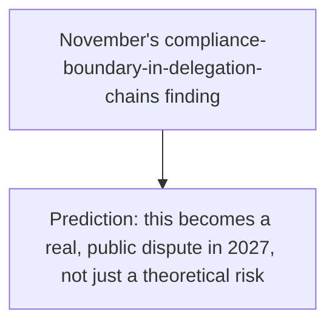
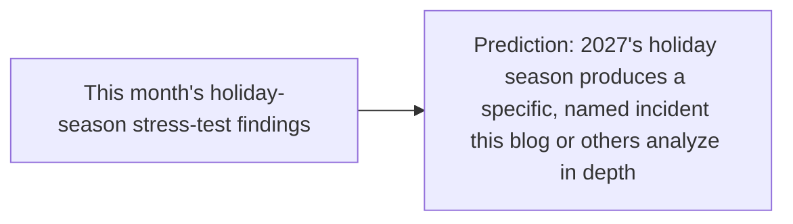

Given this blog's insistence all year on checkable claims over vague assertions — verify on your own eval set, state residual risk explicitly, name a falsification condition — any predictions for 2027 need to meet that same bar. Five specific predictions follow, each with an explicit condition that would prove it wrong, written so this blog (or its readers) can hold them accountable next December rather than letting them fade into unfalsifiable vibes.

## Prediction 1: The Evaluation Gap Narrows, but Doesn't Close

```python
prediction_1 = {
    "claim": "The lab-to-production gap (37% in 2026) narrows to roughly 20-25% by end of 2027, "
              "driven by wider adoption of production-sampling dashboards (November's week-1 posts)",
    "falsified_if": "The gap remains above 30% or a comparable large-scale study isn't conducted at all",
}
```

## Prediction 2: Small/Edge Models Become the Default for a Majority of New Vertical Agent Deployments

```python
prediction_2 = {
    "claim": "By end of 2027, more than half of NEW vertical agent deployments (per October's narrow-"
              "agent thesis) default to a fine-tuned small model rather than a frontier model as the "
              "starting point",
    "falsified_if": "Frontier models remain the default starting point for most new narrow deployments",
}
```

## Prediction 3: A Major Cross-Organization A2A Compliance Dispute Becomes Public



```python
prediction_3 = {
    "claim": "At least one publicized legal or regulatory dispute in 2027 centers specifically on "
              "which organization in an A2A delegation chain bore compliance responsibility for a "
              "high-risk function — the exact scenario November's compliance-boundary post described",
    "falsified_if": "No such dispute becomes public knowledge by end of 2027",
}
```

## Prediction 4: Orchestration-Layer Vendor Consolidation Follows the Browser-Agent Pattern

```python
prediction_4 = {
    "claim": "The orchestration/control-layer tooling space consolidates in 2027 the way October's "
              "Manus-acquisition post described for browser agents — several independent orchestration "
              "platforms get acquired or fold into larger agent-infrastructure vendors",
    "falsified_if": "The orchestration tooling landscape remains as fragmented as it is at end of 2026",
}
```

## Prediction 5: At Least One Agentic Commerce Holiday Season Incident Becomes a Named Case Study



```python
prediction_5 = {
    "claim": "The 2027 holiday season produces at least one specific, publicly-documented agentic "
              "commerce incident (fraud, authorization dispute, or capacity failure) significant enough "
              "to become a named case study, the way November's series analyzed the M365 Copilot CVE "
              "and the Mexican government breach",
    "falsified_if": "2027's holiday season passes without any such publicly documented incident",
}
```

## Why Making These Falsifiable Matters More Than Getting Them Right

```python
def why_falsifiability_matters_more_than_accuracy() -> str:
    return (
        "This blog spent all of November arguing that unfalsifiable or vague "
        "claims (a benchmark score with no stated methodology, a vendor "
        "accuracy claim with no distribution specified) shouldn't be trusted. "
        "A prediction with no falsification condition is exactly that kind "
        "of unverifiable claim, applied to the future instead of the present. "
        "Being wrong about a falsifiable prediction is more valuable than "
        "being vaguely, unfalsifiably 'right' about a hedge."
    )
```

## Key Takeaways

1. **Five specific predictions, each with an explicit falsification condition** — the same accountability standard this blog argued for evaluation claims all year, applied to predictions
2. **They span evaluation maturity, model sizing defaults, A2A compliance disputes, orchestration vendor consolidation, and commerce incident case studies** — one per major thread covered across the year
3. **Falsifiability matters more than being right** — an unfalsifiable prediction is the same category of unverifiable claim November's series argued against, just aimed at the future
4. **These are written to be checked next December**, not to sound impressive now — the actual test of this post is whether it gets revisited honestly, the same standard applied to this week's "what we got wrong" post

---

*Part of the [Road to 2027 series](/tags/road-to-2027-series/) — edge agents, coding agent maturity, orchestration, and where agentic AI stands as the year closes.*
