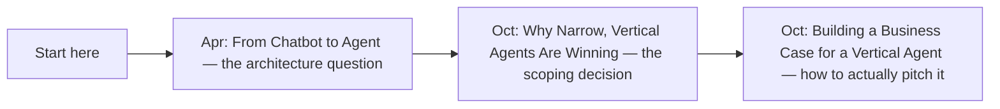
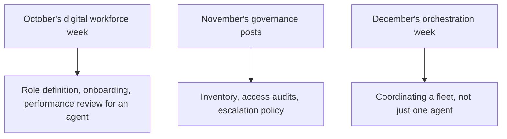

Nearly 275 posts across nine months, spanning six major series, is not something anyone should read chronologically start to finish. This is a practical guide organized by what a reader actually needs *right now* — the same "start with what's actually blocking you" principle this blog argued for in October's roadmap-template post, applied here to navigating the blog itself rather than a platform build-out.

## "I'm Starting My First Agent Deployment"



## "My Agent Is in Production and I Don't Trust My Eval Numbers"

Start with November's opening week — the 37% gap, the 56.6% aggregate, and the Berkeley benchmark-gaming findings — then the production reliability dashboard post for the concrete fix. This is the single most load-bearing stretch of the entire year for anyone past initial deployment.

## "I Need to Get Compliant With the EU AI Act (or a Similar Framework)"

The full November weeks 3-4 sequence, in order: the August deadline post, compliance boundaries in delegation chains, the assembled governance framework post from November 29. Start there rather than any single post — this is the one topic where reading the sequence matters more than any individual entry.

## "I'm Deciding Between Small and Frontier Models"

December's opening week, specifically the 2.6B-vs-671B post and the sizing framework that follows it. Cross-reference against September's small-model-distillation post if you're considering fine-tuning your own.

## "Something Just Broke and I Need to Respond to an Incident Right Now"

```python
def incident_response_reading_order() -> list[str]:
    return [
        "The security incident runbook (earlier this year)",
        "November's post-incident fleet-wide access review",
        "The postmortem format post (earlier this year) — write this up properly once the fire is out",
    ]
```

## "I Want to Understand Where the Field Actually Stands, Not Just My Own System"

This week's own posts: Sunday's field-wide maturity assessment and yesterday's five accountable predictions. These are explicitly written to stand alone from the rest of the archive as a current-state summary.

## "I Manage People (or Agents) and Need the Organizational Playbook"



## Why This Guide Exists

```python
def why_a_navigation_guide_matters() -> str:
    return (
        "Per October's workflow-redesign post: dropping a reader into an "
        "unchanged, chronological blog archive and expecting them to find "
        "what they need is the same mistake as inserting an agent into an "
        "unredesigned workflow. This guide is the redesign — organized "
        "around actual reader need, not around the order things happened "
        "to be published."
    )
```

## Key Takeaways

1. **This guide organizes nine months and nearly 275 posts by reader need**, not chronology — first deployment, eval trust, compliance, model selection, incident response, field-wide context, and org/management
2. **The EU AI Act compliance topic is the one place reading a full sequence in order matters more than any single post**
3. **This week's own posts (field-wide assessment, predictions) are written to stand alone** as a current-state summary for readers who don't want the full year's context
4. **This guide itself applies October's workflow-redesign lesson to the blog's own navigability** — organized around actual need, not publication order

---

*Part of the [Road to 2027 series](/tags/road-to-2027-series/) — edge agents, coding agent maturity, orchestration, and where agentic AI stands as the year closes.*
