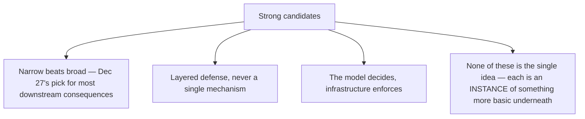
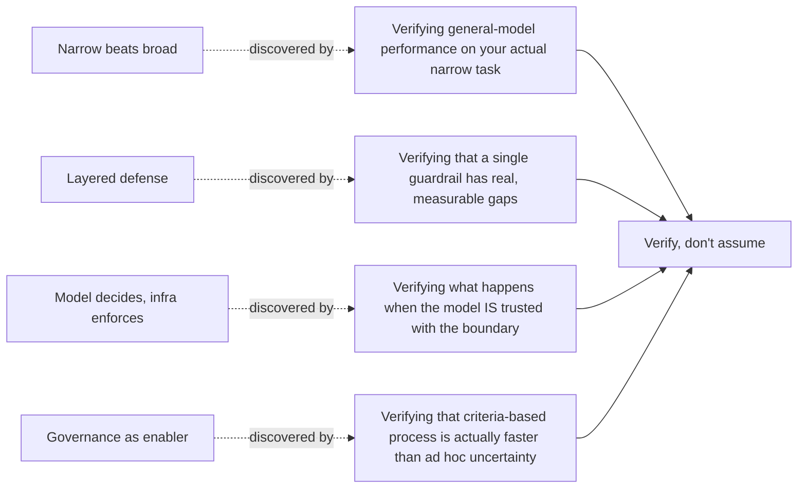

Nine months, six series, nearly 275 posts, closing tonight on the last day of 2026. If a reader remembers exactly one idea from all of this a year from now, it should be this one, and it's worth explaining why it earns that place over every other candidate this year produced.

## The Candidates That Didn't Quite Make It



Two days ago, "narrow beats broad" was named the idea with the most downstream consequences — genuinely true, and on reflection it's an instance of something more fundamental, not the root idea itself. Layered defense and the model/infrastructure boundary are the same: powerful, recurring, and each one is a specific application of a single underlying discipline rather than the discipline itself.

## The Actual Answer: Verify, Don't Assume

```python
def the_one_idea() -> str:
    return (
        "Every specific principle this year reduces to the same root: "
        "verify the actual behavior of the system in front of you, rather "
        "than assuming it matches your mental model, a vendor's claim, a "
        "benchmark score, or what worked last time. Narrow-beats-broad is "
        "what you find when you verify instead of assuming general capability "
        "transfers to your specific task. Layered defense is what you build "
        "when you verify instead of assuming any single guardrail catches "
        "everything. The 37% lab-to-production gap is what you find when "
        "you verify production behavior instead of trusting the eval score."
    )
```

## Why This Is the Root, Not Just Another Instance



Trace any specific principle from this year back to how it was actually established, and every single one traces to the same act: someone checked, measured, or tested rather than trusting an assumption, a claim, or an intuition. This blog's own worst moments (Dec 26's honest accounting) were exactly the times this discipline slipped — assuming frontier models would stay the default without verifying against the accumulating small-model evidence, assuming governance was overhead without verifying its actual effect on deployment velocity.

## What This Means Practically, Going Into 2027

```python
def practical_application_for_2027() -> str:
    return (
        "Whatever new pattern, framework, or claim 2027 produces — and per "
        "yesterday's predictions, several specific things probably will — "
        "the standing instruction is the same one this entire year has been "
        "restating in different clothes: build the eval, run the red-team, "
        "check the production data, verify on your own system before "
        "trusting the general claim. Not because skepticism is a virtue in "
        "the abstract, but because every single failure this year, without "
        "exception, traces back to a place where that verification step "
        "was skipped."
    )
```

## Closing

Thank you for reading this far — whether that means this one post or the full year behind it. The blog picks back up in 2027, presumably with new patterns, new incidents, and new things this year's writing got wrong in ways that will only be visible in hindsight. The discipline for meeting them stays the same either way: verify, don't assume. See you next year.

## Key Takeaways

1. **Every specific principle covered this year — narrow-beats-broad, layered defense, the model/infrastructure boundary, governance-as-enabler — traces back to the same root act: verification instead of assumption**
2. **This blog's own worst moments this year were exactly the times that discipline slipped**, not times the specific technical content was wrong
3. **The standing instruction for 2027, regardless of what specific new developments arrive, is unchanged**: build the eval, verify on your own system, check production data before trusting a general claim
4. **This is the one idea worth carrying forward if nothing else from this year survives** — not because skepticism is inherently virtuous, but because every failure examined this year traces back to a skipped verification step

---

*Part of the [Road to 2027 series](/tags/road-to-2027-series/) — edge agents, coding agent maturity, orchestration, and where agentic AI stands as the year closes.*
